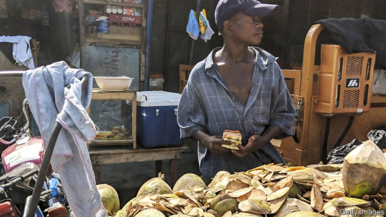
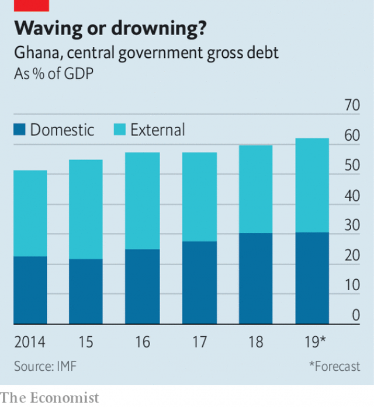

###### Never gonna let you go

# After its 16th bail-out, Ghana hopes to put the IMF behind it 

 

> print-edition iconPrint edition | Middle East and Africa | Jun 22nd 2019 

SIRENS WAILING, a black government car pushes through the traffic, past the beggars and street vendors, up a potholed road. Vehicles like these, the perks of a growing number of political appointees, are a common sight in Accra—and a source of popular outrage. Since Nana Akufo-Addo took office as president in January 2017 the number of government ministers has soared by 42% to 125, each with a car, guards and a taxpayer-funded home. 

Outside Ghana Mr Akufo-Addo has been hailed as a hero. When he was sworn in, it was as if he was a passenger in a plummeting aeroplane who had just been handed the controls. His predecessor, John Mahama, had taken a high-flying economy—growth was 17% in 2011 thanks to the first production of oil from its Jubilee Field—and promptly put it into a nose-dive. Under Mr Mahama inflation soared, the economy slowed and public debt ballooned, with much of the borrowed money squandered on higher wages for public employees. 

After taking the controls Mr Akufo-Addo said he would deliver “Ghana Beyond Aid”. He swiftly imposed discipline on government spending (new ministers notwithstanding). Fifty-three years after the IMF first bailed out Ghana, the 16th rescue package for the country ended in April. The fund now praises the government’s economic management. A glowing staff report said Ghana had tamed inflation (which fell back to 9% this year after reaching 17% in 2016). It also won acclaim for cleaning up rotten banks and achieving a budget surplus (before interest payments). 

Yet the praise should be tempered. Some 3.1m people, or about one-tenth of the population, live on less than $1.90 per day, the World Bank’s measure of extreme poverty. It has been a stubborn problem. Although Ghana cut its poverty rate in half in the 20 years to 2013, most of that progress occurred in the 1990s, when it fell by almost two percentage points a year. Since 2006 progress has slowed to about one percentage point per year. 

 

Many of the government’s flagship investment programmes have been sunk by mismanagement. One especially embarrassing example is that of the Komenda Sugar Factory, which was built three years ago with a loan from the Indian government, and which was supposed to provide more than 7,000 jobs. Yet it is idle because it does not have any sugar cane to process. In all about one-third of infrastructure projects in Ghana are never finished. 

Worse still, many were paid for with borrowed money. A rebasing of GDP last year has flattered the country’s balance-sheet. Ghana’s debt-to-GDP ratio, which hit 73% in 2016, looks quite tame this year at 62% (it would have been 76% under the old GDP measure). 

But simply changing the estimated size of the economy does not magically bring in more tax. Interest payments still consume one-third of government revenues, which is more than it spends on education or health. Increasing the amount raised in taxes will be tough, because most of the economy is informal. The IMF notes that taxes make up a smaller share of GDP (14% in Ghana) than in most other developing countries and classifies it as being at “high risk of debt distress”. 

Investors are also wary and demand much higher interest rates to hold Ghana’s foreign-currency bonds compared with Nigeria’s or Kenya’s. One reason is that they worry the government will start spending freely ahead of elections in 2020, as governments often have in the past. Gregory Smith of Renaissance Capital, a bank, points out that budget deficits were almost one percentage point of GDP higher in each of the seven election years since 1990 than in non-election years. The trend has accelerated: in 2012 and 2016 deficits ballooned by almost three percentage points of GDP. 

Mr Akufo-Addo won the election in 2016 with the preposterous promise of a factory in every district. This time he might do better by breaking the old pattern of running up debts before an election, only to turn to the IMF afterwards for another bail-out. ◼ 

