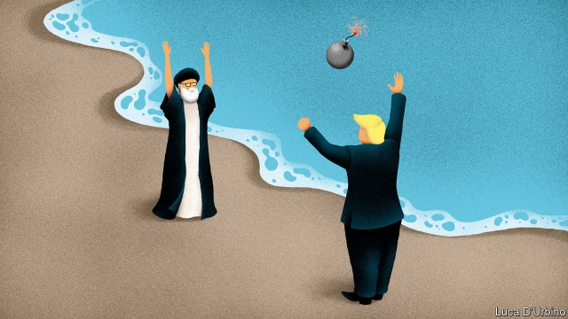

###### Playing with fire

# Backed into a corner, Iran is lashing out 

 

> print-edition iconPrint edition | Middle East and Africa | Jun 22nd 2019 

FOR A MOMENT it seemed as if America and Iran were stepping back from the brink. A month ago the two countries were close to conflict, as Iran threatened to shrug off a deal, signed with six world powers, that limited its nuclear programme in return for economic relief. America had blocked that relief and was sending warships to the region. But Japan’s prime minister, Shinzo Abe, went to Tehran on June 12th with a proposal for talks that appeared to have the approval of President Donald Trump. Mr Abe told Iran’s supreme leader, Ayatollah Ali Khamenei, that Mr Trump wanted a new deal, not regime change. “Iran has no trust in America,” said Mr Khamenei, rejecting the offer. 

So back to the brink they went. While Mr Abe was still in Tehran, two tankers (one operated by a Japanese company) came under attack in the Strait of Hormuz, an important choke point for international shipping. America blamed Iran, which denied responsibility. Iran then declared, again, that it would soon abrogate parts of the nuclear deal by exceeding limits on its stockpile of nuclear fuel and, perhaps, enriching uranium to levels closer to those of a bomb. In response, America sent 1,000 more troops to the region. On June 20th Iran’s Revolutionary Guard Corps shot down an American military drone. 

Iran’s leaders appear to have ditched their “strategic patience” as they wait for Mr Trump’s term to end. Iranian drones and missiles, fired by its proxies in Yemen and Iraq, have struck pipelines and airports in Saudi Arabia, an Iranian rival, and American bases in Iraq. (Last month America pulled all “non-essential” staff from Iraq.) Iran has also threatened to unleash a tide of refugees and drugs on Europe by relaxing security on its Afghan border. The Guards, who answer to Mr Khamenei—not the elected president, Hassan Rouhani—are increasingly calling the shots. “We’ve never seen Iran so aggressive,” says an unusually nervous Emirati official. 

The show of strength by Iran smacks of desperation. Mr Trump pulled America out of the nuclear deal last year and has since tried to undermine it by threatening sanctions on any country that buys Iranian oil. This month he imposed fresh restrictions on Iranian petrochemicals. The administration is also trying to block all of Iran’s efforts to enrich uranium, even to levels allowed under the deal. Meanwhile, the Europe Union’s effort to keep Iran in the deal by creating a mechanism that allows European firms to bypass American sanctions has fizzled. Few businesses want to trade with Iran if it costs them access to America’s market. 

The impact has been devastating. In the 2018-19 fiscal year Iran’s GDP shrunk by 4.9% compared with the year before, says the government. Industrial production has fallen almost as sharply as that of oil. Food prices have tripled and supplies of medicine are diminishing. Gloating rivals in the Gulf have readily met the shortfall left by Iran’s dwindling exports of oil. 

Iran wants to show that Mr Trump’s actions have costs for others, too. Officials in Tehran have repeatedly said that if Iran is not allowed to export oil, then no oil will pass through the Gulf. The attacks on commercial shipping in the Strait of Hormuz, through which one-fifth of the world’s oil supply passes, sent the price of the black stuff (and shipping insurance) upwards. Attacks by Iranian proxies threaten to disrupt the economies of Saudi Arabia and the United Arab Emirates. “Iran’s leaders are showing that they have the potential to be crazier than America,” says Vali Nasr, an Iranian-American academic. 

But a growing and increasingly truculent segment of Iran’s population doubts the standoff is worth it. Most Iranians dislike Mr Trump. Nevertheless, if shaking his hand would get him to relieve the pressure, they wish their leaders would do it. “We need to negotiate to survive,” pleads a housewife who haggles for bargains in Tehran’s bazaar. 

Delegations of Swiss, Germans, Omanis, Qataris, Iraqis and Russians have come and gone from Tehran, failing to stop the cycle of escalation. America, says Mr Khamenei, must lift its sanctions before talks can take place. He rejects Mr Trump’s demand for a permanent halt to Iran’s nuclear programme and an end to Iran’s funding of proxies in the region. Instead of the flashy summit the president craves, Mr Khamenei prefers that any meetings occur in private. 

The Pentagon and the Guards are still talking behind the scenes. On June 11th Iran released a Lebanese citizen charged with espionage who had lived in America for much of his life. Some interpreted it as a gesture by Iran’s hardliners aimed at easing tensions and improving ties. For now it appears not to have worked. ◼ 

