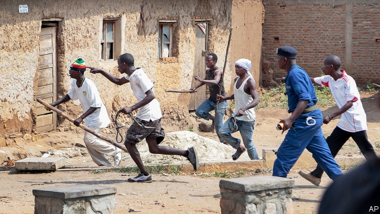

###### Pay up or be pummelled

# Burundi’s “eternal supreme guide” enforces an “election tax” 

 

> print-edition iconPrint edition | Middle East and Africa | Jun 22nd 2019 

GOD SHORT-CHANGED Pierre Nkurunziza, Burundi’s president, when endowing people with democratic values. But someone gave him more than his share of self-confidence. Last year he christened himself the country’s “Eternal Supreme Guide”. He then changed the constitution so that he could stay in power until 2034. Naturally, he claims to have been appointed by God. Nonetheless, he is still keen to hold an election in 2020. 

Alas, his cash-strapped government cannot afford to pay for it. After years of human-rights abuses, donors have cut off most aid. Mr Nkurunziza’s solution is more abuses. In 2017 he introduced an annual election tax of 2,000 Burundian francs ($1.09) per household. The youth wing of the ruling party has been given the task of collecting it. Known as the Imbonerakure (“those who see far”), their day job is to rough up dissidents. Since the new tax was introduced they have roamed neighbourhoods, armed with sticks, to collect the election tax as many times as they please. “This election tax has given these men the green light to extort money from the population all the time,” says Lewis Mudge of Human Rights Watch, a pressure group. 

In the past four years Burundi has sunk ever deeper into poverty. More than half of children under five are chronically malnourished. Three-quarters of Burundians live in extreme poverty, says the World Bank. People have grown poorer, on average, since 2014. 

This was a sharp downward lurch for a country that had been making steady progress since the end, in 2005, of a genocidal 12-year-long civil war between Hutus and Tutsis, the two main ethnic groups. About 300,000 people are thought to have died in the conflict. The peace treaties that ended it called on the Hutus and Tutsis to share power and put checks on the authority of the president, who was limited to no more than two terms in office. 

This fragile peace unravelled in 2015 when Mr Nkurunziza decided to stand for a third term. (He insisted that his first did not count because he had been appointed by parliament.) His love of office was, however, not matched by his people’s love for him. Many took to the streets in protest and army officers mounted a short-lived coup. The Eternal Supreme Guide responded brutally. Human Rights Watch reckons that about 1,700 people were killed in 2015-18 by state security forces and the Imbonerakure. Bloated corpses were found, weighed down with stones, in Lake Tanganyika. 

In 2016 the European Union, which had provided about half the government’s budget, stopped handing over direct aid. It also imposed travel bans and financial sanctions on senior politicians. Yet these measures have had little effect. Mr Nkurunziza has brazenly sent foreign witnesses packing. About 30 international NGOs have left or been pushed out. In February the UN was forced to close its human-rights office in Burundi. This month the government suspended the last independent civil-rights group, Parcem, which had campaigned for better governance. 

In this darkness, brutality is flourishing. Around 350,000 people have fled, some so desperate that they have gone to the eastern provinces of the Democratic Republic of Congo, which are themselves ravaged by armed militias. 

One middle-aged woman in Congo says the Imbonerakure would arrive at her door three times a month. “They would come to the house at night and say: ‘Give us the money for the election or we will kill you,’” she says. “We haven’t even got enough money for school fees, how could we pay for the election?” On their last visit her husband refused to give them money, so they beat up the whole family, including her small children, before dragging him away. She has had no news of him since. 

In the countryside men from the Imbonerakure sit at the roadside, demanding that passers-by display their election-tax receipts. Burundians are also being strong-armed into building offices for the ruling party. A young man says that the thugs accosted him one morning saying: “Pay us money or go and prepare the bricks.” 

Lacking a free press, Burundians anonymously post pictures of maimed bodies on a Facebook group, with comments detailing attacks by the Imbonerakure or police. Mr Nkurunziza apparently plans to keep a promise he made after his election victory in 2015: that his enemies “will be scattered like flour thrown in the air”. ◼ 

Journalist wanted: We are looking for a new writer, based in Africa, to strengthen our coverage of the continent. For further details please go to:www.economist.com/africawriter 

