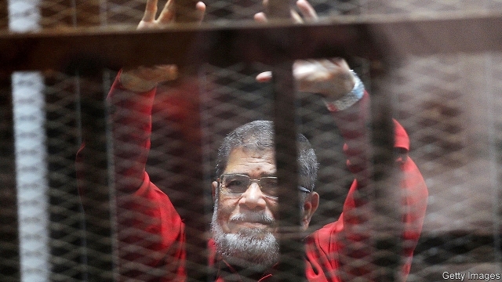

###### An epilogue for the revolution

# Muhammad Morsi, Egypt’s only democratic ruler, dies in court 

 

> print-edition iconPrint edition | Middle East and Africa | Jun 20th 2019 

THE CASES against Muhammad Morsi, now in their sixth year, long ago took on the air of a Kafka novel. Every few weeks Egypt’s only democratically elected president, deposed in a coup in 2013, would appear in court to answer one charge or another. He was accused of espionage and torture, and of stealing livestock. Most people lost interest, but the wheels of Egyptian justice ground on. And then, abruptly, they stopped. On June 17th state television reported that Mr Morsi (pictured on next page) had died of a heart attack during a court session. He was 67. 

Born in the Nile Delta, Mr Morsi trained as an engineer and finished his PhD in America. He returned to Egypt in 1985 and took up a university post in Sharqia governorate, where he had grown up. For the next 15 years he was an academic and a high-climbing member of the Muslim Brotherhood, the Islamist group that was then banned but tolerated by Hosni Mubarak’s government. In 2000 he was elected to parliament, as an independent, since the Brotherhood was not allowed to field candidates. He served only one term. 

This was an unlikely CV for the man who would emerge as Egypt’s president after Mr Mubarak was toppled in the Arab spring of 2011. Indeed, Mr Morsi was not even the Brotherhood’s first choice. The group wanted to run its deputy leader, Khairat al-Shater, a wealthy and well-known businessman. But the army decided that a recent prison term made him ineligible to compete. Mr Morsi was a compromise—uncharismatic, perhaps, but a trusted member of the group. He was nicknamed the “spare tyre”. 

Egyptian liberals, who split their vote during the election’s first round, did not share Mr Morsi’s Islamist politics, but he seemed the democratic choice, a break from the old regime. Many held their noses and voted for him in the run-off against Ahmed Shafiq, Mr Mubarak’s last prime minister, in June 2012. After his victory, Mr Morsi’s first act was to address a crowd in Tahrir Square, the heart of the revolution. There he awkwardly unbuttoned his jacket to show he was not wearing a bulletproof vest—a man-of-the-people gesture that he hoped would endear him to the nation. 

The goodwill was short-lived. Mr Morsi and his allies never got a grip on Egypt’s fractious state. The army undermined him, while the intelligence services worked to bring him down. The Mubarak-era courts became a frequent source of opposition: judges dissolved parliament, in which the Brotherhood held a plurality, and repeatedly blocked Mr Morsi’s efforts to schedule a new election. In November 2012 the president issued a decree that shielded his decisions from judicial review. Anti-Morsi protesters who surrounded his palace were soon attacked by Brotherhood supporters. 

His edict, and the violence that followed, caused a lasting rupture with the revolutionaries who helped put Mr Morsi in office. When the army removed him in July 2013—led by his hand-picked defence minister, Abdel-Fattah al-Sisi—many were happy to see him go. Even the killing of hundreds of pro-Morsi protesters the following month, a massacre unprecedented in Egypt’s modern history, drew only muted public criticism. 

The Brotherhood is again banned, and now not even tolerated. Once a strict hierarchy, it is no longer a coherent group, its leaders locked in heaving jails or exiled to Doha, Istanbul or Europe. Nor is there any other source of opposition. In April Egyptians approved constitutional amendments that let Mr Sisi (now president) rule until 2030. An engineer named Ahmed Badawi held a one-man protest on a Cairo street. He was swiftly arrested. 

Mr Sisi’s foes hoped that Mr Morsi’s death would provide a rallying point. That was wishful thinking. The public is tired of unrest. There are few political figures with the standing to lead protests, or Egyptians willing to risk the consequences of joining. Still, the government took no chances. It did not allow Mr Morsi’s family to bury him in their home village, lest it become a spectacle. He was interred privately in Cairo. Egyptian newspapers, which have little independence, all but ignored the news. State-run Al-Ahram gave it seven lines in the crime section. None referred to Mr Morsi as a former president. A presenter on CBC, a channel owned by the intelligence services, ended her report on his death with the words “sent from a Samsung device”, suggesting that officials had e-mailed the script. 

Three hours after Mr Morsi died, Egypt’s public prosecutor published a report on his death. Unsurprisingly, it found no signs of mistreatment, and so no reason to blame the state. But Mr Morsi’s family had long worried about his health. He was held in solitary confinement in Tora prison, notorious for its grim conditions. Human Rights Watch, a pressure group, alleges that the diabetic ex-president received inadequate medical care. During a court session he hinted that guards were trying to poison his food. Amr Darrag, a former minister in Mr Morsi’s government, calls his death “tantamount to state-sponsored murder”. 

Mr Morsi’s treatment contrasts sharply with that of his predecessor, a man who misruled Egypt for 30 years. Mr Mubarak too faced trial after the revolution. He was held not in Tora prison but in a military hospital in a pleasant Cairo suburb. With the cases against him dismissed, he is enjoying a peaceful retirement. The armed forces look after their own. 

Mr Morsi was a poor president. But he was the only popularly elected one in Egypt’s long history. It is a tragic coda for the revolution that he spent his final years rotting alone in a cell. ◼ 

