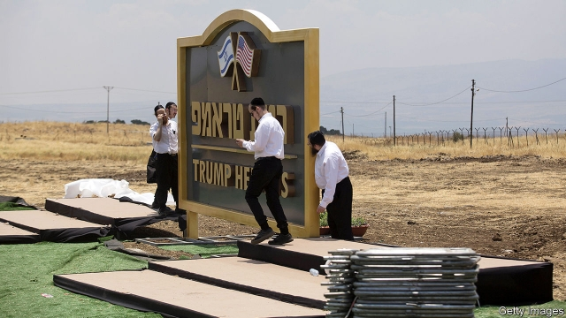

###### The height of flattery

# Trump Heights, Binyamin Netanyahu’s tribute to America’s president 

 

> print-edition iconPrint edition | Middle East and Africa | Jun 22nd 2019 

IF THE PAST is any guide, there is nothing Donald Trump likes more than seeing his name in big gold letters on a real-estate project. Predictably, then, America’s president was pleased when Israel’s prime minister, Binyamin Netanyahu, unveiled the gilded sign for Trump Heights (pictured) on June 16th. The supposedly new town in the Golan Heights is named in honour of Mr Trump. It has no plan or budget. 

Mr Netanyahu wanted to thank Mr Trump for recognising Israel’s sovereignty over the Golan Heights, which it captured from Syria in the six-day war of 1967. No other country accepts Israel’s claim to the territory. But the Trump administration said Israel needed the land to protect itself from Syria and the Iranian-backed forces inside the country. The timing of the decision, two weeks before Israel’s election in April, also seemed aimed at boosting the campaign of Mr Netanyahu, whom Mr Trump considers an ally. 

Many foreign leaders have realised that Mr Trump enjoys vacuous flattery. But even by the standards of the past two-and-a-half years, the inauguration of Trump Heights is a particularly empty gesture. Not only is it an illegal settlement under international law, it isn’t even a new one. An Israeli village called Brukhim was established on the land in 1991, but did not attract many residents. Since Mr Netanyahu failed to form a government after the election in April, he leads on an interim basis—without the legal authority to allocate land or money for Trump Heights. The project has no timetable. About all the government can do is erect a fancy sign. 

On June 25th the Trump administration is expected to present elements of a long-delayed peace plan for Israel and the Palestinians at a conference in Bahrain. Ever since he was elected, Mr Trump has promised to deliver “the ultimate deal”. But the Palestinians have shunned him since he recognised the disputed city of Jerusalem as Israel’s capital in 2017. They will not attend the conference. Nor will Israeli officials, whom the Americans did not invite, perhaps to lower expectations. Saudi and Emirati leaders may show up, no doubt to praise both the plan and Mr Trump. 

An American official admits that the entire peace plan will probably not be unveiled until after Israel’s election in September. Another official says it will probably wait for Mr Trump’s second term—assuming he wins one. If not, the developers of Trump Heights might consider investing in a new sign. 

