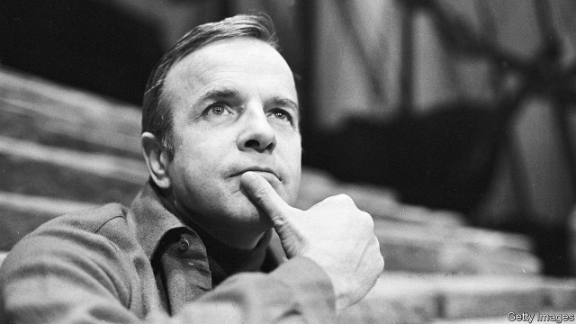

###### The pursuit of beauty

# Obituary: Franco Zeffirelli died on June 15th 

 

> print-edition iconPrint edition | Obituary | Jun 22nd 2019 

THE FIRST time Franco Zeffirelli felt he was a special person was in the late 1940s, when he was in his 20s. Slim, blond and blue-eyed, he could smoulder like Montgomery Clift, all charm and corner-of-the-eye looks. People panted round him to get his favours, of one sort or another. He was merely playing small roles in theatre then, and painting sets, but he began to hear a buzz about him, a murmur of “Zeffirelli!”, even from the gallery seats. 

The buzz persisted, and it grew, until in his early 40s—and still very good-looking—he knew real fame. Not, however, for acting, but for a decade of sensational productions in opera, theatre and film. His “Traviata” in Dallas in 1958 crowned the career of Maria Callas, now the most tear-inducing Violetta of them all, and his “Lucia di Lammermoor” the next year at Covent Garden launched the rise of Joan Sutherland, pulling out every dramatic stop in robes that shone with blood. His staging of “Romeo and Juliet” at London’s Old Vic theatre in 1960, with very young actors, was a wild success, and the film he based on it in 1968 was loved the world over, bringing a new generation to Shakespeare. His “Taming of the Shrew” the year before was a hit too, with Richard Burton and Liz Taylor both backing it and funding it, though they were so riotous on set that he could barely direct them. And for his six-hour TV film “Jesus of Nazareth”, his take on the life of Christ—to him, his best work—stars flew in from Hollywood to beg to be cast. 

Opera, theatre, cinema: he could do them all. He was like a sultan with three wives, who while making love to one would think “Next time I have to try the other one.” Critics sniffed, as if a man should attempt only one thing in life. But for the public the name “Zeffirelli” was a magic thing. It meant splendour, sometimes on a massive scale: the Arena at Verona seething with white horses and Spanish dancers for “Carmen”, or “the Aida of Aidas” he staged there in 2006, with a huge gilded pyramid looming over a cast of hundreds. It meant no detail overlooked, no heartstring left untugged. “Too beautiful,” some said of his work. How could anything be too beautiful? Beauty was beauty. There was no point in putting on backlit grey productions, shooting in bad light, revelling in ugliness. Beauty, spectacle and Zeffirelli went together. 

Yet his name had once meant almost nothing. He was illegitimate, and his mother, obliged to conceal his father, had meant to call him “Zeffiretti”, little breeze, after a Mozart aria. A clerical error made him what he was. At school in Florence, asked to state his father’s name, he could give only the official “N.N.”, nescio nomen. After his mother’s death, when he was six, a cousin he called Aunt Lide brought him up. She stayed with him like a mother until she died, perhaps the only love, with that of his many dogs, he believed he could fully trust. 

His greatest love, though, hitting him right in the forehead and the heart, was for Luchino Visconti. After they met, when he was still a bit-part actor and Luchino the leading director in Italy, Luchino got him better roles and made him his assistant on “La Terra Trema” and “Bellissima”, films in the neo-realist style. For several stormy years they lived together. He hated the word “gay” because it lacked virility, but was happy to be Luchino’s “creature”, enthralled by his talent, his teaching and his scented patrician ways. Not least, Luchino taught him how to lose his temper explosively, effectively—and then, in an instant, be charming again. 

Charm certainly helped with the divas he met. He became one of Callas’s rare confidants, after hanging around her dressing-room door for weeks like a lovesick boy and fetching trinkets for her. It was he who suggested that she ought to try a lighter repertoire, and who tailored her triumphant Covent Garden “Tosca” in 1964 to reflect the strains in her own love-life. He also persuaded Sutherland, so stout and awkward, to loosen up, which made all the difference. In general he thought he directed women better than men. He was almost as easily moved to tears as they were. 

It was not hard to see how his obsession had begun. As a child, sent to the Tuscan countryside each summer (an idyll he revisited in “Brother Sun, Sister Moon”, a gentle tribute to his patron saint, St Francis of Assisi), he was thrilled by peasant actors and lantern-light. Back in Florence, he built his own toy theatres. He began to study architecture and to look closely at the art all around him, but these efforts were not aimed at some well-paid profession. They informed the vaulted, glorious set designs and Old Master imagery of many of his productions—work which paid so poorly that for years, before the film of “Romeo and Juliet” made him rich, he had to boost his income by selling, sadly, the Matisse drawings that had been a present from his dear friend Coco Chanel. 

As he became more famous and popular the critics increasingly sniped. They wanted art-house films, ugly dark elitist stuff, and mocked his work as reactionary. He knew what these people were, disrupters used by the Kremlin; he had watched communists at work as a child, but had never drunk that poisoned milk. He was a true socialist, whose duty was to move and delight the people, to make them dream. When critics panned “The Champ”, about a failed boxer, for being sentimental, or “Endless Love”, another tale of teenage lovers, as soft porn, the public still poured in. 

It was perhaps inevitable, given his loathing of the left, that he should try politics eventually. He was no right-wing extremist, having fought bravely with the partisans against the fascists in the war; really he was an old-fashioned Catholic, the Vatican’s favourite director for its own events, who accepted that his way of life was sinful but trusted in forgiveness. He was also friends with Silvio Berlusconi, who paid for his villa in Rome. (He could no longer bear to live in Florence, full of stupidity and vulgarity.) So in 1994 he became a mostly absent senator for Mr Berlusconi’s party. 

The place he represented was Catania in Sicily, where he and Luchino had shot “La Terra Trema” so many years before. He had hoped to help that poor and Mafia-ridden town. But his legacy, of course, was not political. It was in the spreading of beauty that he knew he would find that little breeze of immortality. ◼ 

