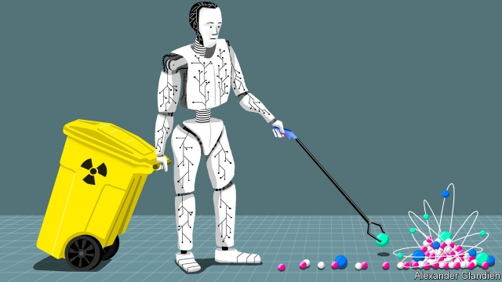

###### Dangerous work

# Cleaning up nuclear waste is an obvious task for robots 

 

> print-edition iconPrint edition | Science and technology | Jun 20th 2019 

SOME PEOPLE worry about robots taking work away from human beings, but there are a few jobs that even these sceptics admit most folk would not want. One is cleaning up radioactive waste, particularly when it is inside a nuclear power station—and especially if the power station in question has suffered a recent accident. 

Those who do handle radioactive material must first don protective suits that are inherently cumbersome and are further encumbered by the air hoses needed to allow the wearer to breathe. Even then their working hours are strictly limited, in order to avoid prolonged exposure to radiation and because operating in the suits is exhausting. Moreover, some sorts of waste are too hazardous for even the besuited to approach safely. 

So, send in the robots? Unfortunately that is far from simple, for most robots are not up to the task. This became clear after events in 2011 at the Fukushima Daiichi nuclear power plant in Japan, which suffered a series of meltdowns after its safety systems failed following a tsunami. The site at Fukushima has turned into something of a graveyard for those robots dispatched into it to monitor radiation levels and start cleaning things up. Many got stuck, broke down or had their circuits fried by the intense radiation. 

Stopping such things happening again is part of the work of the National Centre for Nuclear Robotics (NCNR). This is a collaborative effort involving several British universities. It is led by Rustam Stolkin of the University of Birmingham, and its purpose is to improve the routine use of robotics in nuclear power stations as well as to ensure that robotic trips into irradiated areas are less likely to end up as suicide missions. 

One problem with the robots dispatched into the ruins of Fukushima Daiichi was that they were not particularly clever. Most were operated by someone twiddling joysticks at a safe distance. Such machines are awkward to steer and their arms are tricky to move accurately when viewed via a video screen. Dr Stolkin reckons the answer is to equip them with artificial intelligence (AI), so that they can operate autonomously. 

The nuclear industry, though, is extremely conservative and not yet prepared to let autonomous robots loose within its facilities. So, for the time being at least, AI will be used to assist human operators. For example, instead of relying on a remote human operator to manipulate all its controls, an AI-equipped robot faced with a pile of different objects to move would employ a camera to understand those objects’ shapes and positions relative to one another. It could then plan how best to grasp each object and move it to, say, an appropriately designed disposal skip without it colliding with anything else in the vicinity. 

A human being would remain in overall control of the process via a motorised joystick that exerts forces on the operator’s hand similar to those he or she would feel by actually grasping the object. But although the operator still uses the joystick to move the robot’s arm to carry out a particular task, it is the AI which takes care of the details. It makes sure the arm swings in exactly the right direction and picks things up properly. Such an arrangement has already been successfully tested at the Springfields nuclear-fuel facility in north-west England. It was used to cut up contaminated steel with a high-powered laser. 

Other members of NCNR are examining different aspects of the problem. At the University of Bristol, Tom Scott leads a group working on means for robots to identify materials, including various sorts of plastic, from the “fingerprints” provided by the distinctive ways they scatter laser light. At Queen Mary, a college of the University of London, Kaspar Althoefe’s team is working on radiation-resilient tactile sensors for robots’ fingers. Gerhard Neumann of the University of Lincoln is developing advanced navigation systems. And to ensure robots’ circuits don’t get frazzled, Klaus McDonald-Maier at the University of Essex is developing electronics toughened against the effects of radiation, including circuits that automatically detect and correct errors. 

Besides helping run nuclear power stations, all this will also assist with the growing need to clean up and recycle nuclear waste—and not just because of disasters like Fukushima. Early members of the nuclear club, such as America, Britain, France and Russia, have accumulated a vast legacy of the stuff. In Britain alone, some 4.9m tonnes of contaminated nuclear material are in need of safe disposal. 

A lot of this is found at one of the most hazardous industrial sites in Europe, Sellafield, also in north-west England. Sellafield began producing plutonium for bombs in 1947. In 1956 the world’s first commercial-sized civil nuclear power station opened there. The site went on to become a centre for reprocessing nuclear fuel. Cleaning up Sellafield’s decaying buildings and nuclear-waste storage facilities will take decades. Robots with autonomous abilities would greatly hurry that process along. 

Nor is it just inside buildings that robots can help. This April Dr Scott and his colleagues at Bristol completed an aerial survey of the Red Forest in the Chernobyl exclusion zone in Ukraine using robotic drones. Even 33 years after the accident at the site’s number four reactor, they found previously undetected radiation hotspots. 

Unlike a neat and tidy factory, where robots can be programmed to undertake repetitive tasks without any surprises, decontaminating an old nuclear site requires the ability to operate in an unstructured environment. In some cases, operators may not even know what they might find inside a building. Devising artificial intelligence clever enough to deal with all this will be tricky. But if Dr Stolkin and his colleagues succeed, their efforts are likely to have a wider impact, stretching even into the world of jobs that people are, at the moment at least, content to do themselves.◼ 

