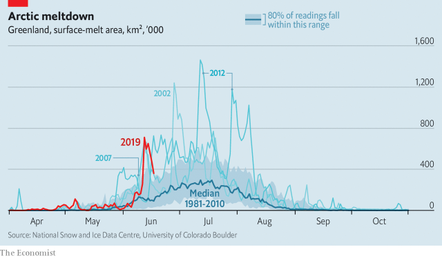

###### Climate change

# Greenland’s ice sheet is melting unusually fast 

> print-edition iconPrint edition | Science and technology | Jun 22nd 2019 

GREENLAND’S MISLEADING name is the result of a marketing campaign by Erik the Red, a tenth-century Norse explorer who wished to attract settlers to its icy landscape. Little did he know that the island had been covered by lush forests many millennia before he was born. Nor could he have fathomed that, a millennium after his death, the vast ice sheet that gave the lie to his inviting description would be in rapid retreat. 

That sheet holds enough water to raise the world’s sea level by more than seven metres, should it all melt and run off into the oceans. For this reason, climate scientists monitor the sheet’s seasonal trends closely. In particular, they study the spring melt that leads up to the late summer ice minimum, after which the sheet starts to grow again. 

The latest data show that the area of melting ice is unusually high this year. On June 12th 712,000 square kilometres of the sheet (more than 40% of it) were melting. That is well outside the normal range for the past 40 years (see chart). 

 

Several things are to blame. First, a natural cycle known as the North Atlantic Oscillation is encouraging ice-melt. Then there is long-term warming driven by rising greenhouse-gas emissions. Third, climate change has also weakened the jet stream, permitting a warm and humid weather system to settle over north-eastern Greenland. As a result of all this, the seasonal ice-melt began two weeks early. And according to data published on the Polar Portal, a Danish climate-research website, Greenland is currently losing 3bn tonnes of ice a day. That is roughly three times the average for mid-June in the period from 1981 to 2010. 

The three previously recorded losses at this scale, in 2002, 2007 and 2012, each portended a record shrinkage of the sheet’s volume at the end of the summer. This year’s is likely to do the same. As Thomas Mote of America’s National Snow and Ice Data Centre observes, although a switch in the weather could still turn things around, the early melt will result in darker snow and ice, which absorb more sunlight and hasten the melting process. 

Jason Box of the Geological Survey of Denmark and Greenland reckons that if this year is anything like 2012 (which set the current record for ice melt), melting ice from Greenland will raise the sea level by a millimetre. That is on top of the 2.5mm-a-year rise brought about by other causes, such as thermal expansion of the oceans in response to global warming. Greenland may not be green yet, but it is far less icy than in Erik’s time.◼ 

