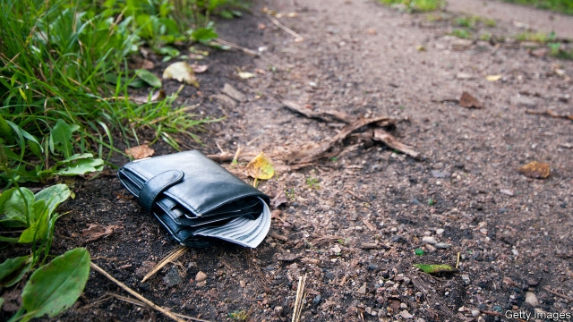

###### Behavioural economics

# People are more honest than they think they are 

 

> print-edition iconPrint edition | Science and technology | Jun 22nd 2019 

IMAGINE THAT you found a wallet in the street containing a stranger’s contact details but no cash. Would you go out of your way to return it to its owner? Now imagine that the same wallet contained a few crisp banknotes. Would that alter your response? Does it depend on the amount of money? And how do you think other people would react in similar circumstances? 

Honesty makes the world go round. Without people trusting in one another, at least to a certain extent, society would fall apart. Honesty is therefore studied academically. Most work in the area, though, takes place under controlled conditions in laboratories. Moreover, it often features well-off and well-educated Westerners as its subjects. By contrast Alain Cohn of the University of Michigan and his colleagues have taken such behavioural economics around the world. And 40 countries, 355 cities and more than 17,000 people later the results are in for their survey of civic honesty in the wild. 

As the team report this week in Science, from Canada to Thailand and from Russia to Peru Dr Cohn’s research assistants entered public buildings like banks, museums and police stations. They handed in a dummy wallet to an employee in the reception area, saying they had found it on the street outside, before making a hasty exit. Each wallet was a see-through plastic card case containing three identical business cards (with a unique email address and a fictitious native man’s name), a shopping list (in the local language) and a key. Crucially, some wallets also included $13.45 in the local currency, while some had no cash. Then, the team simply waited to see who would email the “owner” about returning the wallet. 

In 38 of the 40 countries, the wallets with money in them were returned more often than those without (51% of the time, compared with 40% for the cashless). While rates of honesty varied greatly between different places (Scandinavia most honest, Asia and Africa least), the difference within individual countries between the two return rates was quite stable around that figure of 11 percentage points. In addition, wallets containing a larger sum of money ($94.15) were even more likely (by about another ten percentage points) to be returned than those with less, although the “big money” experiment was done in only three countries. 

With greater temptation, then, comes greater honesty—at least when it comes to lost wallets and petty cash. Intriguingly, though, such personal probity is not reflected in people’s expectations of their fellow men and women. When Dr Cohn and his team surveyed a sample of 299 (admittedly exclusively American) volunteers, most respondents predicted that the more money there was in a wallet the more likely it was that it would be kept. They also asked the question of 279 top academic economists, who did only marginally better than the man or woman in the street at getting the answer right. 

A certain cynicism about the motives of others is probably good for survival, so the response of the general population may be understandable. But the warm inner glow derived from “doing the right thing” is also a powerful motivator. How this altruism evolved is much debated by biologists and anthropologists—particularly when it extends, as in Dr Cohn’s experiments, to strangers whom the altruist has no expectation of ever meeting. Be that as it may, as this study shows, such altruism is real and universal. The study also suggests, from the responses they gave, that quite a few economists have not yet truly taken this point on board.◼ 

