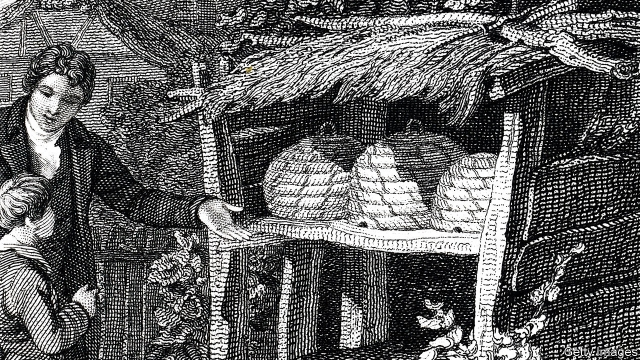

###### Beekeeping

# Stopping bees swapping hives keeps disease down and productivity up 

 

> print-edition iconPrint edition | Science and technology | Jun 22nd 2019 

MUCH GUFF has been written in recent years about the risk of honey bees disappearing. They are not—which is hardly surprising, because unlike most other insects they are domesticated animals and their numbers are therefore controlled ultimately by human desire for the honey they produce and the pollination services they provide. Estimates by the UN Food and Agriculture Organisation suggest that, far from falling, the number of hives in the world is increasing by about 2% a year. 

This is not to say, however, that beekeepers have had it easy. A decade ago a mysterious phenomenon called colony-collapse disorder, in which worker bees deserted hives for no apparent reason, struck apiarists in Europe and America. More prosaically, crowding brought about by domestication can promote disease. A particular risk is Varroa destructor, a parasitic mite that has been spreading through the world’s hives since the 1970s. The mites themselves suck body fat from their hosts. They also carry a virus that affects bees’ development, deforming the insects’ wings. 

Travis Dynes of Emory University, in Atlanta, Georgia, and his colleagues may, however, have found a straightforward way of improving bees’ prospects in mite-infested areas. In a paper published in PLOS One they report on a study carried out in apiaries around Athens, Georgia, which did just that by changing the arrangement and appearance of their hives. 

Hives in apiaries are usually laid out a metre or less apart at the same height above the ground and in a regular grid formation. They are generally painted the same colour and usually have their entrances facing in the same direction. It has been suggested that this arrangement may confuse bees when they return from foraging trips, leading them to drift between their natal colony and others. If true, that would probably aid the spread of mites. 

Dr Dynes and his team therefore compared three conventional arrangements of eight hives with three others in which the hives were painted in different colours and arrayed in circles, with each hive ten metres from its nearest neighbours. The entrances of these hives faced outward from the circle and each bore a symbol, different from any of the others, to increase its visual distinctiveness. As a final touch, the hives were also raised to various heights above the ground. 

To understand better what was happening, Dr Dynes and his colleagues marked a representative sample of the workers in each hive with individually numbered tags. The result was a clean sweep for the new arrangements. Their bees drifted less between hives, supported fewer mites, produced more honey and survived the winter better than their conventionally housed counterparts. 

How easy it will be to translate Dr Dynes’s insights into the world of commercial beekeeping remains to be seen. Apiarists maintain hives at high density for good reason—they may have to manage hundreds in a limited area. But even if they cannot compromise on density, there is nothing to stop them painting their hives different colours, randomising hive’s heights and the orientations of their entrances, and marking them with symbols. If that helps defeat mites, the effort involved will surely have been worthwhile.◼ 

