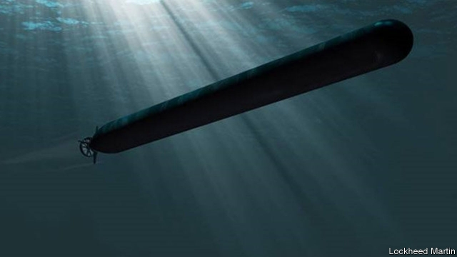

###### Clandestine warfare

# Submarine-launched drone platoons will soon be emerging from the sea 

 

> print-edition iconPrint edition | Science and technology | Jun 22nd 2019 

USING SUBMARINES to land spies and launch raids is nothing new, but America’s navy is planning to add a twist to the idea by employing drones as the spies and commandos in question. Heterogeneous Collaborative Unmanned Systems (HCUS), as these drones will be known, would be dropped off by either a manned submarine or one of the navy’s big new Orca robot submersibles. They could be delivered individually, but will more often be part of a collective system called an encapsulated payload. Such a system will then release small underwater vehicles able to identify ships and submarines by their acoustic signatures, and also aerial drones similar to the BlackWing reconnaissance drones already flown from certain naval vessels. 

Once the initial intelligence these drones collect has been analysed, a payload’s operators will be in a position to relay further orders. They could, for example, send aerial drones ashore to drop off solar-powered ground sensors at specified points. These sensors, typically disguised as rocks, will send back the data they collect via drones of the sort that dropped them off. Some will have cameras or microphones, others seismometers which detect the vibrations of ground vehicles, while others still intercept radio traffic or Wi-Fi. 

HCUS will also be capable of what are described as “limited offensive effects”. Small drones like BlackWing can be fitted with warheads powerful enough to destroy an SUV or a pickup truck. Such drones are already used to assassinate the leaders of enemy forces. They might be deployed against fuel and ammunition stores, too. 

A week-long demonstration of HCUS is planned for later this year. It will test covert deployment, the transfer of data, automatic recharging and the placing of ground sensors. It will culminate in a “remote operator on-demand offensive attack on a simulated target”. 

Unmanned systems such as HCUS thus promise greatly to expand the scope of submarine-based spying and special operations. Drones are cheap, expendable and can be deployed with no risk of loss of personnel. They are also “deniable”. Even when a spy drone is captured it is hard to prove where it came from. Teams of robot spies and saboteurs launched from submarines, both manned and unmanned, could thus become an important feature of the black-ops of 21st-century warfare.◼ 

