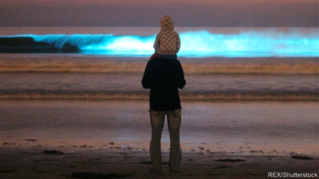

###### Dinoflagellates and copepods

# The bioluminescence people find so attractive is a defence mechanism 

 

> print-edition iconPrint edition | Science and technology | Jun 22nd 2019 

ONE OF NATURE’S most beautiful phenomena is the nocturnal bioluminescence visible in the world’s oceans, particularly on shores where waves are breaking and in the wakes of moving objects such as swimmers and ships. This ghostly light is produced by single-celled planktonic creatures called dinoflagellates. Ironically, dinoflagellates are also responsible for one of nature’s nastiest phenomena—red tides. These are water-discolouring, toxin-generating blooms of the organisms. The toxins kill fish and other large wildlife. And they accumulate in filter-feeding bivalve molluscs of the sort that end up on dinner tables, to the serious detriment of the diner. 

Toxin-generation is clearly defensive. The purpose of bioluminescence is less clear. But many of those who think about such matters suspect that it, too, has a defensive purpose. And work just published in Current Biology by Erik Selander and Andrew Prevett of Gothenburg University, in Sweden, confirms that hypothesis. 

Dr Selander and Mr Prevett conducted their experiments on Lingulodinium polyedra, a common dinoflagellate. They raised, in tanks, several colonies of a strain of L. polyedra that is unable to produce defensive toxins. These tanks also contained colonies of other species of plankton, thus creating mixed communities. In some cases, the researchers tinkered with the dinoflagellates’ internal biological clocks, to rob them of their ability to glow during the experimental period. In some, they let the critters luminesce normally. And to some of these normally luminescing cultures they also added a fat called copepodamide to the water. This substance is produced by small crustaceans called copepods that often graze on dinoflagellates. Then, once all the colonies were flourishing, they unleashed some copepods on them. 

They expected the copepods to gobble up the toxin-free dinoflagellates quickly. And this proved true in those colonies where the creatures had been robbed of their luminescent abilities. While L. polyedra made up only a quarter of the possible prey items in these colonies, they constituted three-quarters of the copepods’ diets. By contrast, in colonies where L. polyedra were able to glow normally, the dinoflagellates formed only a quarter of the copepod diet. Meanwhile, in the third set of colonies—those in which the dinoflagellates had been primed to the presence of copepods by exposure to copepodamide—they flashed brightly as the copepods approached, and in doing so drove the crustaceans instantly away. In this case L. polyedra made up only 2% of copepods’ diets. 

Precisely why a bright flash drives copepods away is unclear. The simplest explanation is that it blinds them temporarily, and they did not wish to repeat the experience. Another suggestion is that the flashes attract predators of copepods. Whatever the details, though, the likely explanation for the bioluminescence caused by waves, swimmers and ships is that the pressure their passage generates triggers anti-predator flashes on a grand scale, and that the light which people find so attractive is thus actually a warning to scram.◼ 

