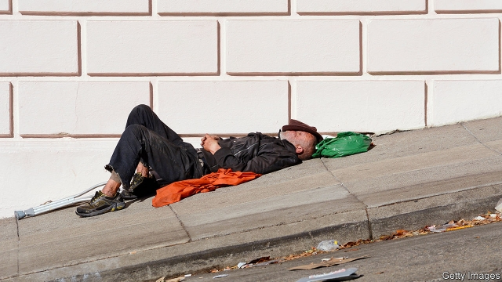
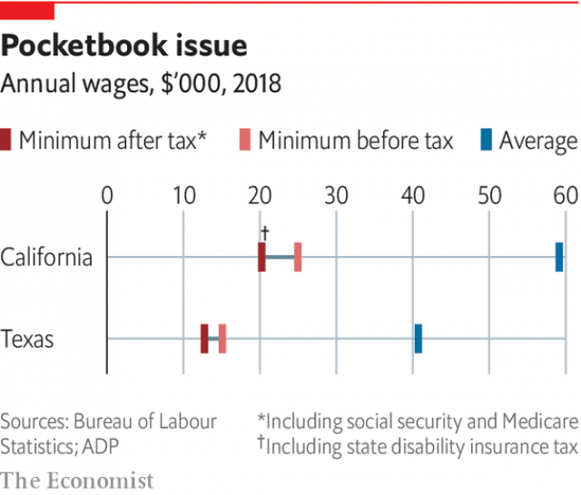

###### Welfare

# California and Texas are both failing their neediest citizens 

 

> print-edition iconPrint edition | Special report | Jun 22nd 2019 

TEXAN LEADERS are proudly thrifty. They also believe that cowboy boots are a legitimate fashion choice and that bootstraps are tools by which people should pull themselves up. Visitors to the website of the department overseeing welfare are encouraged to share their ideas for cost savings. Texas’s constitution, unusually, specifies a spending cap on aid for poor families and children (at 1% of the annual budget). “It seems like California measures success by the number of people who are dependent on government programmes,” quips Greg Abbott, the governor. “We define success by the number of people who are employed.” 

California’s official poverty rate is 13% and Texas’s is 14%, putting them in the middle of the national range. However, after factoring in the cost of living, the Lone Star State’s poverty rate is nearly 15%, the tenth-highest. The Golden State, at 19%, has the highest. The huge gaps between the wealth of the top 5% and bottom 20% make California the second most unequal state after New York, with Texas in tenth place, according to the Centre for Budget and Policy Priorities (CBPP), a think-tank. 

California’s poverty rate is high despite heavy investment to counter it. It has 38% more people, but its spending on public welfare is 120% higher than Texas’s. However, the cost of living in California is 40% higher than the national average, whereas in Texas it is around 9% below the average. Housing is the primary culprit, responsible for around 80% of the higher cost of living in California. Around one in three Californian renters spends at least half their income on rent. “In California it’s harder to make it on your own, but there are supports,” explains Heather Hahn of the Urban Institute, a think-tank. “In Texas you may be better able to make it on your own because it is cheaper to live, but if you can’t, there’s less of a safety-net there for you.” 

Both states accept federal funds for social-welfare programmes, including the Supplemental Nutrition Assistance Programme, which provides food stamps to the needy. “Texas is pragmatic,” explains Ken Miller of Claremont McKenna College. “It’s willing to accept a dollar if the federal government wants to give it a dollar, but it isn’t willing to follow a government mandate.” California goes further, supplementing many federal programmes with money of its own, whereas Texas mostly does not. 

The two states’ safety-nets differ in three significant ways. One concerns handouts. In Texas cash welfare is almost non-existent. That is because the Temporary Assistance for Needy Families (TANF) programme, which is mostly federally funded, gives latitude to states in their spending. After welfare reform in 1996 many states started putting more TANF money towards programmes other than cash welfare, but Texas has been particularly zealous, diverting most such funds to pre-kindergarten, child-welfare services, pregnancy-prevention efforts and more. In Texas only around 6% of TANF funding goes to cash welfare, which means that in 2016-17 only 4% of poor families with children in Texas received a cheque, compared with 23% nationally and 65% in California, according to CBPP. California, on the other hand, heavily supplements federal TANF funding with billions of dollars and spends around 40% on cash assistance. 

A second way the states differ in their treatment of the poor is in their approach to redistribution through taxation and wages. California’s progressive tax regime, with a high personal-income tax on the wealthy, leans heavily on the rich. California also offers a state-level earned-income tax credit, which in 2018 gave around $400m to poor people who are working but fall below a certain threshold. It is one of the most effective poverty-alleviation tools available and encourages people to work. Texas does not offer it. 

 

California also believes that paying people more will help them out of poverty and has pushed up the minimum wage, to $11 an hour this year and $15 by 2023. Texas follows the federal minimum wage, which is $7.25, and has fought cities’ attempts to raise it, as Austin and San Antonio have tried. This plays into a larger stand-off between liberal cities, which want progressive policies such as higher wages and paid sick leave, and the more conservative legislature, which has moved to limit cities’ freedom to craft their own policies. “Local control used to be a principle of state government. But we’ve gone from local control to controlling the locals,” says Evan Smith, head of Texas Tribune, a non-profit news organisation. 

A third difference in state policies toward the poor is in access to health care. Under the Affordable Care Act, states can extend health-care coverage to a larger share of their poor, uninsured citizens, with the federal government picking up 90% of the bill. California did this and its uninsured rate dropped from 17% in 2013 to 7% in 2017. Texas sued the federal government and did not expand the share of those covered by Medicare through Obamacare. Today its uninsured rate is over 17%, the highest in the country. Texan politicians did not trust the federal government always to foot such a large share, says Mark Jones of Rice University. Whatever the rationale, its decision has hurt the poor, who could have had access to subsidised health care were they living in another state. 

Which state’s approach better serves citizens? Neither is helping all the people who need it. Poverty anywhere can feel hopeless, but in Texas it can be especially bleak. In parts of the Rio Grande Valley in southern Texas, one of the country’s poorest regions, more than 40% of children live in poverty. “There are gaping holes in the social-safety net, with so many falling through them,” says Traci Wickett, president of the United Way of Southern Cameron County, a non-profit group that works in the Rio Grande Valley. Nearby are many colonias, unincorporated slum-like areas where the poor live, lacking running water and sewerage. 

Without state intervention, California’s poverty would be even more acute. Around 35% of Californian children would have been poor without social-safety net programmes, compared with the actual rate of 21%, according to the Public Policy Institute of California. Children who grow up in homes that qualify for food stamps and health coverage for the poor under Medicaid are more likely to be healthy and achieve higher educational levels and higher incomes. Those whose households qualify for the earned-income tax credit are more likely to go to college and earn more themselves. These outcomes are not only good for families but also for taxpayers, because they translate into more taxes paid, says Heather Hoynes of the University of California at Berkeley. 

The first term of Gavin Newsom, California’s governor, will test how much bigger and stronger California can weave its socialsafety net. He is expanding funding for many programmes, including subsidised child care, affordable housing and tax credits for the poor, and has expressed support for universal health insurance for all Californians. Such insurance would cost $400bn, about double the state budget, according to the Legislative Analyst’s Office, making it fiscally impossible. Mr Newsom must also grapple with homelessness, as around a quarter of the country’s homeless live in the state. The success of his governorship will be judged by how much he can relieve the primary reason for residents’ economic struggles, which is the cost of housing. 

During economic booms like the one California has been enjoying, it is politically appealing to expand social services. For example, some in the state want to offer health care to poor immigrants of all ages, regardless of their immigration status, which would cost around $3bn a year. But doing this could “demolish” the discretionary spending that needs to go to the university system, courts, parks and other social services, points out David Crane of Govern for California, a non-partisan group. And demand for social services will increase when the economy falters, which is precisely the time when the state’s tax collections fall. 

For Texas the main question is whether the state’s low-touch model will have to bend as people demand more of their government. Mr Abbott has made resisting the Affordable Care Act and other Obama-era policies a pillar of his political career. However, some pragmatic Republicans think it is in the state’s and their party’s interest to expand health-care coverage for the poor. Those without health insurance end up in hospital, leaving taxpayers to foot the bill. Ed Emmett, a Republican who served as county judge for Harris County, which includes Houston, supported Medicaid expansion, because a quarter of all local property taxes go to health-care costs. “Why should the property-taxpayers in Harris County pay for indigent health care when the federal government will pay for it?” he asks. Liberals and fiscally minded conservative voters may push Texas towards change. According to Mr Miller, health care could become a “political flashpoint”, where the “conservative model will have to yield”. ◼ 

