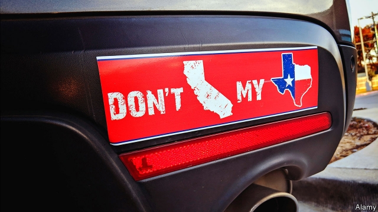
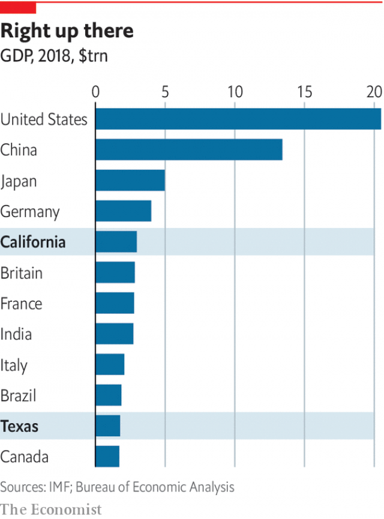
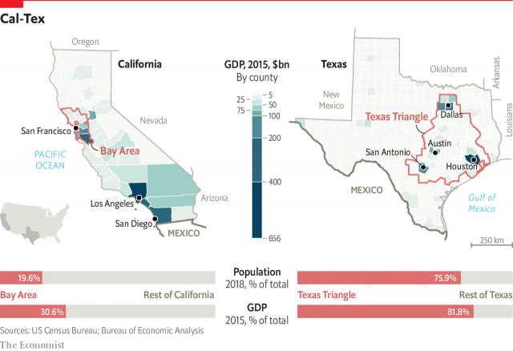

###### California and Texas

# California and Texas have different visions for America’s future 

 

> print-edition iconPrint edition | Special report | Jun 22nd 2019 

IN TEXAS AN unexpected enemy gets a lot of attention. In a television ad for lieutenant-governor that aired last year, Dan Patrick, the winning Republican candidate, looked sternly at the camera and warned of a grave danger. “Truth is, Democrats want to turn Texas into California,” he said. “Well, I’m not about to let that happen. What about you?” United in concern is Greg Abbott, Texas’s Republican governor. He predicts that excessive regulation could turn “the Texas dream into a California nightmare”. “Don’t California my Texas” has become a rallying cry for Republicans in the Lone Star State. You can even buy the bumper-sticker. 

Some competitive jousting between the two is inevitable. California, with 40m inhabitants, and Texas, with 29m, are the states with the largest populations, with more than one-fifth of Americans claiming them as home. They also have the biggest economies. If they were countries, they would be the fifth- and tenth-largest in the world (see chart), with around $3trn and $1.8trn in GDP, respectively. 

Texas is the country’s largest exporter, and California claims the number-two spot. In the past 20 years nearly a third of American jobs were generated in just these two states. Combined, they account for around a quarter of American GDP. They educate nearly a quarter of American children, so their investments in, and approach to, public education directly affects national competitiveness. Both states are booming, too. Between 2010 and 2018 two of the three fastest-growing metro areas in America were in Texas: greater Dallas and Houston each gained more than 1m people. The state has a robust oil and gas industry and has succeeded in diversifying its economy. California enjoys the many fruits of the technology boom, a rising stockmarket and some of America’s best universities. 

But the two states matter just as much because of the opposing visions and models of government for which they stand. Indeed their rivalry is often an expression of these differences. California is the standard-bearer for progressive experimentation nationally, spearheading policies to deal with climate change, gay rights, the decriminalisation of drugs, paid family leave, inclusive immigration and more. Since Donald Trump assumed office, California has become a state of resistance, suing the federal government around 50 times. It is the country’s largest blue state, where the share of registered Republicans is at a historic low and Democrats control all three branches of government. Its model can be summed up as high taxes, high services and high regulation. California sees a strong role for government and leans heavily on its affluent residents to fund a social-safety net. 

 

Texas, by contrast, has been socially conservative for decades. Although Democrats made gains in the state legislature in 2018, no Democrat has been elected to statewide office for more than 25 years. Its model is low taxes, low services and low regulation. “Govern wisely and as little as possible,” is how Sam Houston, who served as the first president of the Republic of Texas in 1836, described the state’s light-touch philosophy. Serious about avoiding government overreach, the legislature meets only every other year. In 2017 Texas ranked 49th out of 50 in spending per person, shelling out around $3,925 per citizen, 52% less than the national average and 68% less than California. 

Demographically, both states are already living America’s future. Their non-white populations started to outnumber their white ones long ago; California became a “majority-minority” state in 2000, Texas in 2005. Today they are both around 40% Hispanic, more than double the national share. With fast-growing, young and ethnically diverse populations, what California and Texas look like today is what the country will look like in 2050. According to Stephen Klineberg, a professor at Rice University in Houston, “states like California and Texas are where the American future is going to be worked out.” 

Both states have vulnerabilities. “The key question for California is how much a state can take on, and with Texas it is about how little a government can continue to take on,” says Ken Miller of Claremont McKenna College. Their differences can be seen in dramatic and subtle ways. To fund its operations, California levies one of the highest income taxes in America. By contrast, Texas’s constitution forbids a state income tax. Unions are a mighty force in Californian politics and workplaces, but Texas is what is known as a “right-to-work” state, meaning that employees do not need to belong to a union, so such infrastructure is weak. 

California probably has the strongest environmental regulations in the country, whereas Texas nurtures its oil and gas industry and regards nature as something to be subdued. It puts minimal restrictions on keeping exotic animals as pets, which is why there are believed to be more tigers in captivity in Texas than in the wild in India. 

Their leaders embody the two states’ divergent philosophies. California’s governor, Gavin Newsom, who took office in January, is a former mayor of San Francisco, best known for legalising gay marriage in 2004 and sparking a national social movement. The governor of Texas, Greg Abbott, is a staunch social conservative who formerly served as the state’s attorney-general and is proud to have sued Barack Obama’s administration 31 times over policies including health care and environmental regulations. 

Earlier this year Mr Newsom ordered a moratorium on the death penalty, around the same time that politicians in the Texas legislature were debating whether to start providing air-conditioning in prisons during the sweltering summer—an expensive creature comfort, in the eyes of some. Since 1976 Texas has executed more prisoners than any other American state and around five times more than second-placed Virginia. 

 

Their independent natures can be partly explained by history. Tellingly, Texans celebrate 1836 as their founding year, when the state became independent from Mexico after an armed insurrection, not 1845, when Texas officially became an American state. At the time slaveholding Texas received an ambivalent welcome into the nation, which was worried about the balance between states that permitted slavery and those that did not. California, which had also been a part of Mexico before it joined America in 1850, never allowed slavery, which meant it was more warmly welcomed. This experience shaped its political attitudes. Its distance from Washington, DC, fuelled its ability to experiment. 

Both states used to be supportive of the other political party. Republicans won California in nearly every presidential election between 1952 and 1988, and Ronald Reagan served as governor there before he became president. The state’s politics swerved in response to its growing population of immigrants, who were troubled by Republicans’ intolerant rhetoric and policies. Texas used to be strongly Democratic and produced Lyndon B. Johnson, who became president after John F. Kennedy was assassinated in Dallas. Mr Johnson’s legacy includes launching many of the programmes that Texan politicians today scorn, including the war on poverty and federally funded health care for the poor and elderly. His commitment to social services and civil rights helped hand his state and the south to Republicans. 

Americans and immigrants have for decades travelled to both states to build their future unencumbered by tradition. The “Texas Triangle”, formed by the four large cities of Austin, Dallas, Houston and San Antonio, accounts for three-quarters of the state’s population, has been responsible for three-quarters of its population growth since 2010, and produces 82% of its GDP. 

The threat of Texas becoming California, as the Lone Star State’s leadership fears, is exaggerated. However, it raises the question of which pole America will turn towards—the progressive left represented by California or the right represented by Texas. “The fact that America can contain two such assertive, contrary forces as Texas and California is a testament to our political dynamism, but more and more I feel that America is being compelled to make a choice between the models these states embody,” writes Lawrence Wright in his book “God Save Texas”. “Under the Trump administration, Texas is clearly the winning archetype.” 

That may not hold for ever. Texas is already changing. “Outsiders think Austin is a blue bubble and the rest of Texas is tumbleweeds,” says Ann Beeson of the Centre for Public Policy Priorities, a left-leaning think-tank. “People have a huge misunderstanding of how giant, progressive and diverse our cities are.” 

Nor should California, which frequently creates political winds that then sweep across the country, be discounted. It experienced an anti-tax backlash in the 1970s and an anti-immigrant push in the 1990s, both of which spread nationally. It legalised abortion six years before Roe v Wade, the historic Supreme Court decision, in a bill signed by Reagan, then governor. “So much of what we aspire to as a country resides in California,” says Austin Beutner, a former businessman who is superintendent of Los Angeles Unified School District. “Laws go east to west. Values go west to east.” 

Much of America’s future rides on California’s and Texas’s success. This special report will look in detail at how the states are approaching business, taxation, public education, social welfare, the environment, and policies toward immigrants. It will ask which state’s model is likely to prove more fruitful in the long term. “There are 50 labs in the United States, and you can watch the California and Texas experiment,” says Ross Perot junior, a successful Texan businessman. “That’s the American way.” ◼ 

