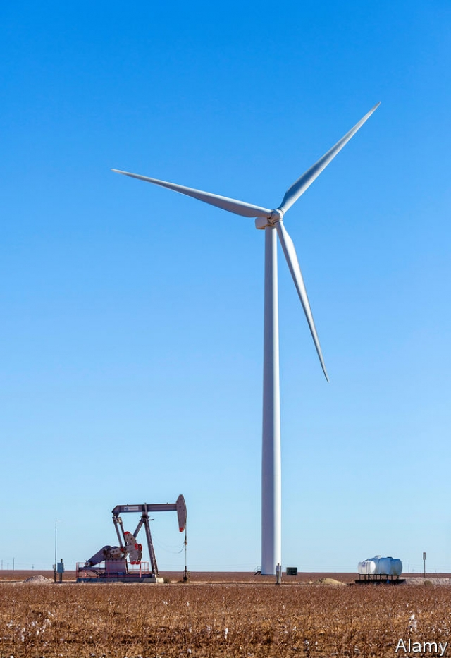

###### The environment

# California is a leader on environmentalism 

 

> print-edition iconPrint edition | Special report | Jun 22nd 2019 

VISITORS TO THE Capitol in Sacramento, the seat of California’s state government, confront an 800lb grizzly bear outside the governor’s office. The bulky bronze statue of the official state animal showcases California’s environmental focus, which sadly developed only after the last remaining grizzly was shot nearly a century ago. The state’s environmentalism has produced many benefits. Its high standards for energy efficiency, for example, have helped to bring more fuel-efficient cars and fewer carbon-intensive products to the rest of the country.  

In 2006 California established the first comprehensive greenhouse-gas regulatory programme in America and has adopted more zealous targets to reduce emissions than many signatories to the Paris Agreement, from which America withdrew. “We have stepped in on climate change where the federal government has stepped away,” says the governor, Gavin Newsom. California’s leadership on the environment has won it kudos, but it has also exacerbated the housing shortage and high cost of living. 

The California Environmental Quality Act (CEQA), which requires state and local agencies to review the environmental impact of new projects, is one example. Signed into law in 1970 by the then governor, Ronald Reagan, CEQA initially applied to public-works projects, but later expanded to housing. Today those opposed to new development can bring CEQA lawsuits, holding up projects for years and adding to developers’ costs, which are subsequently passed on to consumers. Even a top adviser to Mr Newsom says that CEQA “is the standard-bearer for what’s wrong with California”.  

Some of the state’s other standards for reducing greenhouse-gas emissions contribute to higher housing costs. Many new homes are required to install solar panels, and construction is encouraged near transit hubs, where units are more expensive than less-dense housing farther away from job centres. 

California’s environmental efforts have contributed to higher costs for other living expenses, too. Petrol prices are the highest in America, around 40% above the national average, because the state requires a unique formulation for cleaner fuel that only a handful of refineries can produce. This falls disproportionately on the less affluent, who often live far away from their jobs and public transport. Meanwhile, residential and industrial electricity rates in California are 50% and 75% more than the national average. Cheaper power makes other states, such as Texas, more attractive for manufacturers and heavy users of electricity. California counts people and firms that move elsewhere as carbon reductions in its statistics, even though they are moving to states with higher emissions, says Jennifer Hernandez of Holland Knight, an environmental-law firm. 

Texas is the country’s number one producer and consumer of energy, and environmentalism is not part of its brand. But change might not be impossible. In the 1990s, under Ann Richards and George W. Bush as governors, the state made efforts to reduce pollution and encourage renewable energy. In 1999 Texas deregulated the electricity market, which promoted competition, reduced prices and set targets for renewables. The state has retired coal plants and become the leading producer of wind power in America. 

The business community is increasingly concerned about climate change, says Brett Perlman of the Centre for Houston’s Future, a think-tank. This is especially true in Houston, where Hurricane Harvey caused $125bn in damage in 2017. Even oil companies are investing in wind and solar power as it has become cheaper. But plenty of Texan politicians are still wedded to a conservative ideology and a Republican-voting public that rejects the idea of global warming. Asked if he believes climate change is a problem, Greg Abbott, the governor, replies cryptically: “It’s a fact that the climate has changed in the last decade and the last 10,000 years. The climate is constantly changing.”  

