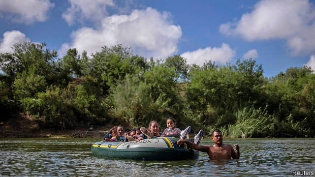

###### Immigration

# Immigration shapes the politics of California and Texas 

 

> print-edition iconPrint edition | Special report | Jun 20th 2019 

SEVERAL THOUSAND feet up in the air, under the deafening whirr of the rotor blades of a helicopter belonging to Texas’s department of public safety, your correspondent found it easy to lose track of which country she was flying over. Much of the border between Texas and Mexico is the Rio Grande river, and the land on both sides looks similar. There is, however, one unmistakable clue: the direction of those crossing the river. Even in broad daylight, small groups of people are wading, swimming and rafting across. It is a one-way flow of human traffic. 

The different philosophies of California and Texas, which were both once part of Mexico, can be summed up by what they do on their southern border. California’s governor, Gavin Newsom, recently withdrew several hundred National Guard troops from southern California in a symbolic protest at President Donald Trump’s hardline stance on immigration. Texas, by contrast, spends $400m a year of its own money to police the border. This investment has been essential in reducing crime in the Rio Grande Valley, says Steven McCraw, who is in charge of the department of public safety. 

For much of the past century immigration has spurred economic prosperity in the country as a whole, and in California and Texas in particular. Around five in ten workers in Texas were not born there. Half of those came from another American state, and half from overseas. Texas and California have the largest share of undocumented immigrants in the country, an estimated 3.8m, or 36% of those nationwide. 

According to the Pew Research Centre, a think-tank, in 2016 undocumented immigrants accounted for 6% of the two states’ total population and 8.5% of their workforce, filling vital jobs in industries like agriculture and construction. The number of people coming across the border has declined from a peak of around two decades ago, but recently there has been an uptick. In May more than 144,000 people were apprehended in the south-west border region, the most since 2007. 

As America has become polarised over immigration, politicians in California and Texas have staked out different public positions. No state has gone further than California to demonstrate support for immigrants, both legal and undocumented, who together account for around a quarter of the state’s population. California has declared itself a “sanctuary” state, which means it limits contact between its own law-enforcement officials and federal immigration authorities. (This designation prompted Mr Trump’s administration to sue, but California’s policy was upheld in an appeals court.) 

It is one of a few states to offer driving licences and preferential in-state tuition rates at universities regardless of immigration status. It already offers health coverage to undocumented children, and is set to become the first state to extend it to undocumented adults. 

Texas has taken a harsher stance. Dan Patrick, the lieutenant-governor, has described illegal immigration as an “invasion”. Many Texan leaders “were Trumpy before Trump”, says Matt Barreto of Latino Decisions, a polling firm, pointing out that their harsher stance on immigration began with the rise of the conservative Tea Party, which predated Mr Trump’s election in 2016. 

Since then heated talk about immigration has only become hotter. In 2017 Texas passed a controversial law that, in effect, bans sanctuary cities and gives law-enforcement officials the right to ask people they arrest or detain to show papers confirming their citizenship. More recently Texas led several states in a lawsuit to end a federal programme that provides a path to citizenship to the American-born children of immigrants, a policy known as Deferred Action for Childhood Arrivals (DACA). 

This year state officials were involved in a controversial voter purge after they identified 100,000 supposed non-citizens and urged local officials to investigate and remove them from voter registries, even though that list included naturalised citizens. (The action was successfully challenged in court.) Mr Patrick has gone so far as to say that Texas would consider building Mr Trump’s border wall on the federal government’s behalf, as long as the state were reimbursed. 

Neither state has always maintained its current political stance. The governorships of George W. Bush and Rick Perry in Texas were marked by tolerance, as well as outreach to, and support from, Hispanics. Under Mr Perry, Texas was the first to extend in-state tuition rates at universities to immigrants regardless of their citizenship status. Today such moderate Republicans are like cowboys—symbols of an earlier, simpler era. 

California’s own volte-face on immigration is a cautionary tale. In the 1990s California led the country in anti-immigrant rhetoric. In 1994 Pete Wilson, a Republican governor, led a campaign for Proposition 187, which limited undocumented immigrants’ access to public services and required public workers to report them. The campaign’s name, “Save Our State”, or “SOS”, captured its zealotry. Voters approved the proposition by a wide margin. Although it was later gutted by judicial and political decisions, its impact was long-lasting. Hispanic voters, who had previously been unengaged, became politically mobilised and turned on the Republican Party for its perceived racism. 

Some think that Texas may be heading for its own Wilson moment. Greg Abbott, Texas’s governor, says that the state’s political rhetoric is not “anti-immigrant”, just “anti-illegal immigrant”, but many Hispanics and others in Texas hear something harsher. “The way they talk raises the hackles of immigrants of all stripes,” says Ed Emmett, a Republican former Harris County judge. Such rhetoric led more Asian immigrants, who had been keen supporters of the Republican party, to vote for the Democrats in the election of 2018, says Mark Jones of Rice University in Houston. 

Hispanics, who have been a latent political force in Texas, could also be mobilised. Around 46% of the country’s registered Hispanic voters live in Texas and California. There will be 32m eligible Hispanic voters nationwide in 2020, surpassing African-Americans for the first time. One political asset California has that Texas lacks is a strong union infrastructure, which mobilised Hispanics. Community-based organisations in Texas will have to fill that hole if there are to be big rises in registration and participation. 

In today’s political climate many Hispanics may feel that it is the Democrats who have their best interests at heart. There was record Hispanic participation in the elections of 2016 and 2018 in Texas, in part because of Mr Trump’s rhetoric on immigration. Democrats are hopeful they will be able to win over more Hispanic voters. For two decades Texas has been red with pockets of blue, but that started to change in 2018, and the Democrats are hoping to win more ground in 2020. 

Changing demography and the possibility of evolving voter preferences help explain why another event in 2020, the census, has taken on great importance. The once-a-decade tally of citizens is used to apportion resources and political representation among states according to population size. This could mean a meaningful boost to federal funding and extra seats in the House of Representatives for California and Texas, but that depends on their populations being counted accurately. “An inaccurate census count could cost California billions,” says Xavier Becerra, the state’s attorney-general, who sued the federal government over whether it can include a question on citizenship status, which might discourage people from taking part. 

California has invested $150m in doing outreach and ensuring an accurate count, whereas Texas has spent nothing. Some think that Texas’s leaders are willing to undercount their immigrant populations, even if it means forgoing federal funding and representation, because any extra seats in the House of Representatives would probably go to Democratic districts. Both states’ once-a-decade redistricting plans will also be undertaken according to where populations are clustered, so a census that counts more recent immigrants could alter the status quo in Texas. 

Though both states have staked out different positions on immigration control, the power they hold is limited. Federal funding that could stop drugs and criminals from entering America from the south has been stalled by arguments over the need for a wall. Only the federal government can set the numbers and types of immigrants who are lawfully allowed to enter each year, and policies have been in limbo because of the debate about the wall. 

DACA, for example, is ensnared in a legal fight, and its future is unclear. “No one is getting the emotional drain on people,” says the boss of one of Silicon Valley’s largest firms, who thinks the “overhang of uncertainty” on immigration is hurting the business environment by making it harder to hire immigrants. 

In Texas businesspeople are also rooting for a revamped national immigration policy that would allow more immigrants to work lawfully. The last big immigration bill was passed in 1986 when Ronald Reagan was president, and a smaller bill in 1990, but more recent bipartisan attempts at federal immigration reform have been defeated. “What would cause Texas to really boom is a good immigration bill,” says Ross Perot junior, a businessman, who believes a shortage of workers is the biggest constraint on building. 

The Dallas area, for example, is short of at least 20,000 workers, which causes delays of around two months and an additional cost of $6,000 for every new home, according to the Dallas Builders Association. A report by the Centre for Houston’s Future calculated that allowing for more immigration could result in $67bn more in GDP by 2036, around one-sixth of Houston’s economic output. 

Immigration and climate change are two areas where chief executives and Texas’s political leadership are not seeing eye to eye. According to Evan Smith of the Texas Tribune, “There is more daylight between the business community and elected leadership than there has been in a long time.” ◼ 

