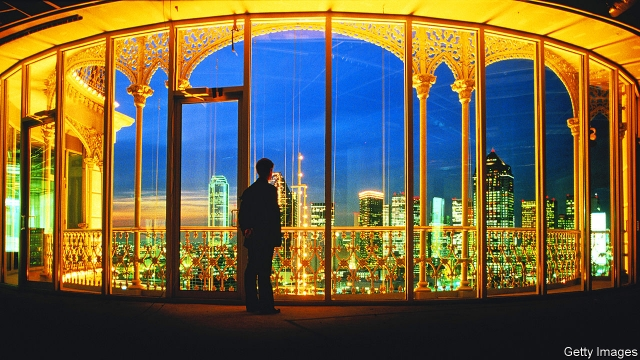
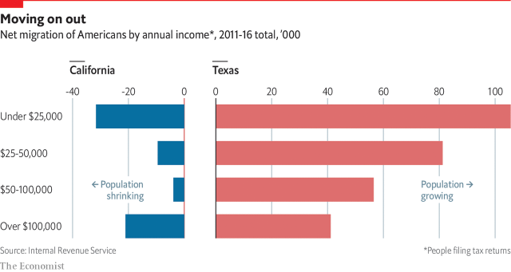

###### Business, tax and regulation

# Many people are moving from California to Texas 

 

> print-edition iconPrint edition | Special report | Jun 20th 2019 

“EVERYONE IS FROM California. Are they kicking y’all out?” asks a curious bureaucrat at the Department of Public Safety in Plano, a city near Dallas. In the previous week she had helped 20 people from California apply for a Texas driving licence. Those keeping score in the contest between the two states do not have to look far to notch up points for Texas. On the way to the state Capitol building in Austin to interview Greg Abbott, the governor, your correspondent discovered that her driver had recently relocated from southern California to start a family in a more affordable city. 

Between 2007 and 2016 a net 1m American residents, or 2.5% of the state’s population, left California for another state. Texas was the most popular destination, attracting more than a quarter of them. More Americans have left California than moved there every year since 1990, though immigrants still arrive from abroad. 

Companies are also moving. Last year McKesson, a medical-supplies company, and Core-Mark, a supplier to convenience stores, shifted their headquarters from California to Texas, as did Jamba Juice, a smoothie company. Many Californian firms are also adding jobs outside the Golden State. Charles Schwab, a financial-brokerage firm based in San Francisco, received more than $6m in incentives from Texas, and by the end of this year will have more employees there than in California. 

 

What explains the one-way traffic? There are four reasons for California’s weaker position. First, it has become very expensive, especially for housing. “If there’s one risk factor in this state, it’s affordability,” says Gavin Newsom, California’s governor. “The thing we most pride ourselves on—the California dream, a notion of social mobility that we export around the world—is in peril.” A third of Californians are thinking of moving out of state because of the high cost of housing, according to a recent survey by the Public Policy Institute of California, a non-profit research firm. Most of those leaving California for Texas earn less than $50,000 a year and have only a high-school education (see chart). 

The middle class is also struggling. In California home-ownership rates are at their lowest level since the 1940s and among the lowest in America, with black and Hispanic families particularly hard hit. In the past ten years around 75,000 new housing units received permits annually, only 40% of the projected need. “From the perspective of a young, upwardly mobile family, California is nearly impossible, unless you have rich parents, rob a bank, or get money from your firm going public,” says Joel Kotkin, a professor at Chapman University, who believes that the state is experiencing a new kind of “feudalism”, where the ultra-rich thrive and others suffer. 

As a symbol of how out-of-reach the once accessible state has become, last year the small house that was the setting for “The Brady Bunch”, a television show in the 1970s about a middle-class Californian family, sold for a whopping $3.5m, nearly double its asking price. Companies expanding elsewhere find that many employees are happy to give it a go in a state where they can afford to buy a house and raise a family. 

The states also have wildly different tax regimes, which is a second reason for Texas gaining favour as a destination. With a top rate of 13.3%, California has the highest state income-tax rate for top earners. Texas does not charge residents a state income tax. Instead, they pay higher property taxes to local governments, and the state gets most of its money from a sales tax. Because of recent changes to the tax code, residents of California and other high-tax states will no longer be able to deduct all of their state and local taxes from federal payments, which could further dampen people’s willingness to remain in the state. 

Taxes on businesses are increasing, too. In the past six elections California voters have approved more than 800 local taxes on businesses and residents, according to Larry Kosmont of Kosmont Companies, an economic advisory firm. (This does not include voters’ decision to raise the income-tax rate on the state’s highest earners.) For example, last year voters in San Francisco approved the controversial Proposition C, which taxes businesses with more than $50m in gross revenues to fund services for the homeless. Companies with fat profit margins can afford higher taxes, but lower-margin businesses cannot, and these are the ones most likely to consider an alternative location. 

Third, Texas has pursued a concerted strategy of wooing and cultivating businesses, whereas California has not. This began with Rick Perry, who served as Texas’s governor from 2000 to 2015. He travelled to California and other states on “hunting trips” to poach businesses, ran ads on radio encouraging people and companies to move, and offered large incentives to create jobs in Texas. Mr Abbott has continued with these pro-business policies and still operates a “deal-closing fund” to incentivise businesses to come. He is a cheerleader for his state’s advantages, including low costs, a central location with good airports and a convenient time zone for doing business with both coasts. He describes Texas as “the quintessential free-enterprise state”. 

California has not done enough to pursue an economic strategy of its own. “I think we rested on our laurels a bit. We put up our feet and talked about the old days,” admits Mr Newsom. Yet when governors from other states come to California to pitch a relocation, the state still does not intervene to retain companies, which sends the message that it is indifferent, says Barry Broome of the Greater Sacramento Economic Council. 

The reality of doing business in California, with heavy regulation across most industries, is a fourth disadvantage. For example, the state has some of the most burdensome occupational licensing requirements in America, even for low- and moderate-income jobs, such as tree-trimming. “It’s easier to do business in Cuba than San Francisco,” says the boss of one of the Bay Area’s most prominent tech firms, which operates in both places. CNBC, a news company that rates America’s states for business, has ranked Texas as first and California as 25th. California has a more educated workforce and stronger innovation, but when it comes to commercial “friendliness” and the cost of doing business, it is in last place and third-to-last place respectively. 

The heavy cost of regulation is evident in property and contributes to higher prices for homes. You can get a building permit within a few months in Texas, but it can take years in California, where the environmental-review process can be lengthy and lead to expensive lawsuits. “I’m an environmentalist, but it’s completely crazy what happens here. The planning commissions slow-walk everything,” says the boss of one of America’s largest technology companies, based in Silicon Valley. 

Red tape takes a toll on small firms, too. “If you have the balance-sheet to fight through it, you can make money, but you have to be big and well-capitalised to do business in California,” says Mr Perot. “A little guy can’t survive. That’s the irony of the politics.” Property projects that use public funds or subsidies, including below-market-value land for affordable housing, must pay “prevailing” wages for workers, which can add 15-25% to the total cost, says Mr Kosmont. This does not happen in Texas. 

The tech boom has created huge wealth disparities. Local anger and insistence on business contributing more to society could result in extra taxes and red tape. Already San Francisco is one of the few cities in America where “civic leaders openly flay their most successful progeny and throw so many roadblocks in front of young companies,” says Michael Moritz of Sequoia, a leading venture-capital firm. “It makes states and countries that roll out the carpet and offer a welcome to businesses exceedingly attractive.” Tools that Silicon Valley has produced, such as email, video conferencing and messaging, make it possible to work remotely, which will help more companies expand in less expensive states. 

So far the wealthy have accepted California’s tax increases without moving en masse. The state boasts many assets, including a long coastline, a global and educated elite, top-tier universities and a concentration of tech expertise. However, its long-term fiscal health is precariously balanced, because it relies on a small number of people to pay for an extensive system of benefits. The top 1% of taxpayers account for 46% of all personal-income tax and 35% of California’s general-fund revenues, according to Gabe Petek of the Legislative Analyst’s Office, an independent fiscal monitor. 

Because personal-income tax is the main source of revenue, California’s fortunes ride on the stockmarket’s performance. The state has the fifth most volatile tax system of any American state, according to the Pew Charitable Trusts (Texas ranks 21st). Facebook’s initial public offering in 2012, for example, alone contributed $1.9bn in tax to California’s coffers. In 2016 the state collected $1bn from a single zip code in Palo Alto. Such concentrated bounty can be welcome when times are good, but it leaves the state more vulnerable when the market falls. Today the state has around $20bn in reserves to withstand a slowdown, but even a mild recession would wipe that out within a single year, says Mr Petek. 

Texas must also cope with economic volatility. Its strong reliance on energy, which accounted for around 16% of its GDP over the past ten years, means global energy prices can drive the state’s prosperity. As its constitution bars income tax, Texas has few ways to stabilise revenues in bad times. “You have two legs of a stool—sales tax and property tax—and if you only have two legs, there’s a lot of teetering,” says Michael Hinojosa, superintendent of Dallas’s school district, which faced big cuts during the last downturn. 

In order to continue to thrive, California must make changes, like increasing affordable housing, generating more tax revenue from diverse sources and creating well-paid jobs. The state appears to be booming, but the gains are concentrated. Between 2007 and 2017 the Bay Area accounted for a third of new jobs and enjoyed 17% employment growth, against 7% for the rest of the state. 

“If California were divided into states, we’d have the richest state in Silicon Valley and the poorest state in the centre,” says Lenny Mendonca, director of California’s Office of Business and Economic Development. Regions like the Central Valley, east of San Francisco, are ailing. “We can’t be a great state if we’re two states,” says Michael Tubbs, the mayor of Stockton, a poor city in that area. In 2008 the city was America’s foreclosure capital. Today it has the dubious distinction of having the largest number of “super-commuters”. Around 30,000 people commute more than 90 minutes each way to work. 

According to Mr Broome, the state needs to develop a strategic plan and invest in a more robust economic-development agency to persuade companies to stay. In other words, California needs to adopt a pro-business attitude and strategy more like that of Texas. “We’re incorporating a lot of ideas from Texas, and we’re not just going to roll over any longer,” says Mr Newsom. In the future his administration will try to encourage businesses to relocate or expand to more affordable areas within the state. But it is not obvious that such a pitch will succeed. Costs are lower in places like the Central Valley, but they are even lower in other states. 

Mr Newsom has also asked his team to examine the licensing requirements for various occupations, so that California can reduce bureaucratic red tape. But more dramatic changes are required. “I don’t know that a week goes by where we’re not engaged in tax-reform discussions,” declares Mr Newsom. However, a major tax overhaul may not be politically feasible. Proposition 13, which caps the rate at which property taxes can rise, is why the state is so heavily reliant on personal-income tax. In 2020 voters will decide whether to exempt some commercial properties, which could lead to billions of dollars in extra tax revenue. But that alone is unlikely to solve the state’s precarious fiscal balance. 

Today Texas is better placed to grow than California, but that could change. Some firms worry that the state is not investing enough to retain its competitive edge. Texas has thrived by importing skilled Americans, but it needs to cultivate its home-grown workforce, too. “The private sector creates jobs but the public sector must provide the infrastructure to enable growth to occur,” says Tom Luce, a lawyer, who says he is “concerned about how Texas will deal with its future” and whether it can produce enough educated workers to fill the jobs that companies will create. ◼ 

