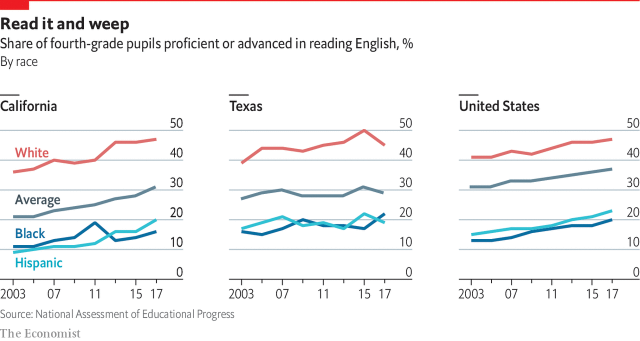

###### Public education

# Public education in both California and Texas is poor 

> print-edition iconPrint edition | Special report | Jun 20th 2019 

 

THEIR TASK is to educate whole generations, but if California and Texas were to be graded for their achievements in the classroom, they would barely pass. They rank 36th and 41st, respectively, out of 51 states (including Washington, DC) for educational outcomes, according to Education Week, a news firm. Only 29% of fourth-graders (aged 9-10) in Texas and 31% of their counterparts in California are proficient in reading at their grade level, compared with 35% nationally, according to the National Assessment of Educational Progress, which measures student achievement (see charts on next page).  

Since nearly a quarter of America’s public-school students are educated in California and Texas, the states’ performance matters profoundly for the country’s future. Yet less than 7% of economically disadvantaged kids are prepared for college, compared with 27% of children who are not economically disadvantaged. Those who enroll in community college or university in either state can spend months taking remedial courses before their coursework counts towards a degree, says Jim Lanich of Educational Results Partnership, an NGO. California’s students underperform Texas’s in several areas, including maths and science, and its Hispanic and African-American students do worse, too. But neither state has much to boast about. 

Education is the biggest budget item in both states, costing $100bn per year in California and $50bn in Texas. But disenchantment is growing. “Education is the single largest enterprise in California. It has 6m student customers. And it sucks,” exclaims David Crane of Govern for California, a political outfit. A high-ranking education official in Texas compares his state’s poor performance to “being the thinnest fat dude. It’s not adequate for our kids.” Why, then, is performance so disappointing? 

Both states have a difficult assignment. Around three-fifths of their students are economically disadvantaged and one-fifth are bilingual or still learning English, making their task especially challenging. But other factors are also at play. One is investment. In the fiscal year 2015-16 California spent $11,420 per pupil, 22% more than Texas but 4% less than the national average, according to the National Centre for Education Statistics, which tracks spending. Funding for education in California has risen by 60% since 2010 and is at a 30-year high, but given the needs and backgrounds of its students the state still underinvests. 

California’s high costs help explain why increased spending has not produced better results. The average teacher’s salary in California is around $79,000, which is 50% more than in Texas, but that does not stretch far because of the extortionate cost of living. Many teachers struggle to buy their own house, says Eric Heins, who runs the California Teachers Association, a union. 

The Golden State also maintains a more generous system of benefits for pensioners. With defined-benefit pensions and health-care subsidies, spending on benefits is eating up a growing share of the education budget. In 2012 Californian voters approved a 30% increase in income-tax rates, in part to fund public schools, but all that extra funding went to pensioners and their health care, rather than to pupils or teachers’ salaries, says Mr Crane. Politicians are loth to deal with the rising costs of benefits for fear of a backlash at the polls.  

Teachers’ unions are a powerful political force in California, significantly more so than in Texas. Unions represent the interests of their members, not the students they teach, and they limit school districts’ ability to manoeuvre. When Californian districts run into hard times, they often retain teachers based on seniority. 

The quality of teachers determines the performance of students, especially those from a low-income background. But in California firing underperforming teachers is more difficult than mastering advanced calculus. It is one of four states to offer lifetime tenure to teachers after only two years. In most states, including Texas, achieving tenure takes three or more years, and even after that it is easier to fire underperforming employees. School districts’ limited ability to manoeuvre shows up in California’s education code, which, at 2,590 pages, is more than twice as long as the Bible.  

The financial crisis also hurt educational performance in both states. In Texas proficiency in maths among eighth-graders (aged 13-14) has fallen since 2011, when the legislature announced it would cut $5.4bn from education over two years. Legislators in Texas have been especially stingy. School districts have sued the state several times for underfunding and often prevailed. “More money won’t necessarily solve everything, but the absence of money can make things extraordinarily difficult,” says Todd Williams, a former Goldman Sachs executive who is now an education advocate in Dallas. There has also been a broader shift away from testing and accountability at state level, meaning that underperforming schools in the Lone Star State face fewer consequences, says Sandy Kress, a lawyer. (California has also pushed back against testing.) 

But although there is less money to go around in Texas, there is more latitude to experiment. One example is a programme developed by the Dallas Independent School District, which eliminated seniority-based pay in order to reward its best-performing teachers, with some earning $80,000-90,000 a year. Those star teachers who agree to teach in a high-needs school get an extra salary lift of $8,000-10,000. The school district, with nearly 90% low-income students, has increased achievement across all grades and subjects by 13%. “The fact that I don’t have to deal with a union contract gives us a big advantage in being nimble and creative,” explains Michael Hinojosa, the district’s superintendent. 

Texas wants 60% of its high-school graduates to receive a certificate, two- or four-year degree by 2030, but currently less than half that number are achieving that aim. California scores better in the quality of its universities, share of students enrolled and investment. It is widely believed to have the best public university system in the country, and between 2008 and 2018 increased higher-education funding per pupil by 3%, while Texas cut its by 23%. 

Both states are trying to up their game, for example by putting more money into early-childhood education. This can make a difference for low-income students, who are more likely to enter kindergarten already lagging their peers. The states should also invest more in “pre-college” courses so that high-school students can graduate with college or technical-school credits under their belt. Young people who start college work in high school are more likely to enroll in college and graduate with less debt, says Daniel King, superintendent of Pharr San Juan Alamo school district in Texas’s Rio Grande Valley. The effect of pre-college offerings is more profound on low-income students and minorities, for whom it “changes how they see themselves and what they can be”, he says.  

A recent report on public-school finance commissioned by the Texas government highlights the economic rationale for investing more in students. It calculates that each high-school graduate who does not go on to earn a certificate from a vocational or technical school, or a two- or four-year degree from a community college or university, misses out on $1m in lifetime earnings. “This represents a significant forgone opportunity cost approximating $200bn in lifetime earnings with each and every graduating class,” the report says. Others point out that imprisoning people costs far more than schooling them does, and the probability of incarceration rises when someone drops out or underperforms in school. 

Overall, Texas seems more likely to pull ahead of California for two reasons. First, business and civic leaders are concerned about inadequate investment in students, which reduces the pipeline of skilled workers for the jobs companies are creating. “We’re not going to have a workforce without doing a vast amount better with the students that are in poor and minority districts,” says Margaret Spellings, former secretary of education under President George W. Bush. Texan politicians eventually tend to follow what businesspeople want. In May the state legislature approved a $6.5bn public-education bill, providing funding for sensible policies, such as expanding merit-pay programmes for teachers and giving school districts with high-needs kids the option to extend the school year. But more funding is still needed. 

Second, political self-interest will focus attention on public education. Texas is seeing greater political competition for the first time in decades. Some Republicans believe that, without more investment and improvement in public education, voters could bring in the Democrats. If poor test results do not cause them to change their approach, the mathematics of politics might. ◼ 

