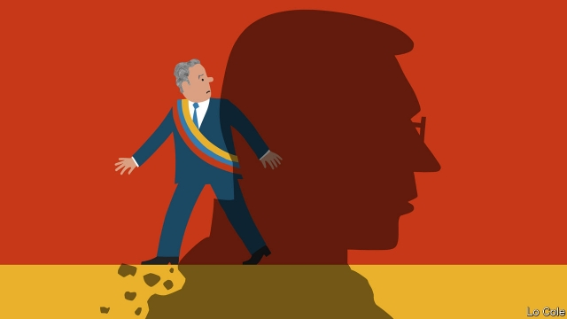

###### Bello

# Can Colombia’s President Iván Duque find his feet? 

 

> print-edition iconPrint edition | The Americas | Jun 22nd 2019 

THE LONG war between the state and the communist guerrilla army of the FARC may be over, but governing Colombia is no cakewalk. The ELN, another nominally Marxist outfit, still threatens, as do violent drug-traffickers and dissidents from the FARC. Geography sometimes conspires against development. Last month a mountainside collapsed, taking with it part of a new motorway linking Bogotá with the south-eastern lowlands. The government is helping more than 1.3m Venezuelans who have fled their country in the past three years. 

These and other problems face Iván Duque, who became president last August. Aged 42, he appealed to Colombians as a fresh face, keen on technology and creative industries and with a mantra of “legality, enterprise and fairness”. Though he is part of South America’s swing to the right, he is not Brazil’s Jair Bolsonaro. He accepts unquestioningly the decisions of courts and of congress. He worries about deforestation and climate change. “Our migration policy is based on fraternity and not xenophobia,” he says, and he clearly means it. 

But he was elected for the conservative party of Álvaro Uribe, an embittered former president. Mr Duque has often seemed trapped in the political battles of Colombia’s recent past. These centre on the peace agreement of November 2016 between his predecessor, Juan Manuel Santos, and the FARC. Under this, some 13,000 guerrillas disarmed; the FARC’s new political party gained ten temporary seats in congress; and the government promised rural development. Guerrilla leaders (and army commanders) are supposed to confess their war crimes to a special peace tribunal and then face temporary “restrictions on liberty”. 

Mr Duque thought the agreement too soft but as president has pledged to carry it out. Its core provision is succeeding: the vast majority of the former guerrillas have returned to civilian life. “We can’t afford to fail in that,” Mr Duque told The Economist. Beyond that, the arguments start. 

Critics accuse the new government of doing too little for rural development, which is essential to make the most of peace and avoid another war. That may be true, but Mr Duque retorts that he has done more in less time than his predecessor. He points to locally agreed development plans for 16 formerly conflict-ridden areas that are under way. He says his government has so far issued titles for 300,000 hectares of rural land. 

Then there is the peace tribunal. Mr Uribe’s supporters fear that it is biased in favour of the FARC. That seemed to be borne out last month when the tribunal freed Jésus Santrich, a FARC commander whom American authorities accuse of trafficking cocaine after the peace deal. An attempt by Mr Duque’s government to subject FARC commanders to tougher terms by partially rewriting the peace agreement was rejected last month by congress and the constitutional court. It would be better to broaden the tribunal’s membership. An official says he sees an opportunity for that. If the supreme court reverses the tribunal’s decision and extradites Mr Santrich, who sits in congress, that could reduce tensions within Mr Duque’s political base. 

Another inherited headache is that coca production rose in Mr Santos’s final years, exacerbating turf wars over cocaine exports. “You can’t build a lasting peace with 200,000 hectares of coca,” says Mr Duque. His government wants the constitutional court to lift a ban on spraying the crop with herbicide. “Spraying is not a silver bullet,” he says. “But it has to be a tool. Some areas of coca are protected by landmines and snipers.” 

Mr Duque’s main challenge is to develop clear policies of his own. They should start with security. Much of the countryside remains unsafe. Some 135 demobilised guerrillas have been murdered. Community leaders are also being killed. Colombia needs to rethink security policy for a post-FARC era, with greater use of intelligence and civilian co-operation. The new army commander, General Nicacio Martínez, issued orders that seemed to encourage his forces to increase the body count—a throwback to a controversial policy under Mr Uribe. There is no evidence that killings have risen. But that approach is misguided. 

Mr Duque “has yet to find his own feet,” says Malcolm Deas, a British historian of Colombia, who suggests that he formalise his relationship with Mr Uribe, for example by confining it to scheduled meetings. He could complement that by developing his own political base in the centre. He has time to become a good president. But the clock is ticking. 

