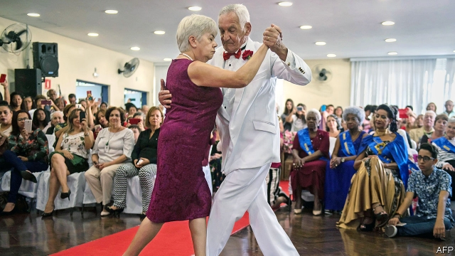

###### Chaos and progress

# Despite turmoil, Brazil is starting to fix its pension system 

 

> print-edition iconPrint edition | The Americas | Jun 22nd 2019 

JAIR BOLSONARO, Brazil’s president, likes romantic metaphors. “Our marriage is stronger than ever,” he said in May, after the press speculated that he was at odds with the economy minister, Paulo Guedes. “The marriage ended with no hard feelings,” he said this month after sacking Carlos Alberto dos Santos Cruz, a minister who had said that others in government should be more careful on social media—thus outraging Bolsonaro fans who tweet about the virtues of military rule and the horrors of homosexuality. 

When Mr Bolsonaro took office in January investors thought he might let Mr Guedes, a free marketeer, reform the unaffordable pensions system, liberalise the economy and restore robust growth. Scandals, and the president’s rocky relationships with congress and his own deputies, have spoilt that mood. In mid-May Mr Bolsonaro forwarded an opinion article to his WhatsApp contacts saying that congress was making Brazil “ungovernable”. For the first time more Brazilians disapproved of his government than supported it. The currency, the real, reached an eight-month low. Rumours of impending impeachment spread. June brought the resignation of the respected director of the state development bank, Joaquim Levy, and leaks that embarrassed the justice minister, Sérgio Moro. “The government is a crisis factory,” said Rodrigo Maia, the business-friendly president of the lower house of congress. 

Uncertainty is holding the economy back. GDP contracted by 0.2% in the first quarter, the first time it has shrunk since a severe recession ended in 2016. A mining disaster in January and a downturn in neighbouring Argentina were partly to blame. Economists are likely to revise downward their gloomy prediction that growth will be less than 1% this year. Capital Economics, a consultancy, calls the 2010s a “lost decade” for Brazil. 

Despite the chaos surrounding Mr Bolsonaro’s administration odds have improved that congress will reform the pension system, a precondition for resurrecting investors’ confidence and therefore growth. Pensions gobble up 44% of federal spending, or 8.5% of GDP. Brazil’s pension programmes are shockingly indulgent. They allow workers to retire in their mid-fifties and let widows and widowers receive their spouses’ full benefits, which encourages May-September marriages. Brazil spends seven times as much on its oldest citizens as it does on programmes for the youngest, such as education. The regional average is four. 

This is harming Brazil’s future growth. Without reform, pension spending will double as a share of GDP by 2060. Public debt has jumped from 52% of GDP in 2013 to 78% now, and would soon surpass 90%. The plight of state and municipal governments is especially bad. Seven of the 27 states say that they can’t pay salaries. 

On May 23rd Mr Bolsonaro proposed a “pact of understanding” with leaders of both houses of congress and the president of the supreme court to co-operate on pensions reform and other pro-growth measures. In fact, he has ceded control to the legislature. The congressman in charge of the lower-house committee dealing with pensions recommended changes to the government’s draft on June 13th. The committee is expected to vote on his plan by the end of the month. Then it will go to the full house. Since the reform requires amendments to the constitution, both the house and the senate must approve it twice with three-fifths majorities. 

The congressional proposal would save the federal government about 900bn reais ($230bn) over ten years by raising the retirement age for most workers, to 65 for men and 62 for women, increasing contributions and closing loopholes. It is less ambitious than Mr Guedes’s plan, which aims to save 1.2trn reais. It is more generous to the poorest and oldest pensioners and to rural workers. It scraps the idea of shifting gradually from a pay-as-you-go system to one based on individual savings accounts. It does not include government workers for the states and municipalities. Mr Guedes grumbled that the committee had “aborted” his reform. Its plan overstates the money it would save, he says. 

His verdict may be unduly harsh. Most analysts think that the congressional plan would save enough to reassure investors. “The day after pensions reform passes will be the start of a new Brazil,” says Luiz França of the Brazilian Association of Real Estate Developers. “We all have a 400m- or 500m-real project sitting in a drawer waiting for the economy to pick up,” says Carlos Jereissati, the CEO of Iguatemi, a chain of luxury shopping centres. 

By itself, pension reform may not restore the economy to health. Though encouraging investment, it could also hurt consumer spending, since workers will need to save more for retirement, says Antonio Spilimbergo of the IMF. Italy’s economy took a hit because it enacted pension reform only after a long wait and during a downturn. Cuts in other spending, needed to comply with a 20-year freeze enacted by Brazil’s previous government, are weighing on growth this year. Mr Jereissati is keeping his millions in the drawer until he sees a year of growth of 2% or higher. 

Another concern is that dysfunction in Brasília will impede other reforms. To privatise state firms and cut import tariffs, the government will have to battle special interests. Mr Bolsonaro will need the co-operation of congress to revamp the tax system and reduce the public-sector wage bill. A pension reform “might get the party started”, says Tony Volpon, an economist at UBS, a bank. “But we’re one Twitter storm away from this all going to hell.”◼ 

