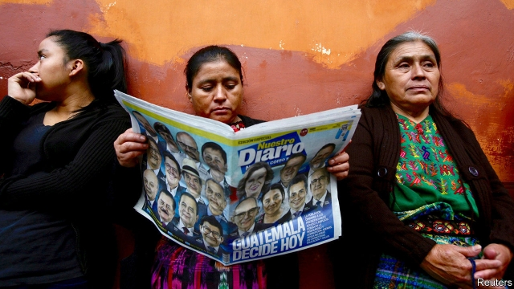

###### After the comedian

# Guatemala holds a dispiriting election 

 

> print-edition iconPrint edition | The Americas | Jun 22nd 2019 

MANY GUATEMALANS searching for change prefer the border to the ballot. In the four years since Jimmy Morales won the country’s last presidential election, 635,000 Guatemalans have been picked up by border agents in Mexico and the United States. A candidate who won that many votes in the first round of elections on June 16th would have made the run-off to succeed him. Those who stayed were given little reason to believe that the election would improve a rotten political system, whose failures include a child-malnutrition rate that is among the world’s highest. 

Few people embody that system better than the two candidates headed for the second round on August 11th. Sandra Torres, a former first lady, won 26% of the vote. Joining her in the run-off will be Alejandro Giammattei, who has run without success for mayor or president in every election since the end of the civil war in 1996. He got 14% of the vote. The run-off could be close. 

The election had fleetingly offered hope. Among the strongest candidates had been Thelma Aldana, a former attorney-general, who made her name pursuing wrongdoers in co-operation with the International Commission Against Impunity (CICIG), established by the UN in 2007. In 2015 their investigations of corruption led to the resignation and arrest of then-President Otto Pérez Molina, to big anti-corruption demonstrations and to the election of Mr Morales, a former comedian who called himself “neither corrupt nor a thief”. 

CICIG accused Mr Morales of financing his campaign illegally. He refused to extend CICIG’s mandate, which ends in September. Ms Aldana decided to run for the presidency to defend her anti-graft project. But in March the government charged her with embezzlement and tax fraud. She has been in El Salvador ever since. That plus other disqualifications left 19 candidates. 

Ms Torres is a formidable politician. During the presidency of her then-husband, Álvaro Colom, from 2008 to 2012, ministers who wanted something done sought her approval, not his. She created Guatemala’s first conditional cash-transfer programme, Mi Familia Progresa, which reached nearly 1m households. Rural Guatemalans remember it with gratitude. 

Urban voters dislike her. This year a recording was leaked of Ms Torres seemingly agreeing to receive 40m quetzales ($5.2m) in undeclared campaign donations from a construction magnate. She denies wrongdoing. Some voters say she divorced her husband because wives of ex-presidents are barred from running for the office. 

To be sure of avoiding jail she will need to beat Mr Giammattei, a former boss of Guatemala’s prisons. He promises to crack down on crime. He was locked up in 2008 for his alleged role in the extrajudicial killing of 11 inmates, but was later acquitted. 

Guatemalans who yearn for the rule of law are despairing. Ms Torres promises to hold a referendum on CICIG’s future, though it will have shut down by the time the next president takes office. 

Mr Morales, who has achieved little, may end his presidency with a flourish. On June 17th President Donald Trump tweeted that Guatemala was “getting ready” to sign a safe-third-country agreement. The United States could then refuse asylum to migrants from outside Guatemala who pass through it. That will strike Guatemalan voters as ironic. Their country does not feel safe to many of them.◼ 

