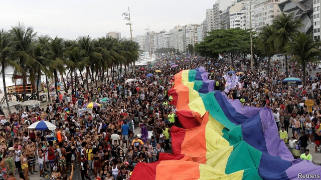
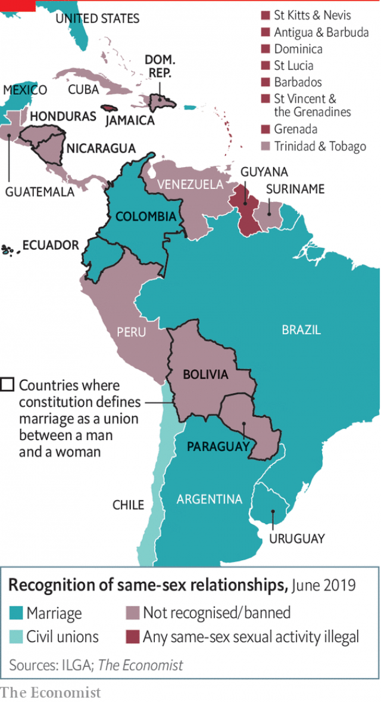

###### The next pink tide

# How 25 countries in the Americas could end up allowing gay marriage 

 

> print-edition iconPrint edition | The Americas | Jun 22nd 2019 

PEOPLE WAVED rainbow flags in the streets of Quito. Gay couples kissed. They were celebrating the decision on June 12th by Ecuador’s constitutional court to legalise same-sex marriage. Ecuador is now the eighth country in the Americas to take that step. Its constitution explicitly defines marriage as a union between a man and a woman. The court therefore had to rule that one part of the constitution—which holds that citizens are entitled to equal treatment under the law—outweighs the part that defines marriage. 

Less than a third of Ecuadoreans support gay marriage, a poll in 2017 found. Conservatives ask why unelected judges should dictate to a whole country what a family means. In a dissenting opinion four of the nine judges in Ecuador said that the legislature, not the court, should resolve the constitutional contradiction. 

 

In the biggest Latin American countries attitudes are more tolerant than in Ecuador. In Argentina, Brazil and Mexico, support for gay marriage exceeds 50% (as it does in Chile and Uruguay). In the rest of Latin America and the Caribbean it is near or below Ecuador’s level. Ecuador is not the only country with laws that explicitly forbid gay marriage (see map). Honduras’s constitution bans it. The constitutions of six countries besides Ecuador refer to marriage as a union between a man and a woman. Some Caribbean countries have laws that make homosexual acts illegal. 

Even where laws and attitudes are hostile campaigners for gay rights are making and winning legal arguments. By The Economist’s count, 25 of the 35 countries in the Americas have constitutions with equal-treatment clauses. The American Convention on Human Rights, to which 23 countries are party, has such a clause. In 2015 the United States Supreme Court legalised same-sex marriage on the grounds that to deny gay people the rights and privileges of marriage is to deny them equal treatment. Colombia’s constitutional court made a similar ruling. In January the Inter-American Court of Human Rights said that the convention’s equality clause required its signatories to permit same-sex marriage. 

In some countries, politicians are putting up a fight. Paraguay’s president, Mario Abdo Benítez, campaigned in last year’s election on a promise to veto legislation to allow same-sex marriage. Both of the remaining candidates in Guatemala’s presidential election oppose gay marriage. 

Ecuador’s ruling will encourage campaigners to continue challenging even the most formidable obstacles to same-sex marriage. This year they filed a case to overturn Honduras’s constitutional ban. When Latin Americans talk about a “pink tide”, they usually mean the spread of leftwing politics. In future, they may mean the increasing freedom of gay people to wed whom they love.◼ 

