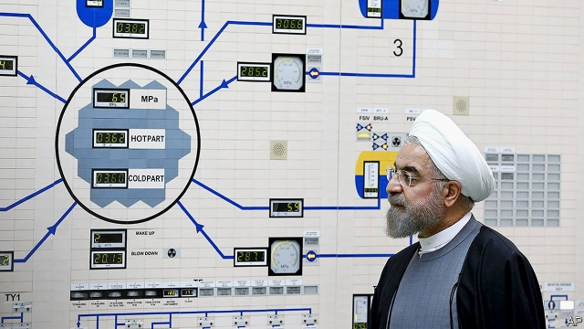

###### Texas and California

# Politics this week 

 

> Jun 22nd 2019 

Iran said it would soon exceed the limits on nuclear fuel that are part of a deal it signed with America and other powers in 2015. It may also begin enriching uranium to levels closer to those of a bomb. America, which pulled out of the deal last year, said Iran was behind the recent attacks on two commercial ships in the Strait of Hormuz and sent 1,000 more troops to the region. America confirmed that Iran shot down one of its drones. See article. 

Muhammad Morsi, the only democratically elected president of Egypt, died. Mr Morsi took office in 2012, after the Arab spring. But he was deposed in a coup in 2013 and thrown in prison along with other leaders of the Muslim Brotherhood. He was in court on charges of espionage when he died of a heart attack. Mr Morsi’s supporters claim that he received inadequate care for health problems. President Abdel-Fattah al-Sisi, the coup’s leader, has crushed dissent. See article. 

The prime minister of Israel, Binyamin Netanyahu, cut the ribbon on a new town in the Golan Heights named after Donald Trump. Earlier this year Mr Trump recognised Israel’s control over the territory, which it captured from Syria in 1967. Critics noted that the town, called Trump Heights, has no buildings or funding. Meanwhile, Mr Netanyahu’s wife, Sara, admitted to misusing state funds on catering. See article. 

A UN special rapporteur called for an investigation into the Saudi crown prince, Muhammad bin Salman, over the killing of Jamal Khashoggi at the Saudi consulate in Istanbul last year. Her report concluded that the journalist was “the victim of a deliberate, premeditated execution”. Meanwhile, a Saudi teenager who faced a possible death sentence on charges related to attending anti-government protests was instead given a 12-year prison sentence. 

Gunmen killed dozens of people in two Dogon villages in central Mali, the latest in a series of tit-for-tat attacks by Dogon and Fulani militias. 

At least 161 people were killed amid ethnic violence in north-eastern Democratic Republic of Congo. The fighting between herders and farmers has forced 300,000 people to flee, complicating efforts to contain the spread of Ebola. 

Donald Trump launched his re-election campaign at a rally in Orlando. The central belt of Florida is highly competitive in presidential elections and the state is the biggest electoral prize among the swing states. In a TV interview Mr Trump claimed to have “done more than any other first-term president ever”. For good or bad he didn’t say; the electorate will get to decide that next year. See article. 

Patrick Shanahan pulled out of the (snail’s pace) confirmation process to be defence secretary, after the press dug up details about a violent domestic incident involving his son. Mr Shanahan has been acting defence secretary since January. Mr Trump quickly nominated Mark Esper, the army secretary, to replace him. See article. 

Investigators in the Netherlands charged three Russians and a Ukrainian with shooting down a Malaysian Airlines plane in 2014 over east Ukraine, killing all 298 people on board. International arrest warrants have been issued for the men, but since Russia has refused to co-operate with the inquiry, it seems highly unlikely they will ever face justice. See article. 

Berlin’s local government imposed a five-year freeze on rents, in an attempt to curb their soaring cost. 

 

A report from the Wellcome Trust, a charity, covering 140 countries discovered that only 80% of people trust vaccines to some degree. Surprisingly, rich countries have the least faith in vaccinations. Just 36% of people in western Europe “strongly agreed” that vaccines are safe; those in South Asia were the most positive, with 85%. Scepticism in countries like France, where 33% think vaccines are unsafe, is not new, but with countries falling below “immunity thresholds”, cases of measles and meningococcal diseases are rising. 

A blackout left almost all of Argentina, Uruguay and parts of Paraguay without power for much of a day. Authorities are still investigating but say a cyber-attack is unlikely. The problem started when electricity surged along a transmission line in the north-east of Argentina. Power was gradually restored to tens of millions of people by late evening. 

Sandra Torres, a former first lady, and Alejandro Giammattei, a former director of prisons, came top in the first round of Guatemala’s presidential election. The election was marred by accusations of unfairness: two of the most popular candidates were disqualified. The run-off is in August. See article. 

Brazil’s senate overturned a decree signed last month by President Jair Bolsonaro to expand citizens’ rights to own and carry guns. The decree, which paves the way for some 19m Brazilians to apply for carry permits, remains valid unless it is also rejected by the lower house. Many congressmen hope to quash it, but the powerful gun and farm lobbies will fight to keep it. 

Up to 2m people marched in Hong Kong to protest against a proposed extradition law that could see its citizens and visitors alike being carted off to the Chinese mainland for trial. It was the biggest demonstration yet amid a wave of dissent that has shaken the territory’s authorities. Carrie Lam, Hong Kong’s leader, apologised for the extradition bill and said it was “unlikely” that it would become law soon. Many locals would like her to resign. See article. 

Xi Jinping, China’s president, began a state visit to North Korea. It was the first time he had called on Kim Jong Un, the North’s dictator, (although Mr Kim has come to China to meet Mr Xi several times). The summit has been interpreted as a reminder to America that it will need China’s help to bring talks with North Korea on disarmament to a successful conclusion. 

The four main reservoirs serving the Indian city of Chennai ran completely dry, leaving many homes and businesses without water. The city government has been drilling extra boreholes and sending water tankers to parched neighbourhoods. 

Donald Trump blasted a news outlet on Twitter for exaggerating the length of an interview with him. But he lashed out at the wrong ABC, tagging the Australian Broadcasting Corporation instead of the American Broadcasting Company. The Aussie ABC responded with an image of a cheery talking koala. 

