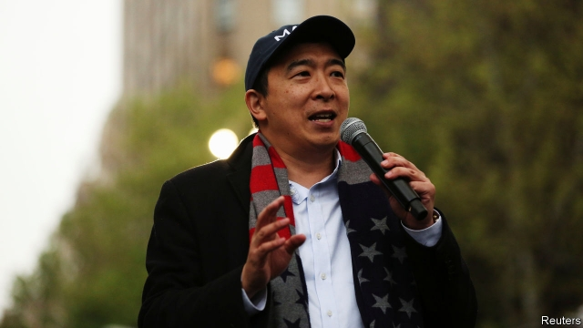

###### Dismal Democrats

# Andrew Yang, prophet of doom 

 

> print-edition iconPrint edition | United States | Jun 22nd 2019 

ANDREW YANG, the New York entrepreneur running for the Democratic presidential nomination, cannot be accused of lacking confidence. “I only see two outcomes in this race. One, I win. Or, two, someone else wins and takes the vast majority of my ideas into the White House,” he says from his campaign headquarters in midtown Manhattan. By branding himself a doomsayer of the impending automation apocalypse, which he warns will destroy most jobs and roil society, Mr Yang has cultivated a devoted following—leapfrogging better-known candidates like Bill de Blasio, the city’s mayor, and Kirsten Gillibrand, one of New York’s senators. In such a crowded field, with roughly two dozen contenders, scoring 1% in the polls is no small feat. But becoming a serious contender is a different matter. Mr Yang hopes his break will come in the upcoming primary debate in Miami, where he will share the stage with heavyweights like Joe Biden, Kamala Harris and Bernie Sanders. 

His appeal hinges on an economic anxiety that borders on outright fear. Mr Yang decided to call his campaign book “The War on Normal People”. In it he describes the advent of automation and artificial intelligence as “very scary”. He warns that millions of truck-drivers forced out of work by self-driving cars and retail workers done in by automated kiosks could riot. “If we don’t start getting ahead of that curve, we’re going to be doomed to worse than Donald Trump over time,” he says. The antidote to this impending calamity is a universal basic income (UBI) of $1,000 a month for each and every American adult, which Mr Yang calls a Freedom Dividend, because that polls better. At times, Mr Yang’s Freedom Dividend is almost a universal panacea: it is his first answer when asked about combating poverty, spurring entrepreneurship, narrowing the racial wealth gap and reversing educational disparities between the rich and the poor. 

But the idea has cross-ideological appeal—both to libertarians who think the government does least harm by shovelling cash to people, and to bleeding hearts concerned with the plight of the poor and downtrodden. Devotees, who call themselves the Yang Gang, throng his rallies wearing hats emblazoned with the word “MATH” (for which the acronym “Make America Think Harder” has been devised). 

“This is not a lefty idea,” Mr Yang says, noting that the country’s red-leaning rural interior would gain most from his proposal: “The one state that has a dividend right now is Alaska, which is a deep-red conservative state.” Alaska’s universal benefit, paid out of oil revenues, is typically less than $2,000 per year. Mr Yang’s proposal is six times as generous—offering $12,000 per year—and would cost roughly $2.8trn (the entire annual budget, encompassing defence spending, Social Security, Medicare and everything else, is $4.4trn). How this will be paid for is unclear. Mr Yang has proposed introducing a value-added tax and extracting sufficiently large sums from the tech firms automating jobs away. 

Its cost does not make the Freedom Dividend an outlier in the primary debate. Most of the Democratic candidates are pitching multi-trillion plans of one sort or another. Mr Sanders wants Medicare for all (which Mr Yang and many of his competitors also endorse), while Elizabeth Warren would like to channel a few trillion towards green manufacturing, free college and universal child care (see Lexington). All these ideas would have seemed like fringy leftism to mainstream Democrats just four years ago. Mr Yang’s chief contribution might follow similar lines: he could hope to inject his ideas into the mainstream of Democratic politics. 

His most valuable policy contributions may lie elsewhere, however. Mr Yang argues, more persuasively than most politicians, that he chooses his positions on data and evidence. His campaign website sports (at last count) 106 proposals, running from the consequential—imposing a tax on carbon pollution, legalising marijuana, decriminalising opioids and reforming zoning rules—to the zany, like offering free marriage counselling to all. Many of them are quite sensible. 

A good few are refreshingly unorthodox too. Mr Yang has not shied away from pointing out the errors in the thinking of his competitors. He thinks a federal jobs guarantee—embedded in the widely accepted proposal for a Green New Deal—is a “well-intended but terrible idea”. The “liberal training fantasy”—turning coal miners into coders—is mere “wish-fulfilment as policy talk”. He’d like to “break the stranglehold that college has on learning” that pushes Democrats to prefer free university tuition to vocational training. He is one of the few candidates willing to publicly admit that charter schools, which are government-funded but privately run, are not abominable. “I’m pro-good school, and there are some very good charters. I think the Democrats, who are frankly just jumping into bed with the teachers’ unions, are doing our kids a disservice.” Among the ideas that an eventual White House occupant will inevitably steal from him, those would be the right ones to start with.◼ 

