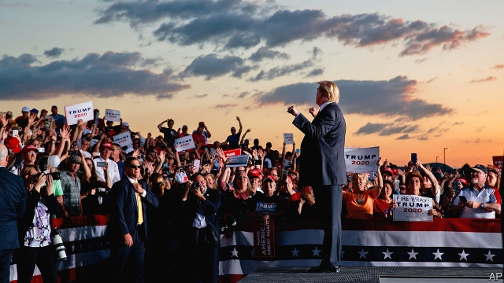
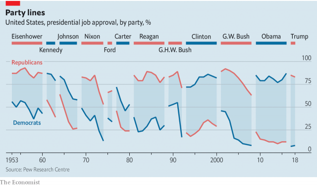

###### Trump 2020

# Donald Trump launches a familiar-sounding re-election campaign 

 

> print-edition iconPrint edition | United States | Jun 20th 2019 

TO DESCRIBE THE event President Donald Trump held in Orlando’s Amway Centre on June 18th as his re-election campaign launch does not do justice to its strangeness. It would also be only narrowly true, because he has never stopped campaigning. Since filing his re-election papers over two years ago, on the day he took office, Mr Trump has held over 50 “MAGA rallies” across the country, revelling in the adulation of his devoted fans. This week’s event, in the crowded, but not completely full, home of the Orlando Magic basketball team, was merely an extravagant example. 

As always, Mr Trump opened with a shout-out to the independent witnesses to his pending performance, “the fake news”. (Outside the arena, a Trump supporter would shortly become the first of the new campaign to be arrested for attacking a journalist.) The president then launched into the improbable balancing act—extreme triumphalism mingled with extreme grievance—that represents both his state of mind and his political method. 

He claimed to have “accomplished more than any other president” in his first two and a half years. Much of what he offered in support of that claim was dubious. He exaggerated how much border wall he is building to keep Mexicans out; he falsely represented the size of the tax cuts he signed; he repeated his mischaracterisation of tariffs as a cost on Chinese exporters, not American consumers, and so on. 

He claimed to have meanwhile been labouring “under circumstances that no president has had to deal with before…the great and illegal witch-hunt”. The Mueller investigation unearthed a lot of evidence of malfeasance by the president. Yet far from being hounded, he has in fact faced remarkably little comeuppance. His Democratic opponents are averse to taking up articles of impeachment, as previous opposition politicians might have done. 

 

Mr Trump did not thank them for their restraint. “Our radical Democrat opponents are driven by hatred, prejudice and rage,” he cried. “They want to destroy you and they want to destroy our country.” To be pro-Trump is to be a patriot, to oppose him treason. It was nearly an hour into his prepared speech before he turned to the economy, including growth of 3% in the first quarter, rising wages and the lowest unemployment rate for half a century. 

It may contravene James Carville’s maxim, but Mr Trump’s re-election campaign is not primarily about the economy. That is partly a reflection of his character, because his sense of grievance swamps his feelings of triumph. But it is also tactical. The idea that elections are decided by the state of the economy rests on an assumption that there is a critical mass of swing voters, persuadable by either side. And that mass had been dwindling for years, owing to partisanship, even before Mr Trump’s extreme divisiveness accelerated its demise. Only 51% of Americans approve of his performance on the economy, despite its rude health—and the economy is easily his strongest measure. His overall approval rating has rarely reached 46%, the share of the popular vote he won in 2016; it is now a couple of points below that. He is the only president never to have reached 50% since Gallup began polling on the issue. 

These poor numbers make it hard to see Mr Trump winning any state he lost in 2016. To win again he must therefore walk the same path to an electoral college majority he trod that year—through Florida, Ohio and a trio of formerly Democratic rustbelt states, Michigan, Pennsylvania and Wisconsin. The fact that all have lots of older white people, his most reliable constituency, is why he remains competitive, despite his low ratings. Yet he has a major worry. While Florida and Ohio are becoming more Republican, the more northerly states appear to be reverting to the Democrats. And they are doing so, results in the mid-terms suggested, because the working-class voters Mr Trump recruited from the left in 2016 are cooling on him. 

Four years ago he wooed them with a combination of paternalistic economic promises and white identity politics. Only the second of these may now be available to him. Having failed to provide universal free health care, bring back coal-mining and regenerate long-shuttered factory towns, among other unlikely pledges, he is now struggling to repeat them. (Mr Trump’s recent vow to unveil a new health-care plan “in about two months” carried a hint of desperation.) 

Mr Trump may yet find a way to fill this void. A trade deal with China or a cut in illegal immigration could help. Yet it is likely that identity politics, in the form of fierce rhetoric on guns, crime and immigration, will dominate his campaign. Mr Trump warmed up for his appearance in Orlando by vowing to round up “millions of illegal aliens”—starting “next week”. He also refused to retract his demand for five black teenagers convicted of assaulting and raping a jogger in Central Park to be executed—though they were exonerated by DNA evidence and freed 17 years ago. Outside the Amway Centre a white chauvinist crew called the Proud Boys flashed “white power” signs at reporters. 

Though these are early days, in short, it seems highly probable that Mr Trump will re-run his previous campaign. To hear him, it seems to be 2016 still. He persists in whipping up his supporters with denunciations of Hillary Clinton (“Lock her up!” they screamed in Orlando). By far the biggest uncertainty, perhaps the only one, therefore concerns who the Democrats send out to face him in her stead. 

Betting markets put his chances of re-election at 50%, which reflects uncertainty about who the Democrats will pick. Though incumbency gives him a boost, absent some game-changing event Mr Trump would struggle against a strong opponent. His hopes may depend on the Democrats putting forward another dud, too weak or compromised to survive his attacks. Do not put it past them.◼ 

