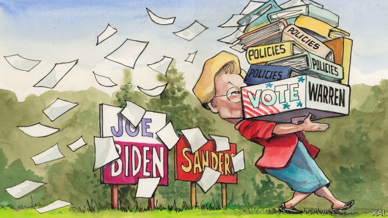

###### Lexington

# Elizabeth Warren, saviour of capitalism 

 

> print-edition iconPrint edition | United States | Jun 22nd 2019 

THERE IS A revealing tradition of apostasy in American politics. Ronald Reagan’s disingenuous claim never to have left the Democratic Party (“It left me”) helped him woo millions of blue-collar Democrats. Hillary Clinton’s decision to downplay her early Republicanism, by contrast, signalled her lack of ambition to win votes from the other side. That Donald Trump switched camps at least five times before entering the Republican primary suggested his disloyalty to any party. Elizabeth Warren’s gravitation from right to left, and the use she is making of it in her increasingly fancied presidential campaign, is another telling case. 

Unlike Mrs Clinton, she is leaning into her Republican past. Her stump speech, which Lexington heard in a sun-dappled New Hampshire garden last week, opens with a description of her conservative upbringing in Oklahoma: her three brothers in uniform, her frugal parents. It testifies to her experience, rare in a former Harvard law professor, of working-class concerns and the heartland, even if she escaped both long ago. Yet she remained a registered Republican into her late 40s. 

Many Democrats would find that embarrassing. Yet Ms Warren, who entered politics over a decade later, after making a name for herself as a critic of Wall Street after the financial crisis, has no need to prove her left-wing credentials. She has used her conversion story to help distinguish herself from Bernie Sanders, her rival on the left, and to try to broaden her appeal. 

She stuck with the Republicans, she has said, because she believed their claim to be the best market managers. Unlike the socialist from Vermont, she says she is a “capitalist to my bones”. She left the right after researching surging individual bankruptcies, which turned out to be caused not by fecklessness, but ill health and other misfortunes. Why were so many hardworking people like her parents living so precariously? she asked. And why were companies, their soaring profits suggested, more protected? 

Like Mr Sanders, she considers the economy to be not merely skewed, but rigged in the corporate interest. Stagnant wages, rising economic insecurity, outsourced jobs are a product of “who government works for”, she said in New Hampshire. But where Mr Sanders promises a revolution, her proposals are more measured, detailed and various. Indeed Ms Warren, who in a couple of recent polls was ahead of Mr Sanders, in second place behind Joe Biden, has unveiled more policies than her main rivals put together. 

Her signature proposal is a wealth tax of two cents on the dollar on assets over $50m. She optimistically claims this would raise $2.75trn in a decade, a windfall she would splurge on progressive priorities including universal free childcare, free public college fees and writing off college debt. That is Sanders-esque, with a tonal difference. Unlike Mr Sanders, whose recent entry into the “millionaire class” seems not to have lessened his dislike of rich people, Ms Warren claims not to begrudge them their success. She just wants them to chip in more (“Two cents—just two cents!” is one of her slogans) to help expand opportunity (which is another). 

Believe that or not, her other main proposals are regulatory fixes that are far-reaching and radical but mostly within the Democratic mainstream. Channelling the spirit of her hero Theodore Roosevelt, she vows to curb lobbying, campaign-finance extravagance, carbon emissions and much else. She has hedged her support for Mr Sanders’s promise of Medicare for all. 

Setting aside the merits of her proposals, her focus on policy is clever politics, and unusual. Mrs Clinton’s loss to a candidate with no serious policies, though she had reams of them, has deterred most Democratic candidates from issuing detailed proposals. Mr Biden, the front-runner, has two policies, including a cut-and-paste climate plan. Ms Warren apprehends that Mrs Clinton failed not because she had too many policies, but because she had no theme to make sense of them. Her commitment to saving capitalism from the capitalists is an answer to that. 

Her wonkishness also helps her deal with specific weaknesses. It has revised her former image as a one-trick pony, banging on about Wall Street. It has moderated her reputation as a left-winger. It has made Mr Sanders look lightweight by comparison. It has also helped neutralise an impression, exacerbated by sexism no doubt, that she is rather hectoring. “She reminds me of my sister-in-law,” said one of her listeners in New Hampshire guiltily. “But she knows what she’s talking about.” Mrs Clinton’s supporters were often unwilling to acknowledge her weaknesses as a campaigner. If Ms Warren’s are more willing, it is because she also has strengths. 

She may well supplant Mr Sanders as the main threat to Mr Biden from the left. Whether she could woo enough moderate voters to mount a serious challenge is harder to predict. It is certainly possible. Yet such voters are mainly concerned with beating Mr Trump, and may consider Ms Warren too left-wing for that, which would be reasonable. Or they might consider her too like Mrs Clinton, as a woman in her 60s, which would not be. 

That suggests Ms Warren’s ideas may get less attention than they deserve on the left. Meanwhile they are being studied by reform-minded Republicans, grappling with the rejection of conservative verities that Mr Trump represents. Tucker Carlson of Fox News described Ms Warren’s industrial policy as “like Donald Trump at his best”. Senator Marco Rubio wrote a column applauding its aims, while concluding that a “radical progressive movement” would not fulfil them. This illustrates a paradoxical feature of the political divide: a combination of intellectual flux and partisan rigidity. 

Despite her past Republicanism, Ms Warren could not win votes on the right without repudiating her party in some way; by opposing mass immigration, for example. Yet her critique of American capitalism is quietly inspiring conservative thinkers. It is an odd time, when ideas cross parties more easily than people.◼ 

