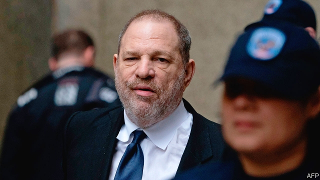

###### Court in the act

# Harvey Weinstein’s trials 

 

> print-edition iconPrint edition | United States | Jun 22nd 2019 

“THIS CASE is testing the presumption of innocence in our country,” Harvey Weinstein’s then defence lawyer, Jose Baez, told reporters last January, cameras shuttering as the movie mogul shuffled out of a New York courthouse. For a man who, the state attorney-general says, required his drivers “to keep condoms and erectile dysfunction injections in the car at all times” that is undeniably true. 

But the justice system’s ability to hold those accused of sexual crimes to account is also being tested. The low conviction rates for rape and sexual assault are often blamed on under-reporting. Less than a quarter of estimated sexual assaults are reported to police. No such excuse exists in the Weinstein case. Since late-2017 he has been accused by more than 90 women of acts ranging from harassment to rape. The main villain of #MeToo has lost his company, reputation, wife and some hair. But, bar an ankle tracker, he retains his liberty and much of his fortune. It is not at all clear that the justice system will take either. 

Most of Mr Weinstein’s accusers are not going to court. Expired statutes of limitation or other legal hurdles prevent some; others do not wish to go through a gruelling public trial. Well over a dozen are suing for damages through civil procedures, though. The New York attorney-general has also filed a civil-rights suit against Mr Weinstein, his brother and their former company for endangering employees. And the 67-year-old faces criminal charges for allegedly attacking two women in 2006 and 2013. If found guilty Mr Weinstein, who denies all charges of non-consensual sex, could spend decades in prison. His much-delayed criminal trial is set for September 9th. It may be delayed again after Mr Baez asked the court to excuse him from the case, making him the second member of Mr Weinstein’s defence team to walk away in quick succession. 

Women in America, Britain and Canada are suing for damages related to what one of their lawyers calls “Weinstein events” involving allegations such as rape, assault, false imprisonment (for instance, holding a woman while he masturbated) and career sabotage. They are going after not just Mr Weinstein, but also the companies that employed him: Miramax, Disney and The Weinstein Company (TWC). At TWC his contract included an unusual clause which listed escalating financial penalties for using company resources to pay someone off if he acted “improperly in violation of the Company’s Code of Conduct”. 

In May rumours appeared in the media of an imminent “global settlement” for $44m that would close most civil suits. TWC is currently going through the bankruptcy process and some attorneys, such as Elizabeth Fegan, who represents several plaintiffs in a class action, believe this is the best hope for getting compensation. 

Several accusers, including actresses Ashley Judd and Rose McGowan, quickly distanced themselves from any rumoured settlement. Part of the problem was the amount, less than half of the $90m that had been suggested in early 2018, nearly a third of which would be reserved for the legal fees of Mr Weinstein’s co-accused directors and board members. Going after Mr Weinstein’s enablers has been a priority for financial reasons as well as moral ones. “At the end of all of this, given all his legal fees, we expect that Mr Weinstein himself will be relatively asset light,” says Ms Fegan. 

For those seeking the sort of justice that involves steel bars, Mr Weinstein’s criminal trial will be the one to watch. It has been marred by delays and false starts. Charges relating to a third woman were dropped after a police blunder, something Mr Weinstein’s lawyers argue taints the whole case. The remaining five criminal charges are serious. They concern a woman who claims Mr Weinstein forcibly performed oral sex on her in 2006 and a woman who says he raped her in 2013. The crimes he is accused of include predatory sexual assault—a class A felony—rape in the first degree and rape in the third degree. 

Proving such charges beyond a reasonable doubt, the burden of proof in a criminal court, will be hard. “The case will probably centre around ‘forcible compulsion’ or, for the least serious offence, whether the victim clearly expressed ‘non-consent,’” predicts Margo Kaplan of Rutgers University. She believes New York’s broad definition of consent is particularly “victim-unfriendly”. The assumption that women by default always consent to sex unless they are forced or clearly state otherwise makes rape hard to prove in many jurisdictions, prosecutors less likely to pursue charges, and convictions of watered-down charges more likely. 

More important than the letter of the law will be the mood of the jury. Cultural norms determine judgments in rape cases far more than legal definitions, found Dan Kahan, a professor in law and psychology at Yale, in a 2009 study. Working in Mr Weinstein’s favour is the fact that he is on bail, which studies have shown greatly increases his chances of acquittal. Beyond that, “his chances now directly relate to his lawyers’ ability to impeach the credibility of his accusers,” predicts Daniel Hochheiser, a criminal defence attorney. 

Their job may be about to get harder as the court considers whether other women should be allowed to testify about Mr Weinstein. This strategy, aimed at demonstrating a pattern of abuse, was successful in helping convince the jury at the Bill Cosby retrial last year of the comedian’s guilt. For several women it was also cathartic. But it is controversial and Mr Weinstein’s lawyers have fought hard against it. One problem for prosecutors in sexual-misconduct cases is that each accusation tends to be treated as a one-off, which makes it far easier for the defence to argue it was a “he said, she said”. Settlements with gag-clauses make it yet harder to give a jury more context. 

Just as most civil cases are dismissed or settled before trial, so over 95% of criminal cases are either thrown out or settled with a plea-bargain before trial. Lack of resources or the hope of a shortened sentence can push poorer and younger suspects into taking a plea, but are less likely to persuade Mr Weinstein. The prospect of facing not just two isolated women but a couple of platoons may push him towards a deal, should one be offered. Yet given the high-profile nature of the case, and the severity of the charges, insiders predict that the prosecutor is unlikely to do so and would prefer to roll the dice in trial. ◼ 

