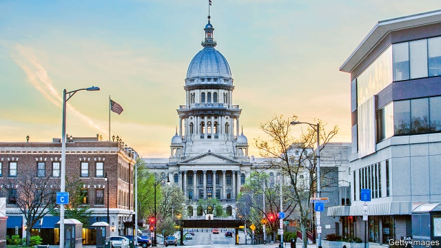

###### Whistling crayfish

# More liberal, functional Illinois 

 

> print-edition iconPrint edition | United States | Jun 22nd 2019 

ILLINOISANS HAVE long grumbled that theirs is a most dysfunctional state. Bruce Rauner, their Republican former governor, never grasped how to manage a legislature run by Democrats and struggled even to pass a budget. Chronic problems preceded him: years of reckless promises and spending left a $134bn hole in the state’s pension fund. Illinois’s population has shrunk for each of the past five years. How, then, to explain the sudden outbreak of activity in Springfield? 

The new governor, J.B. Pritzker, a Democrat, is enjoying balmy times. He has supermajorities in the legislature and also gets bipartisan support when Republicans like at least some measures. He has signed off on a $40bn budget that sailed through the legislature. It is even balanced, something so rare that Mr Pritzker’s Ukrainian ancestors might have likened it to a crayfish whistling on a mountain. 

Lawmakers are in a perky mood for another reason: they get to influence where a separate, even juicier, dollop of official largesse ends up. The governor will soon wield his pen to sign off on a $45bn capital-spending programme, mostly long-overdue public investments in run-down roads and bridges, renewable energy and schools. The Chicago Tribune, alarmed about overspending, rising taxes and pork for politicians, notes that lawmakers were also cheering pay rises for themselves. 

Much of the spending is sorely needed, though. Take the state’s education system. A recent survey by the Pew Charitable Trusts points out that, on average, states’ outlays on schools were still 1.7% lower last year (in inflation-adjusted terms, per person) than when the Great Recession began in 2008. In Illinois things are especially grim: school spending was 22% lower than a decade before. 

The capital splurge is to be funded in part by the sale of over $20bn in bonds, and in part from several taxes that left-leaning folk, especially Chicagoans, who dominate state politics, have long sought. On July 1st the state tax on petrol will double. A sin tax on cigarettes is also up sharply. Meanwhile sports betting and other gambling is to become more widespread. Chicago will get its first casino. Credit-rating agencies gave the changes a cautious nod of welcome. 

Legislators restated the state’s liberal reputation by making Illinois the 11th in America to legalise the recreational use and sale of marijuana, from January 1st. It is the first to do so by legislation. The law contains measures to wipe clean the records of those previously convicted of cannabis offences. By one estimate, that will result in clearing 700,000 cases. The legalised market is expected to raise about $90m in taxes next year, rising thereafter. 

Legislators have also passed a law asserting the “fundamental right” of women to have abortions, while stating that a fertilised egg, embryo or fetus has no independent rights. In doing so, they scrapped a law from 1975 that had once imposed restrictions—such as the need for consent from a spouse—on women seeking abortions. In practice little changes from this (the old law was largely defunct), but the symbolism matters when other states are tightening their restrictions. In Missouri, next door, the state’s last abortion clinic is threatened with closure. 

The most significant legislative measure, however, involves a potential constitutional change. This is a proposal to scrap the state’s flat tax on income, replacing it with a progressive one. To become law, voters will have to approve a ballot initiative in November 2020. The idea, initially, is that only those earning at least $250,000 a year would pay higher taxes. Opponents warn that once a progressive tax is in place, those earning less are sure to be squeezed too. 

The state is thus readying itself (oh joy) for 17 months of public debates on tax. Mr Pritzker and other proponents say the new income tax will raise revenue and cut inequality, noting that 34 states have graduated ones and get along fine. Opponents retort that Illinoisans are already among the most heavily taxed of all Americans, and warn that the changes will spur wealthy people to leave, sapping growth. Who will prevail? Mr Pritzker’s luck may last a bit longer. But Illinois has a habit of chewing up and spitting out governors. ◼ 

