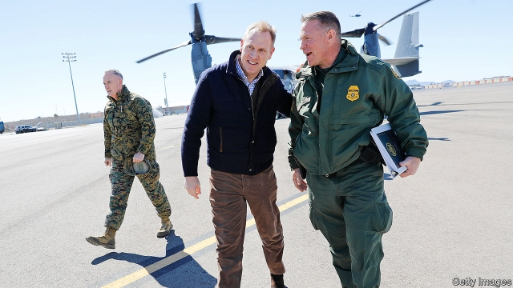

###### Secretaries wanted

# Patrick Shanahan stands aside from the DoD 

 

> print-edition iconPrint edition | United States | Jun 22nd 2019 

THERE ARE three reasons people are ejected from the top echelons of President Donald Trump’s administration. Either past personal failings come to light, or petty self-dealing scandals emerge while in office, or they suffer a sudden decline in the appraisal of a mercurial boss who likes a good firing now and again. 

Ronny Jackson, the president’s personal doctor, who was appointed to run the Department of Veteran Affairs, bowed out after allegations emerged of drinking on the job and carelessly dispensing opioids. Scott Pruitt, the former administrator of the Environmental Protection Agency, and Tom Price, the former health secretary, got the boot after their lavish spending habits—overstuffed security details, private-plane travel—caused considerable embarrassment. Rex Tillerson, the former secretary of state, and Kirstjen Nielsen, the former homeland security secretary, irked Mr Trump. And on June 18th the nomination of Patrick Shanahan, the acting defence secretary to succeed to the permanent post, imploded after details of Mr Shanahan’s personal life were published by American newspapers. Mr Shanahan has been doing the job since General Jim Mattis resigned (done for by number three). 

Unlike the failed nominations of Andrew Puzder as labour secretary and Herman Cain as a member of the Federal Reserve’s board, or the ignominious sacking of Rob Porter, the White House staff secretary, Mr Shanahan was not accused of groping anyone. Instead there were two episodes. In the first, Mr Shanahan’s wife at the time was arrested in 2010 on domestic-violence charges after she punched him in the face. In the second, in 2011, Mr Shanahan’s 17-year-old son beat his mother with a baseball bat, leaving her with a fractured skull and needing surgery. 

Mr Shanahan, who was in Seattle at the time working for Boeing, flew to Florida where the assault occurred and tried to provide a legal defence for his son to spare him jail time. In the immediate aftermath of the assault he wrote a memo claiming that his son had “acted in self-defence”. He told the Washington Post that the characterisation was made before he had all the facts, and that he was wrong to write it. When it became clear that the news would break, Mr Shanahan travelled to the Oval Office to withdraw his nomination. 

Mr Shanahan’s predicament appears agonising. His difficulties do not elicit the same moral outrage as some of Mr Trump’s other nominations did. Yet they do illuminate the problem of a patchy vetting process and an impetuous chief executive who sometimes picks people simply because they look the part. Of the 713 top posts in the government which require the affirmation of the Senate, only 455 are filled by confirmed appointees. 

The Department of Defence is perhaps America’s most important ministry, particularly now tensions with Iran are high—1,000 more troops have just been dispatched to the Middle East. The temporary replacement to the previous temporary replacement is Mark Esper, a West Point classmate of Mike Pompeo, the hawkish secretary of state. Mr Esper is a supporter of dispatching troops to the southern border, which allows Mr Trump to portray illegal immigration as an invasion. If the polls are tight next autumn, expect to see Mr Esper deploy more soldiers to guard the Rio Grande. Supposing he lasts that long. ◼ 

