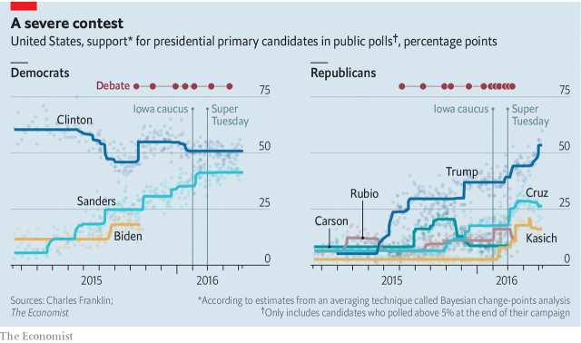

###### Primary numbers

# Presidential debates seldom move opinion polls 

> print-edition iconPrint edition | United States | Jun 22nd 2019 

 

FOR DEVOTED election-watchers the onslaught of on-the-ground reporting and analysis from 30,000 feet that acccompanies a campaign is pleasurable. But voter preferences tend to be more stable than front-page coverage, which typically consists of assorted gaffes and flip-flops, might suggest. Primary debates really do matter, though. The Democrats hold their first one in Miami next week. An increase in available polling over the decades has helped The Economist quantify their impact. Primary debates are responsible for changes in polling that rival the effects of the Iowa caucuses on public opinion. 

General-election debates rarely move opinion polls, because voters’ choices are largely dictated by their partisan allegiance. Most of those who bother to tune in have already tuned the other party out. In primary debates, though, this does not apply. Partisan allegiance will not help a Democrat choose between Senators Cory Booker of New Jersey and Michael Bennet of Colorado. Primary voters are also more receptive to arguments about policy and electability than the wider public is. 

Hillary Clinton’s lead in public polling increased nearly nine percentage points in the two weeks that followed the first debate of the 2016 Democratic nomination, according to data made available by Charles Franklin, a political scientist. On the other side of the aisle, Donald Trump experienced a four-point bump in the two weeks after his first debate. What happened in the years before 2016? Were the bonuses that Mrs Clinton and Mr Trump received atypical, or part of a pattern? 

To find out we analysed Mr Franklin’s polling data, which span all presidential primary elections from 1976 to 2016, using a technique called Bayesian change-point analysis to calculate a polling average that is not too sensitive to outlier polls, as some other approaches are. We assume it takes about two weeks from the date of a debate for any new information arising from that debate to be reflected in public opinion and for pollsters to gather their data. 

Our calculation shows that the year before a presidential election, the average change in a candidate’s polling numbers in the two weeks after a debate was 6%. Debates held in the winter and spring of the election year have even larger effects (an average change of 13%), but it is hard to tell whether it was the debates that made the difference or something that happened at the same time as the debate, such as a primary election or caucus. 

Admittedly most of the movement in polls after a primary debate consists of small fluctuations spread out between many candidates. Yet primary debates do sometimes cause an obscure candidate to become a star or a star candidate to implode. Compared with a regular week in the year before the election, debates are six times as likely to produce a large increase or decrease in voting intentions. 

Elaine Kamarck of the Brookings Institution, the author of “Primary Politics: Everything You Need to Know about How America Nominates Its Presidential Candidates”, concurs. Primary debates are one of the most important events of a campaign, and match other disruptions. “There is little difference between a debate and a dramatic event,” Ms Kamarck says, adding that they are almost always consequential. With the 2020 Democratic debates kicking off next week, the 20 candidates who will appear (divided between two separate events) really do have an opportunity to change voters’ minds.◼ 

