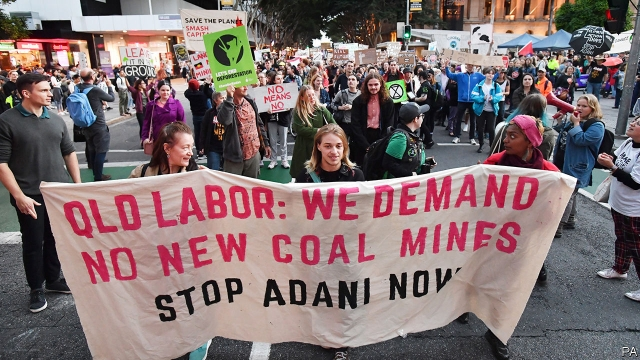

###### Black in business

# Adani’s giant Australian coal mine gets the go-ahead 

 

> print-edition iconPrint edition | Asia | Jun 29th 2019 

ENVIRONMENTALISTS HAVE been campaigning against it for the better part of a decade. For a time, it seemed they had won. But in mid-June the government of the state of Queensland cleared the way for construction to start on the Carmichael coal mine, owned by Adani, an Indian company. The project will open up the Galilee Basin, one of the world’s largest untapped reserves of thermal coal, the type used in power plants. Adani has already started work. It claims it could export its first coal to India within two years. 

Activists had expected a different outcome. At a federal election in May they tried to rally voters against the conservative coalition government, which has presided over rising emissions of greenhouse gases. To some extent they succeeded. Concerns about global warming played a big part in the defeat of Tony Abbott, a former prime minister and dogged opponent of curbs on emissions, who lost his seat in a posh part of Sydney. But even as well-to-do urbanites embraced greenery, voters in Queensland, where the economy has struggled since the end of the mining boom, warmed to the idea of the mine. Labor, the main opposition, shilly-shallied over its future, and was walloped in the surrounding marginal constituencies, delivering an unexpected victory to Scott Morrison, the prime minister, who once cradled a lump of coal in parliament. 

The result terrified Queensland’s Labor government, which faces its own election next year. It won the most recent state election after refusing to subsidise a railway which Adani will need to transport its coal 400km to the coast, and had since knocked back the firm’s plans to conserve local fauna, notably the black-throated finch, an endangered species. But four days after the federal election the state’s premier, Annastacia Palaszczuk, conceded that locals had “had a gutful” of delay and insisted that the necessary approvals should be hurried through. Within a month, the state had given its final assent to a plan to conserve a vast aquifer and a set of springs held sacred by local indigenous groups. 

This is “a disgrace”, complains David Ritter of Greenpeace, a pressure group, showing “Adani’s unholy grip on our politicians”. In its first phase, the group would dig up 10m tonnes of coal annually, a tiny fraction of global consumption. But the mine’s full capacity is six times that amount. Moreover, six more mines are proposed in the Galilee Basin. With Adani’s going ahead, the others may follow more easily. Together, their coal could produce more carbon dioxide each year than the rest of Australia, according to the Climate Council, a research group. 

Many Australians feel queasy about exporting dirty fuel to poorer countries. They worry about the Great Barrier Reef, a national treasure which provides employment for more than 60,000 people through tourism. Warming waters have killed much of its coral since 2016. Adani would export its coal from a port on the reef’s edge. Contaminants leaked from an adjacent facility have already harmed the surrounding wetlands, activists say. They fear that dredging and heavier maritime traffic will damage the reef, too. 

But many towns along the coast of Queensland, although far from the coal seams, still benefit from mining because they are home to lots of fly-in-fly-out workers. Cavalcades of anti-Adani activists from other parts of Australia have not been well received in the state. Supporters of the mine argue that preachy greens from Sydney and Melbourne also benefit from the resource business. Last year coal overtook iron ore as Australia’s biggest export. 

Activists insist the mine can still be stopped and continue to demonstrate against it. Adani has yet to finalise a royalty agreement with Queensland’s government, or obtain a licence to build its railway. They cite other big projects that were halted after work had started, such as a dam on the Gordon river in Tasmania which was stymied by protests in the 1980s. 

Companies following Adani into the Galilee Basin may have trouble financing their investments, since banks are reluctant to support controversial mines. Adani is having to fund the first, A$2bn ($1.4bn) phase of the Carmichael mine itself. As countries try to cut their emissions, the market for thermal coal is shrinking. Even in Australia, which still relies on coal for most of its electricity, the three biggest power producers have cancelled plans for new coal-fired plants. In the end it may be economics, not activism, that stops the development of the basin. ◼ 

