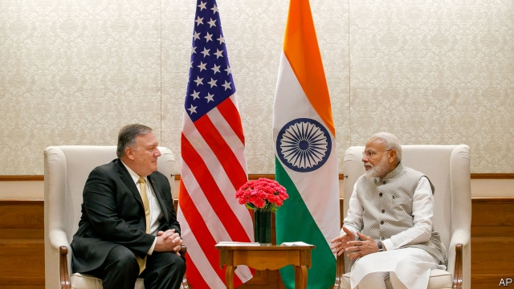
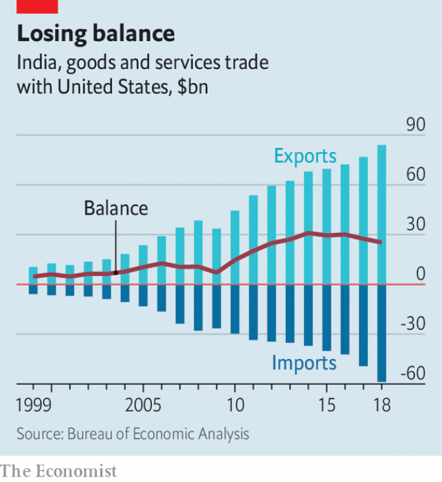

###### A Harley-hating ally

# India presents America with a choice between geopolitics and trade 

 

> print-edition iconPrint edition | Asia | Jun 29th 2019 

MIKE POMPEO, America’s secretary of state, had two objectives during his trip to Delhi on June 25th. The first was to affirm India’s importance to America, which envisages a grand Indo-Pacific alliance to counter China. The second was to soothe an increasingly heated row about trade. Achieving the first was easy enough, but the second is proving harder. 

America and India have bickered about trade for years. India’s average tariff is high, at around 13%. Its bureaucrats are also keen on other barriers to trade, from obscure rules on packaging to prohibitive red-tape on the import of dairy products. But over the past few years Narendra Modi, India’s prime minister, has further inflamed these irritations. His government has increased tariffs on lots of American exports, including telecoms equipment, medical devices and nuts. It has also expanded rules favouring locally made goods in public procurement and has proposed a new law demanding that tech firms store data about Indian customers within India. And last year it abruptly announced rules on e-commerce that seemed to target two American firms, Amazon and Walmart, the latter through its purchase of Flipkart, a fast-growing local e-tailer. 

The complaints of American trade negotiators about Indian protectionism, however, are typically drowned out by diplomats and soldiers, who see India as a natural and indispensable ally against China. The two countries established a new high-level diplomatic dialogue last year and have increased their military co-operation. America wants India to stop importing oil from Iran, which India recently and reluctantly agreed to do. (Oil is the biggest contributor to India’s trade deficit and the Iranian oil comes at a discount to world prices.) America also wants India to reverse plans to purchase Russian anti-aircraft missiles and telecoms equipment made by Huawei, a Chinese company—steps that India is resisting. 

The Indian government seems to have been pleased by what it perceived to be American support in its recent stand-off with Pakistan. In the days preceding Mr Pompeo’s visit, it announced a large order of long-range patrol planes made by Boeing—a gesture that was presumably intended in part to mollify Mr Pompeo’s boss, Donald Trump. 

But even as the strategic co-operation between the two countries deepens, the row over trade is gathering strength, too. India was one of the countries America hit with tariffs on steel and aluminium last year. It is also the subject of several complaints America has made at the World Trade Organisation in the past year. And on June 5th America evicted India from a scheme that offers tariff-free access to certain goods from poor countries as a spur to development. India, Mr Trump complained, was not providing “equitable and reasonable access to its markets”, a condition of the scheme. There are even mutterings in Washington about launching a formal investigation into India’s unfair trade practices—the same step that initiated America’s trade war with China. 

 

Both sides would prefer to avoid a full-blown conflict. Since 2002, when America’s ambassador to India called Indo-American trade and investment “as flat as a chapati”, it has grown rapidly (see chart), making America India’s biggest export market. Moreover, India’s economy is slowing, which will presumably make the government even warier than it otherwise would be of a trade war. 

Although India accounts for only a small fraction of America’s trade, there are plenty of big American firms that would lobby against tit-for-tat tariffs. And hawkish American trade officials have their talons full at the moment. The fact that it was Mr Pompeo who visited, rather than Robert Lighthizer, America’s top trade negotiator, suggests that the administration’s geopoliticians have the upper hand for now. 

Yet both countries have leaders with protectionist instincts. India also has a growing trade surplus with America—not something that will endear it to Mr Trump. He has called India the “tariff king” and often cites its 50% duty on Harley-Davidson motorbikes as a textbook example of the unfair treatment of American exports. Mr Pompeo and his Indian counterpart, Subrahmanyam Jaishankar, insist that the two countries will find a way to resolve their differences—but it is not up to them. ◼ 

