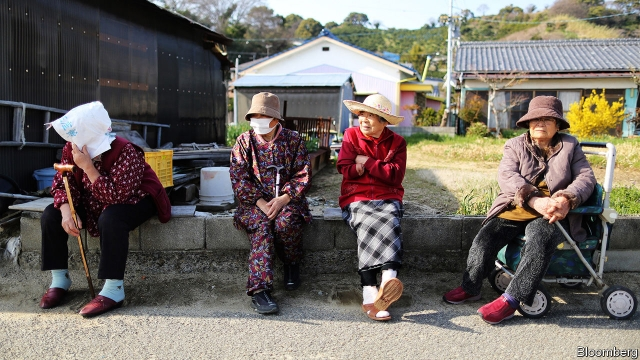
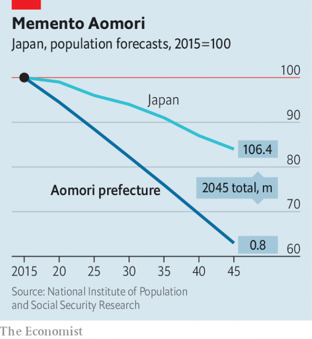

###### Old, shrivelling and broke

# Rural areas bear the burden of Japan’s ageing, shrinking population 

 

> print-edition iconPrint edition | Asia | Jun 29th 2019 

WHEN Hisaaki Nakajima ran for mayor of Imabetsu, on the northernmost tip of Honshu, Japan’s main island, he said he had a vision of a town of 2,000 people. That may have sounded odd, given that Imabetsu had 2,700 inhabitants at the time (in 2017). But it is shrinking fast. Since Mr Nakajima took office, the population has declined by around 150, or some 6%. On a pleasant spring day the streets are almost empty; many buildings are disused. A big pachinko parlour at the entrance to the town lies in ruin. 

Villages and towns across Japan have been shrinking for decades because of migration to big cities. Since 2011 the national population has been falling, too. Last year it shrank by 450,000. The two trends are emptying rural areas: whereas Japan as a whole is projected to lose 16% of its population between 2015 and 2045, the population of Aomori prefecture, where Imabetsu is located, will plunge 37%, reckons the National Institute of Population and Social Security Research (NIPSSR), a think-tank in Tokyo (see chart). 

The numbers tell only part of the story. Locals who move away, who account for around two-thirds of the 150 people Imabetsu has lost since Mr Nakajima took office, are predominantly young people seeking education or work. (Jobs in Imabetsu are mainly in farming and fishing.) Youto Komura, a 27-year-old who works at the town hall, says only six of the 40 people he went to school with still live in Imabetsu. Only one of the four children of Mr Nakajima, who worked in a sewing shop and flower shop before becoming mayor, remains; the others are in Tokyo, Sapporo and Aomori city. 

 

Women leave in greater numbers than men, says Hiroya Masuda, the author of an alarming report on rural depopulation. “There is a glass ceiling for women everywhere, but in rural areas it tends to be made of thick steel,” he says. “In offices in rural areas they tend to be pouring tea, while in Tokyo there is more chance of fulfilling jobs.” Young men who might otherwise stick around are put off by the lack of potential brides. 

This movement of young people, and Japan’s long and lengthening life expectancy, has led to an extraordinary preponderance of old people in far-flung places. Some 37% of those living in depopulated areas are over the age of 65, about ten percentage points more than the national rate, according to the government. Imabetsu has the accolade of being the town with the highest proportion of over-65s in Aomori: they are already around half the population. 

Because baby-boomers are starting to die off, the depopulation of rural areas is set to spike, reckons Shiro Koike of the NIPSSR. In 2014 Mr Masuda predicted that 896 of Japan’s 1,700 municipalities would be extinct by 2040. He has now revised that to 929. In the five years to 2016, by the government’s count, 190 places disappeared from the map (although a handful of those were emptied by the earthquake, tsunami and nuclear disaster of 2011). 

The impact of the dwindling population in rural areas is clear to see. Imabetsu has no supermarkets and no restaurants, cafés or snack bars, bar the konbini (convenience store) on the outskirts of the town. In the 1980s, residents say, there were dozens of lunch joints. Now the townsfolk must drive elsewhere or wait for occasional visits from trucks that sell vegetables. 

The three schools have only 30 to 40 children each. From October one will stop accepting new pupils. “It is not good for the children,” says Mr Nakajima. “They need company, competition, a healthy atmosphere.” In depopulated areas primary schools have on average 118 pupils each; those in the rest of the country have 320. There are also fewer paediatricians and obstetricians than the national average. 

The national government wants to raise the fertility rate from 1.4 children per woman to 1.8. To that end, it is trying to provide more support for families, such as making nursery free. It has also begun admitting more migrants, but not enough to compensate for the decline in the native population—and anyway, the government insists it will not let them settle permanently. What is more, immigrants, like Japanese themselves, prefer to live in cities. 

Shrinking localities tend to focus on trying to get people from elsewhere in Japan to move there. They talk not just of encouraging people to return to the countryside from cities but also of persuading people to move from towns to rural areas. Many offer families free housing and other subsidies to attract younger people. Imabetsu offers free school lunches and free cancer treatment. But the number of people such incentives attract is very small (zero in Imabetsu’s case). They “will never change the demographic dynamics of slow, steady decline”, says Peter Matanle of Sheffield University in Britain. 

There are some more successful campaigns, of course. Tokushima prefecture has attracted IT companies by setting up a fast internet connection. But as Karen Makishima, an MP for Kanagawa in eastern Japan, points out: “Many towns want to have people move there permanently. But Japan as a whole is losing people so if we shift people, other places lose out.” She thinks the solution is to work on attracting domestic and especially international tourism, which is growing rapidly. To that end, she is trying to encourage people to buy holiday homes in her region, or to make regular visits, in part by creating relationships between visitors and locals. The depopulating islands of the Seto Inland Sea, in south-eastern Japan, are a model for this sort of initiative. Visitors flock there to see new art installations. 

In the absence of such a lifeline, the local government in Imabetsu is struggling to pay for education, health care and other services. Its budget is 2.4bn yen ($223m) a year. Only half of that comes from the national government on a routine basis, although one-off grants and money funnelled via the prefectural government help make up the shortfall. Local tax revenue has been dwindling for years, and now brings in only 200m yen a year. The town has resorted at times to borrowing, Mr Nakajima says, but the cost of servicing the debt only adds to its fiscal problems in the long run. 

The central government has tried to help places like Imabetsu, not only by upping the budget for “rural revitalisation”, but also through a scheme called furusato nozei, which allows taxpayers to send a proportion of their taxes to a locality of their choice, instead of the one where they live (towns and villages compete for this cash by offering gifts in return, such as local sake or dried fish). The intention is for emigrants from rural areas to the cities to be able to funnel money to their hometowns. 

Nonetheless, small towns are having to cut back. In some areas local authorities are trying to gather services in one town, from which they offer transport to other towns and villages in a sort of hub-and-spoke model. Others are looking at ride-sharing as a way to relieve the pressure on, or replace, public transport. Private businesses such as konbini and the post office, which by law has to have outposts in remote places, are also being used to offer public services. Technology could help. “It may be fun to get pizza by drone in Tokyo, but more important is getting milk and newspapers to elderly people in rural areas,” says Ms Makishima. She also advocates online medical consultations. 

Mr Nakajima’s vision for Imabetsu is modest: to promote tourism, preserve existing industries rather than try to conjure up new ones, use remote instruction to keep schools going and create a single hub for people to obtain information and services. Yet even that is a struggle, he says. For example, the town government looked at taxi-sharing, but found it unfeasible since Imabetsu has only one taxi. Next time he runs, it may have to be with a vision of even fewer people. ◼ 

