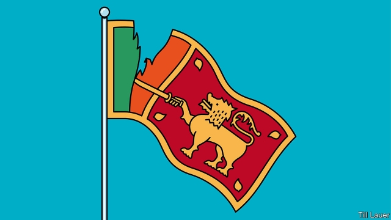

###### Banyan

# “Us” v “them” in South Asia 

 

> print-edition iconPrint edition | Asia | Jun 29th 2019 

“THEY,” LIKE its cousin “them,” sounds an innocent word. Given the wrong context, though, even a simple pronoun can turn insidious. Since a pack of suicide-bombers, claiming to act in the name of Islam, killed 261 people on Easter morning, Sri Lanka’s 2m Muslims have collectively felt that turn. After a thousand peaceful years as a minority in the island country “they” have quite suddenly become aliens, perhaps to be tolerated, but not to be trusted. 

The signs of rejection can be stark, such as when rioters have torched Muslim property. But mostly they appear by whisper and insinuation. Lists ripple across Facebook, detailing shops and businesses to avoid because they are Muslim-owned; rumours circulate that the free meals served by a Muslim-run charity at public hospitals are doctored to make non-Muslims infertile. On June 24th officials in the small town of Wennappuwa barred Muslims from trading at its weekly market because citizens objected to their presence. Lending sanction to the mood, a Buddhist monk noted on YouTube how some devotees had suggested that a Muslim obstetrician accused of secretly sterilising patients should be stoned to death. “Now I am not saying that that is what we should do,” the Most Venerable Sri Gnanarathana Thero Mahanayake cautioned, “but I say that is the punishment they deserve.” 

Sri Lanka’s current, acute intolerance is a reaction to a terrorist death cult. But it has older, deeper causes, too. Since independence in 1951 the country has struggled to replace the divide-and-rule of the colonial era with a more all-embracing notion of shared citizenship. One “unifying” political trend sought to impose the language of the dominant group, Sinhala-speaking Buddhists, on everyone else. The second-biggest group, Tamil-speaking Hindus, violently resisted, provoking 26 years of civil war. Partly as a result of this failure, what has prevailed is a tacit ghettoisation, where each of the main religious and ethnic groups lives largely in its own space. 

This is compounded by a school system that perpetuates division. Most Christians and Muslims go to “their” schools, while Tamils and Sinhalese are naturally separated by the language of instruction. Sinhalese students learn that the great warrior-king Dutugemunu defeated a foreign ruler, Elara, protecting Buddhism and uniting the country. Tamil students read instead that Ellalan—as he is known in Tamil—was a wise and just king who ruled Sri Lanka from 205BC to 161BC. As a result, the inhabitants of a rather small island grow up knowing surprisingly little about their own neighbours. It is not just Muslims; there are many versions of “them”. 

The same may be said of Sri Lanka’s immensely bigger, kaleidoscopically more diverse northern neighbour, India. Decades after establishing a secular constitution and abolishing caste—and with it such categories as the “criminal tribes” and “martial races” beloved of the British Raj, India remains addicted to its habit of othering others. A simple glance at recent headlines is revealing. A hit-and-run driver ploughs into a family at high speed when they stop him from dragging their daughter into his car. Surprise! They are Dalits, formerly known as untouchables. Five men are freed after spending 13 years on death row for murders they did not commit. Surprise! They belong to a nomadic group once categorised as a “criminal tribe”. Villagers tie a suspected motorbike thief to a pole and beat him to a pulp as they force him to shout “Jai Sri Ram”, a Hindu chant. The villagers film it all. He later dies. Surprise! The man is a Muslim, one of several score of “them” that similar mobs have lynched in recent years. 

And as in Sri Lanka it is not just ignorant people who partition “us” from “them.” When India’s freshly elected parliament convened in mid-June, and one of its handful of Muslim MPs stood to take his oath, taunting cries of “Jai Sri Ram” rose from the ruling party’s benches. Eroding the secular basis of citizenship, the government plans to speed the naturalisation of Hindu, Buddhist, Sikh, Jain and Christian refugees, but not Muslims. It also proposes prison terms for Muslim men who practise “triple talaq”, a kind of instant divorce that the courts have banned. Lawyers argue that such cases represent a tiny fraction of the more than 2m Indian women—mostly Hindus—who have been abandoned by husbands without support. So why not a law to protect all Indian women, rather than to punish a few Muslim men? The answer, never stated, is that it is not a law for us, it is for them.◼ 

