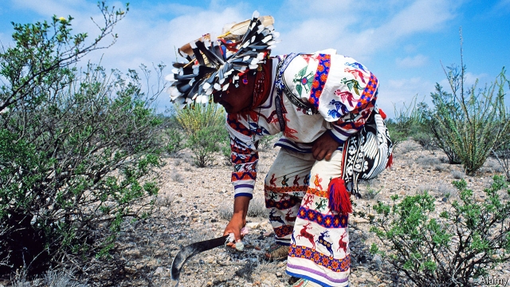

###### Cactus spirit

# A mind-bending history of mescaline 

 

> print-edition iconPrint edition | Books and arts | Jun 29th 2019 

Mescaline: A Global History of the First Psychedelic. By Mike Jay.Yale University Press; 304 pages; $26 and £18.99. 

MESCALINE IS THE drug that launched the modern fascination with hallucinogens. It is also the hallucinogen for which there is the earliest evidence of human use. At Chavin de Huantar, a temple complex in the Peruvian Andes thought to date to as early as 1200BC, stone carvings show grimacing figures—part human, part jaguar—clutching the oblong San Pedro cactus, one of a few plants known to contain the chemical. Another natural source of mescaline, the squat peyote cactus, has been used in rituals in northern Mexico since pre-Colombian times. Anthropologists studying Amerindian culture, along with botanists and chemists, turned white people on to the stuff, eventually kicking off the psychedelic revolution that is still unfolding at spiritual retreats in California and dance clubs in Ibiza. 

Mike Jay’s history of mescaline use is a bit of a mind-altering experience itself, both rollicking and intellectually rigorous. Readers may know the drug as the inspiration for Aldous Huxley’s “Doors of Perception” in the 1950s. Mr Jay grounds his story a century earlier in the white encounter with (and near-extermination of) Native-American culture. 

In the 1890s James Mooney, an anthropologist at the Smithsonian Institution, befriended a Comanche chief named Quanah Parker who embraced the religious use of peyote, which had spread from Mexico in the cultural maelstrom accompanying the genocide of Native Americans. Quanah and Mooney saw peyote rituals as a peaceful alternative to the Ghost Dance, an apocalyptic cult that had inspired a series of doomed uprisings. They incorporated the Native American church, which blended Indian and Christian elements. Its right to use peyote was enshrined in law in 1994. 

Meanwhile the pharmaceutical industry, on the hunt for profitable plant-derived compounds like cocaine, was eager to experiment with the cactus. A Detroit-based drug company marketed a powdered form as an Indian panacea. In Berlin a celebrity pharmacologist named Louis Lewin failed to isolate the psychoactive ingredient because he was unwilling to test it on himself. A less squeamish chemist, Arthur Heffter, worked it out after swallowing an alkaloid derived from the cactus and finding himself immersed in classic mescaline hallucinations: carpet patterns, ribbed vaults, intricate architectural phantasms. 

Mr Jay takes seriously mescaline’s ability to produce such visual and emotional revelations. But he also wants to demystify the heroic accounts of some of its evangelists, who have imagined it as a delivery system for their own aesthetic or spiritual obsessions. Genteel Edwardian experimenters like Havelock Ellis and W.B. Yeats saw it as a pathway to the symbolist worlds of that period’s art. Jazz-age eccentrics like Aleister Crowley took it as a direct line to the occult. Antonin Artaud worked mescaline’s effects into surrealism, Jean-Paul Sartre into existentialism. Huxley, who had studied with a Hindu swami, thought it promised mystical experiences for all. In a darker vein, Hunter Thompson turned a mescaline trip into the lunatic climax of “Fear and Loathing in Las Vegas”. For Mr Jay, this marks a moment when the drug culture was “leaving the utopian dreams of the Sixties in its dust”. 

Doctors’ hopes for mescaline have foundered too—a fact worth remembering as hallucinogens draw renewed medical interest. Some 20th-century psychiatrists thought mescaline might unlock the mechanism of schizophrenia. It didn’t. Its effects are too unpredictable for clinical applications: it can produce elation or paranoia, elaborate visions or none. The let-down spurred a search for related compounds such as LSD and ecstasy, which have more reliable effects at lower doses. 

For Mr Jay, the most rewarding way to take the drug remains the Native American “half moon” peyote ceremony, guided by an experienced shaman and surrounded by fellow travellers on their own spiritual roads. When consuming mescaline, as with many things in life, it is a mistake to focus too much on the commodity, and too little on the company. ◼ 

