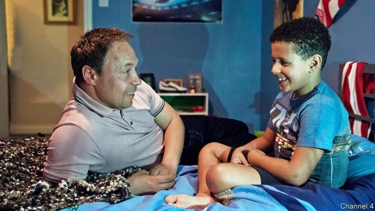

###### Bard of Britain

# Modern British television has found its Dickens 

 

> print-edition iconPrint edition | Books and arts | Jun 29th 2019 

JACK THORNE’S phone flashes with messages and alerts; he turns it face-down, swearing under his breath. With five BAFTAs, an Olivier and a Tony award to his name, Mr Thorne is Britain’s most sought-after scriptwriter. He is juggling several projects at once: his new play is in rehearsal ahead of its premiere at the Royal Court theatre in London on June 27th, while three television series that he wrote are in production. He is becoming to modern British TV what Charles Dickens was to the Victorian novel—a chronicler of the country’s untold stories and social ills, and the domestic dramas that encapsulate them. 

Much of Mr Thorne’s work is concerned with the challenges faced by ordinary Britons. The main character in “When You Cure Me”, his first major stage play, was a young woman incapacitated after a brutal sexual assault. Elsewhere he has written about the impact of local-council cuts, a couple mourning a stillborn child and the creation of a community playground out of scrap materials. His new play, “the end of history...”, is about tensions between the generations. Mr Thorne says it both “celebrates and castigates” baby-boomers. 

A keen interest in the travails of Everyman has defined his television career, too. It began in 2007 on the writing team of “Shameless”, a black comedy set in a working-class area of Manchester, and “Skins” (2007-09), a grim teen drama set in his home town of Bristol. He collaborated with Shane Meadows on the three seasons of “This is England” (2010-15), about skinhead, mod and rave subcultures in the late 1980s and early 1990s, and more recently on “The Virtues” (2019), which follows a man coming to terms with childhood abuse. 

His biggest solo project to date came about when Channel 4 asked him to write a trilogy of shows about modern Britain. “National Treasure” (2016) was inspired by Operation Yewtree, a police investigation into sexual misconduct by media personalities; the smash hit “Kiri” (2018) explored transracial adoption. Caroline Hollick, the channel’s head of drama, praises the balance in Mr Thorne’s writing between brutal honesty and warmth, even humour: “That’s why he can dig into these huge state-of-the-nation ideas and make them so appealing to watch.” The trilogy’s final instalment will be a mini-series about corporate manslaughter, which will draw on real-life incidents including the Grenfell Tower fire of 2017. 

Mr Thorne, who is 40, tends to anchor his stories in families (sometimes unconventional ones), scrutinising the relationships between siblings or between parents and their children. These families have a veneer of unity but, underneath, they tend to be fractured by lies and betrayals. Much is left unsaid. In “National Treasure” Dee (Andrea Riseborough) wonders whether her drug-addiction and memory loss is linked to the predatory behaviour of which her father is accused. In “The Virtues”, to mask his slide back into the bottle, Joseph (Stephen Graham, pictured left) spins a story about a workplace accident to his son. Mr Graham, who also starred in “This is England”, reckons that “no one catches truth and reality the way Jack does”. Mr Thorne’s shows do “more than make you look at pretty pictures,” Mr Graham says; they come “into your living room and make you think”. 

Other threads knit the writer’s disparate subjects into a coherent oeuvre. Many of his stories feature loss or violence, exploring how such experiences calcify into trauma; several of his characters are dependent on booze or sex. He is an acute observer of nuances of affluence and class, that eternal British theme. Typically, Mr Thorne avoids the temptation to provide easy moralising and neat conclusions, considering those unrealistic and therefore dishonest. He says he wants his work to lead “to people asking questions rather than giving them answers”. 

That interrogatory bent is, he thinks, why he enjoys another, contrasting genre, which he has honed alongside the social realism: fantasy. That is also a means to ask “fascinating questions about the world”, he says. “The Fades”, a supernatural drama broadcast in 2011, which followed two nerdy teenagers battling the evil spirits of the dead, was really about pacifism, Mr Thorne suggests. A few years ago he adapted Dickens’s moralistic ghost story “A Christmas Carol” for the stage. 

He also wrote the script for “Harry Potter and the Cursed Child”, based on an original tale by J.K. Rowling. The play won more Olivier awards (Britain’s most prestigious theatrical gongs) than any previous West End production. He wanted it to capture the predicament of outsiders; it follows Albus Severus Potter, Harry’s son, as he is bullied at Hogwarts and struggles to live up to his father’s legacy. And he has adapted Philip Pullman’s “His Dark Materials” for a forthcoming serialisation. Lyra, the protagonist, struggles to assert her free will in the face of unpleasant parents, while trying to set the world to rights. 

Perhaps inevitably, details from Mr Thorne’s own life have found their way into his locations, scenes and characters. For “the end of history...”, his most personal piece of writing to date, he mined his childhood in a politically active household where—like some of his creations—he felt he was constantly falling short of his parents’ ideals and expectations. His father, a union representative, took him and his siblings to rallies and protests from an early age; Mr Thorne has been a member of the Labour Party since he was 16. 

“My politics are very important to me,” he acknowledges. He resists the seepage of those views into his work, but all the same they “infect the stories I tell”. He dislikes speechifying, but says that, as he writes, he constantly questions “what right we have to try and change the world and how we can, if indeed we can”. A motto is tattooed on the inside of his wrist: “Be good”. ◼ 

