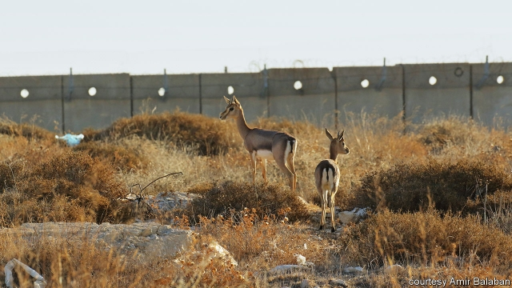

###### Fault lines

# On the borders of art in Israel 

 

> print-edition iconPrint edition | Books and arts | Jun 29th 2019 

IN THE BEGINNING it seems to be an ordinary nature documentary. Two gazelles, a male and a female, seek each other out in the mating season. But as the background comes into focus, it becomes clear that this a political scene, too. The viewer sees the shiny white apartment blocks of a Jewish suburb of Jerusalem, built across the “green line” in the occupied West Bank. The two gazelles are close, yet they are kept apart by the security barrier, which on one side Israelis refer to as “the separation fence”, and the Palestinians on the other call “the wall”. 

A muted group of young people watch the film in the art gallery of Tel Aviv University. “Hey, we had a case like that,” one of them says, breaking the silence. “We opened the gate so they could get it on together.” The others chuckle; there is an air of transgression. Their uniforms disclose that these are not routine visitors. In Tel Aviv on a cultural excursion, they are soldiers of Israel’s Border Police, under instruction from their officers to be quiet in the gallery. This is the last place they expected to see the barrier they know so well. 

To the surprise of its curators, “Defence Lines: Maginot, Bar-Lev and Beyond”, an exhibition that includes the film, has turned out to be very popular with security personnel, both serving and retired. “We didn’t originally think we’d get so many,” says Tamar Mayer, the gallery’s chief curator. But her team did aim to draw a crowd beyond “the usual suspects”. In the event, entire military units have come on organised tours, as have peace activists. One officer says he has been twice, in uniform and then off-duty. “Coming as a civilian, you’re a different person from the officer whose job it is to guard these lines,” he says. “I saw things differently the second time and began to grasp that every wall I’ve ever guarded will one day become obsolete.” 

Israeli galleries are stuffed with subversive and radical art, but it is rarely seen by such a wide audience. “Defence Lines” has raised thorny old questions about the relationship between art and politics, but its reception has posed them in a novel way: an instant feedback loop has developed between the visions of walls and borders on display, and the people responsible for guarding them in real life. 

The first exhibit in the show—a tall border fence in a rugged desert—seemed familiar to the visitors, too. Only upon closer inspection did many realise that they were not looking at the Negev, but at a prototype for Donald Trump’s proposed wall on the Mexican border, in pictures by Assaf Evron, an Israeli photographer. The disorientation is intentional—a bid to disconcert an audience in a place preoccupied with defining its own frontiers. Next comes “The Line”, a series of photographs by Alexandre Guirkinger (first shown in his native France), which focus on the mouldering fortifications of the Maginot Line. The immense construction, built in the 1930s, failed to protect France from the Wehrmacht, which bypassed the defences by advancing through Belgium and the Netherlands. But it is still standing, abandoned. 

The traumatic folly of the Bar-Lev line was Israel’s version of the Maginot. It, too, was built at great cost and named after a general. It, too, failed to stop an onslaught (by the Egyptians at the start of the Yom Kippur war in 1973). The pictures of it by Micha Bar-Am, an Israeli photographer, which appear in “Defence Lines”, begin with the barrier’s construction in the late 1960s; move on to the placid routine of soldiers on the banks of the Suez canal; and culminate in the carnage of war. The images have a special poignancy for Israelis. Unlike the Maginot, which sits on French territory, the Bar-Lev line was built to defend the Sinai Peninsula, from which Israel ultimately withdrew, returning it to Egypt in the Camp David peace accords. 

“It brings home the fact that while we feel invincible, building walls and fences and standing guard over them, there’s always an aspect of weakness and vulnerability to them,” observes Commander Ronen Bar-Shalom of the Border Police, as he peruses the exhibition with his troops. “It’s a reminder that every wall can be breached.” A retired combat pilot at the gallery recalls how he was taken on a tour of the Bar-Lev line’s construction and assured of its impregnability, only to be ordered—after the Egyptians had overrun it—to bomb the fortified positions Israel had established at such expense. 

The most sensitive defence lines in the show, and in the country—the ones that demarcate the current Israeli-Palestinian conflict—are represented by “Gazelles, Separation Fence Herd, Jerusalem”, a film by Amir Balaban, an Israeli nature conservationist and documentary-maker (pictured), and by “25FT”, a collage of video and stills. Netta Laufer, an Israeli artist, put “25FT” together from military surveillance footage taken in the West Bank. Ms Laufer tries to recreate the experience of an Israeli soldier operating one of the cameras. As with Mr Balaban’s film, the images, in black-and-white night-vision, are not of humans, but the outlines of small animals moving across the contested landscape. 

A critic for Haaretz, Israel’s liberal daily, questioned whether all these snapshots really counted as art (another hoary talking-point). Others have complained that the treatment of the controversial barrier is too mild. The occupation of the West Bank has lasted 52 years and counting; this is not the exhibition to dispel the widespread Israeli complacency over its effects. 

But the intention was less grand and more subtle than that. “At first I thought the exhibition would be more political,” says Sefy Hendler, head of the university’s art department and the gallery’s director. But “we decided to try and escape the good guys-bad guys dichotomy”: in other words, to depict barriers, not erect them. Art “shouldn’t belong to the liberal crowd who come to gallery openings in Tel Aviv with a glass of wine,” Mr Hendler insists. “I’d much prefer to have military officers come here and perhaps leave with a more nuanced perspective.” ◼ 

