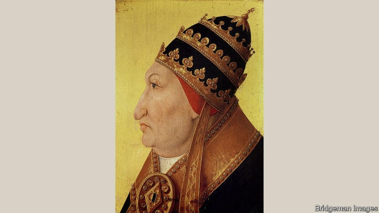

###### Family affairs

# The most scandalous popes in history 

 

> print-edition iconPrint edition | Books and arts | Jun 29th 2019 

The Borgias. By Paul Strathern.Pegasus Books; 400 pages; $28.95. Atlantic Books; £25. 

THE BORGIAS achieved many remarkable things. They reformed and rebuilt Rome; they were patrons of geniuses such as Leonardo da Vinci; and they influenced the course of world events for centuries. It is, for example, thanks to a single Borgia ruling in 1494 that Brazil now speaks Portuguese, whereas most of South America uses Spanish. But perhaps the most noteworthy accomplishment of this noble Aragonese dynasty, which during the Renaissance produced two popes and many legends, is that it managed to bring disgrace upon the Catholic church. Then, as now, this was no mean feat; after all, previous bishops of Rome had rarely been as infallible as later dogma insisted. 

Take Pope Formosus. In the ninth century he was exhumed, dressed in full papal regalia, put on trial as a corpse—and found guilty of perjury and violating the laws of the church. Or consider the exuberant Pope Paul II, who in 1471 expired from apoplexy apparently brought on by “immoderate feasting on melons”, followed by “the excessive effect of being sodomised by one of his favourite boys”. Or Pope Innocent VIII, who in 1492 is said to have spent his final days drinking blood drawn from three ten-year-old boys (who all died), and supping milk from a young woman’s breast. For health reasons, naturally. 

Long before the rise of the Borgias, therefore, this was an institution well-acquainted with embarrassment. Yet as Paul Strathern shows in his new book, the family eclipsed them all. As a result, the 11-year reign of Rodrigo Borgia (Pope Alexander VI) is still, to many, “the most notorious in papal history”. Although not everyone agreed. When, some decades later, Sixtus V was asked to name his greatest predecessors, he offered St Peter—and Borgia. 

Mr Strathern’s even-handed book shows how this rosy judgment was possible—if not, now, entirely plausible. The Borgias, he writes, “were often better than they appeared”. The first Borgia pope, Callixtus III, did the job for only three years, from 1455 to 1458. When his nephew, Alexander VI, came to power in 1492 the Eternal City was suffering from the eternal problems of banditry, corruption and violence. Punctilious in his work, Alexander expelled mercenaries, created an armed watch and overhauled the justice system. 

Few readers will pick up a book on the Borgias hoping for details of city administration, however—and Mr Strathern does not stint on the depravity. Alexander had what Mr Strathern discreetly calls an “evident enjoyment of life”. Take a party that Cesare, his illegitimate son (and a sometime cardinal), held in the Vatican. It was attended by the pope and 50 courtesans, who after dinner danced “fully dressed and then naked”. Chestnuts were thrown onto the floor which the courtesans “had to pick up [with their vaginas]”. Cesare, somewhat unsurprisingly, caught syphilis. 

This is a book rich in such telling details—if sometimes also in less compelling ones. Characters and aristocratic titles proliferate, to such a degree that readers may struggle to keep up. But it is worth persisting. The Borgias, Mr Strathern explains, did not merely acquire their reputation through roistering and making the bureaucracy run on time. They also earned it through the ruthless elimination of their enemies—and friends. Cesare’s own brother turned up in the Tiber, brutally stabbed. A disliked brother-in-law was also dispatched. A trusted ally was cut in two. 

The Borgias’ ambition was boundless; their legacy proved to be enormous. Not without reason did Machiavelli make Cesare the hero of his masterpiece of sinister machination, “The Prince”. That book in turn became the companion of some of the world’s most overweening leaders. Napoleon travelled with it; Mussolini quoted from it; Saddam Hussein kept it by his bedside. Few pontiffs before or since can claim to have had such influence. ◼ 

