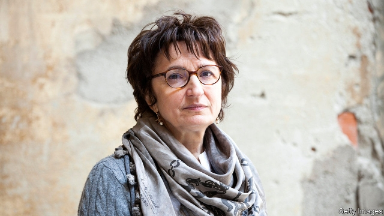

###### Mamma mia

# The story of a lost girl 

 

> print-edition iconPrint edition | Books and arts | Jun 29th 2019 

A Girl Returned. By Donatella Di Pietrantonio. Translated by Ann Goldstein. Europa Editions; 160 pages; $16 and £12.99. 

“I WAS THE arminuta, the one who was returned.” So says the narrator of Donatella Di Pietrantonio’s third novel (entitled “L’Arminuta” in Italy), her first published in English. The return—or the “transfer” as one character terms it—takes place one afternoon in August 1975. An unnamed 13-year-old girl is wrenched from the people she assumed were her parents and deposited with a group of unfriendly strangers who, she is told, are her birth family. What follows is a captivating tale about the trials of settling down, fitting in and battling on amid emotional upheaval. 

During the girl’s prolonged adjustment, she is both a fish out of water and a cuckoo in the nest. No longer an only child with ample urban comforts, she must get used to a hardscrabble life in the Abruzzo countryside, with taciturn parents who beat their offspring and cruel brothers who torment her. After some time in “the family that was mine against my will”, she finds allies in her younger sister Adriana and older brother Vincenzo—who each crave her company for reasons of their own. 

This new life is a rollercoaster. The girl excels at school and reconnects with an old friend in the city whom she was forced to leave behind. But eventually tragedy strikes, rocking and nearly rupturing the family. Meanwhile, for all her progress, she is constantly afflicted by a feeling of rootlessness: “I was a child of separations, false or unspoken kinships, distances. I no longer knew who I came from.” 

And she doesn’t know why she was returned. Did the woman she still calls “Mamma” give her up because she was ill, even dying, or did her supposedly “real” parents want her back? For most of the novel Ms Di Pietrantonio keeps both her protagonist and her readers in the dark. All their questions are answered by way of shock truths in the final act, in which the girl and her mamma are brought together for a powerful showdown. 

Expertly translated by Ann Goldstein, “A Girl Returned” is as heart-warming as it is heart-rending. Both the heroine’s resilience and her confusion are poignant—as is her naive belief that her loved ones will realise their error and come to collect her. In this shrewd examination of identity and belonging, Ms Di Pietrantonio ensures that her character’s loss is her reader’s gain. ◼ 

