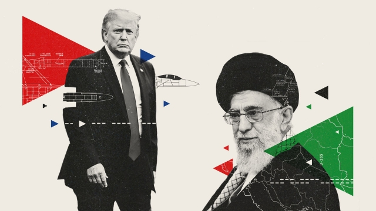
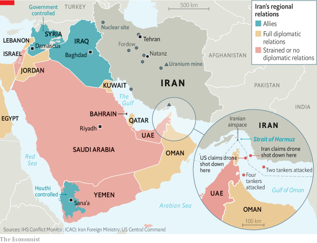
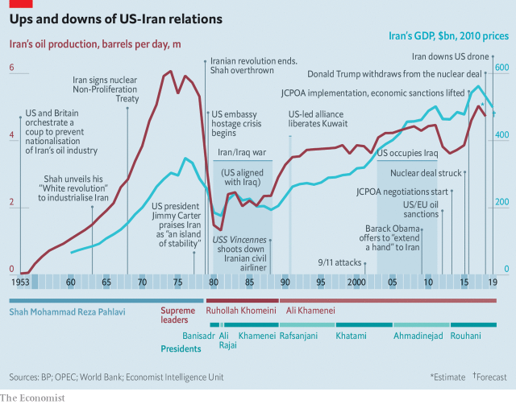

###### Spinning out of control?

# Breaking the nuclear deal ratchets up the conflict between Iran and America 

 

> print-edition iconPrint edition | Briefing | Jun 29th 2019 

THE FACILITY 30km (19 miles) north-west of the Iranian city of Natanz looks like a humdrum industrial site. Only the anti-aircraft guns hint at what goes on eight metres (26 feet) underground. For over a decade Iranian scientists there have fed uranium hexafluoride into centrifuges that spin at twice the speed of sound so as to sift out uranium-235, the isotope capable of sustaining a chain reaction in a nuclear power plant or bomb. The “raw” uranium that goes in is 0.7% 235U; the stuff that comes out is 4% 235U. 

In 2015, as part of the nuclear deal between Iran, the permanent-five nations on the UN Security Council and Germany, Iran promised that it would not enrich any uranium beyond this 4% level, nor hold stocks of more than 300kg of such low-enriched uranium (LEU). But in May 2018 President Donald Trump walked away from that deal, reimposing old sanctions and adding a spate of new ones, too. America now imposes over 1,000 sanctions on Iran and parties that might trade with it. These sanctions have hurt Iran a lot: inflation is expected to reach 50% this year, and GDP to shrink by 6%. 

Iran hopes that if it does, or threatens to do, things others would rather it did not, it might have its plight relieved. So in May it quadrupled the rate at which it was producing LEU. On June 27th, according to the International Atomic Energy Agency (IAEA), the LEU stocks at Natanz had not quite surpassed 300kg. But in just a few days the limit could be broken. 

An imminent step beyond the limits of the deal is not a cause for immediate alarm. For one thing, no amount of LEU can in itself be used to make a bomb; that is typically done with uranium enriched to 90% or so. For another, the step is easily reversed. Enrichment is difficult, but dilution is a doddle. 

At the point when it signed the deal, Iran had amassed a much larger stockpile of LEU—ten tonnes—and had many more centrifuges up and running. Its breakout time—the time it would take to produce enough fissile material for a single bomb—was a harrowing two to three months. With the stockpile and centrifuges it has working at Natanz today, the breakout time would be over a year. 

Stepping over the LEU threshold is a signal that Iran is no longer willing to abide by the terms of the deal, despite encouragement to do so from the other five parties, unless it is offered new incentives. Further steps look sure to follow. Iran’s president, Hassan Rouhani, recently warned that if the deal’s other signatories did not set about easing the country’s economic pain by July 7th, the country would start enriching uranium beyond the 4% level. Another reversible move, but a more troubling one. Enrichment follows the rules of geometric growth, so uranium enriched to 20% is most of the way to 90%. 

Other escalations might include: pulling mothballed centrifuges out of storage to increase the amount of enrichment it can do; restarting enrichment at Fordow, an even deeper-buried and thus harder-to-bomb plant. Perhaps the most ominous would be to expel the inspectors from the IAEA who closely monitor Iran’s nuclear facilities, leaving the world blind to any attempts at breakout. 

For the time being, Iran is more interested in hinting at such options than dashing nuke-wards. Measured and reversible steps lessen the backlash from European states, which have some sympathy with Iran’s predicament, and make it harder for America or Israel to justify a preventive war. But they are still provocative, and speak of a certain desperation. “When we looked at scenarios in the past, we never assumed such a long and unbelievably aggressive US policy towards Iran,” says a former Pentagon official who participated in war games to understand how a conflict with Iran might play out. “Maximum pressure”, America’s term for the tightening vice of sanctions, “has left Iran as a wounded animal, up against a wall.” 

 

Fissile brinkmanship is the most candid signal of Iran’s willingness to make its pain a concern to others, but there are more. On May 12th and June 13th several tankers were attacked off the coast of the United Arab Emirates and in the Gulf of Oman. America and some allies blamed Iran’s Islamic Revolutionary Guard Corps (IRGC). Rebels in Yemen, who have been armed by Iran in the past, have recently carried out several missile and drone attacks against targets in America’s ally, Saudi Arabia. And on June 20th Iran shot down a remotely piloted American spy-plane which it claimed was in its airspace. 

Mr Trump quickly ordered an attack on the surface-to-air missile system that shot down that drone. He then called off the operation, reportedly with ten minutes to spare. He later said he had done so because he had learned that it could inflict up to 150 casualties, a death toll he described as “not proportionate” to the provocation. 

What Iran wants from all this is clear: relief from sanctions. What America wants is harder to say—not least because Mr Trump and his advisers may well not agree. 

A couple of weeks after America pulled out of the deal, Mike Pompeo, the secretary of state, set out a dozen demands to be made of Iran in any negotiations. They included ceasing all enrichment, withdrawing all forces under Iranian command from Syria and ending support for militant groups such as Hizbullah and Hamas. These demands go far enough beyond what Iran might conceivably comply with as to suggest that the real aim is regime change brought on by economic collapse and, if necessary, military confrontation. John Bolton, Mr Trump’s national security adviser, has called for attacks on Iran over many years. 

Mr Trump seems less keen. Yes, he has chosen to employ hawks like Mr Pompeo and Mr Bolton. He is much closer to Iran’s regional foes, Israel and Saudi Arabia, than was Barack Obama, under whom the deal was negotiated. But on the campaign trail he largely set himself against foreign interventions. His volte face over the retaliatory raid reportedly followed a conversation with Tucker Carlson, a Fox News host keen to be seen standing up for the promises of that campaign—pro-little-guy, anti-big-business, nigh-on-isolationist. And the president knows that he will soon be on the trail again. Any military outcomes short of prompt and decisive triumph would be a boon to his opponents. 

Hence another interpretation of maximum pressure on Iran: that it is aimed at pushing the country into negotiations. “I think they want to negotiate,” Mr Trump said on June 23rd. “And I think they want to make a deal. And my deal is nuclear.” Pace Mr Pompeo’s wide-ranging demands, Mr Trump stressed there were no preconditions for talks. The plan, to the extent that such a thing exists, would seem to follow the template he used with North Korea. 

In that stand-off, too, Mr Trump was prepared to go to the rhetorical brink, alarming the world with talk of fire, fury and the size of his nuclear button, before taking part in a summit with Kim Jong Un, North Korea’s leader, in Singapore. “He may believe that by targeting the supreme leader [with specific sanctions] he can push him into the same dialogue as he forced ‘Little Rocket Man’,” says John Smith, a former head of the US Treasury’s sanctions enforcement. 

Coercive diplomacy can work: indeed, it produced the deal of 2015. However William Burns, a diplomat who was involved in that effort and now heads the Carnegie Endowment for International Peace, a think-tank, points out that Mr Trump is trying the coercion without the diplomacy. Take the latest sanctions aimed at high-ranking individuals. Their first targets are Ali Khamenei, Iran’s supreme leader, and eight military commanders. The next salvo is likely to include the foreign minister, Javad Zarif. Some of America’s allies see this as making diplomacy very difficult. Iran’s foreign ministry says it means “the permanent closure of the diplomatic path”. 

That said, there are always channels. Shinzo Abe, Japan’s prime minister, recently visited Tehran bearing a message from Mr Trump. True, he is said to have left empty-handed. But the fact that Mr Khamenei, who rarely meets foreign leaders, was prepared to see him was perhaps a sign of openness. The question is what might America want him open to? 

Any deal Mr Trump could countenance has to look like something tougher than the one he broke. Iran might expand the supreme leader’s apparently long-standing fatwa outlawing nuclear weapons in effect turning religious law into secular law. It might also agree to tighten the IAEA inspections regime—already one of the toughest in existence—and to extend the amount of time for which certain nuclear activities are prohibited. 

In return, Iran would need America to rejoin the deal, provide greater sanctions relief than it did in 2015 and decline to press Iran on some or all of the wider goals Mr Pompeo set out. America might also offer the surety of a deal which, unlike the original, would be enshrined in a treaty ratified by the Senate from which no president could withdraw off his own bat. Democratic senators want the deal restored, and the Republicans who opposed it under Mr Obama might now come round. 

 

This might be presented as “more for more”. Mr Trump could boast of a bigger, better deal—most importantly, one struck by him rather than Mr Obama. Iran could hail its success in seeing off sanctions and staring down American threats. However, such things take time and patience. Iran and America have a long record of mutual distrust (see timeline). Iranians point to America’s part in the 1953 coup against their elected prime minister and its support for Saddam Hussein in the Iran-Iraq war of the 1980s. Americans recall the embassy hostage-taking of 1979-81 and promiscuous support for terrorism, some of which has cost American lives. There is now the added problem that America broke their last agreement. 

Though Mr Trump would surely prefer the sort of meeting in front of the world’s cameras that he had with Mr Kim, the countries’ long history of bad blood, along with the fact that Iran’s regime needs to keep various factions on board, would probably require normalisation to come about step by step—through the appointment of trusted envoys, waivers on some sanctions, confidence-building talks on Yemen, and so on. Mr Bolton would be unlikely to have any of it; he might decamp to the fields of punditry, criticising any reconciliation (though probably not on Mr Carlson’s show, where he has been denounced as a “bureaucratic tapeworm”). 

In the meantime the risks of miscalculation rise. This does not mean all-out war is imminent. Iran spends just over $13bn on its armed forces each year—five times less than Saudi Arabia and about 50 times less than America. If the attack of June 20th had not been called off, Iran could not easily have escalated matters by means of a direct military response. But it might have launched further mine attacks in the Persian Gulf, or intensified the attacks against Saudi Arabia by rebels in Yemen. 

It might also have launched cyber-attacks of its own. “Incidents involving Iran have been among the most sophisticated, costly, and consequential attacks in the history of the internet,” noted Collin Anderson and Karim Sadjadpour, experts at the Carnegie Endowment, in a study in 2018. Marcus Willett, a former senior official at GCHQ, Britain’s signals-intelligence agency, observes that Iranian cyber-operations have penetrated not only Saudi Arabia’s national oil company but also critical national infrastructure in Western states. 

America could respond in kind. It has devoted considerable resources to planting malware throughout Iran’s nuclear sites, military and communication networks and power grid as part of a project called Nitro Zeus. After the air strikes of June 20th were called off, cyber-attacks on the IRGC and missile forces went ahead. America also disrupted the communications of Kata’ib Hizbullah, an Iran-backed militia group in Iraq, in the days afterwards. Persistent low-level cyber-skirmishing may be becoming normal. 

If Iranian mines, missiles or malware provoked America to launch a much bigger strike—Mr Trump has tweeted that “any attack by Iran on anything American will be met with great and overwhelming force”—its armed forces would doubtless prevail. But they might well suffer some losses along the way. The IRGC has honed the art of asymmetric warfare, for instance operating small, zippy boats designed to swarm around and discombobulate big American warships. Iran has also built up a formidable array of projectiles, including the largest ballistic-missile force in the Middle East and sea-skimming anti-ship missiles that can be launched from the shore or from quiet submarines hidden in the murky waters of the Persian Gulf. 

Nor would American warplanes have a free run of Iranian skies. Iran’s air force may be dilapidated—it flies F-14 fighters from the “Top Gun” era—but since 2017 it has acquired 32 batteries of Russia’s formidable S-300 air-defence system. Its home-grown missiles are not bad, either. One of them took down that sophisticated high-altitude American drone. 

The IRGC’s elite Quds Force would also be likely to draw on its region-wide network of proxy groups and allies to extend the conflict beyond its borders. Hizbullah in Lebanon has around 130,000 rockets and missiles. Predominantly Shia militia groups in Syria and Iraq could threaten thousands of American troops with guerrilla attacks. 

Above the level of punitive strikes and regional repercussions there is little room for anything but a campaign to destroy Iranian nuclear sites or overthrow the regime. Neither is appealing. In 2012 a study by former diplomats and military officers concluded that air strikes on Iranian nuclear sites might delay Iran’s programme by just four years. Only an invasion and occupation of Iran could durably quash such efforts. That, said the study, would require about a million troops for an extended period. Even the most bellicose of Mr Trump’s advisers would blanch at that, you would hope. American voters certainly would. 

Regime change sounds easier than occupation; but it has not proved a very productive strategy in recent years. And if the new regime inherits a nuclear programme, even a degraded one, any relief might prove short-lived. 

Neither side is eager for war; but Iran is definitely eager to see sanctions relaxed, and has few ways of achieving that end which do not look warlike. What is more, ratcheting down is harder than ratcheting up. And if North Korea is indeed the template, it is not a terribly encouraging one. Yes, Mr Trump and Mr Kim are again exchanging warm letters. But Mr Kim shows no sign of being willing to denuclearise in the way America wants him to, and continues to churn out fissile material for bombs. 

There is a deeper difference. With North Korea Mr Trump appeared to defuse, or at least defer, a serious crisis that predated him. With Iran, he faces an unnecessary crisis of his own making. That sad fact of authorship may make it harder for him even to appear to come out ahead.◼ 

