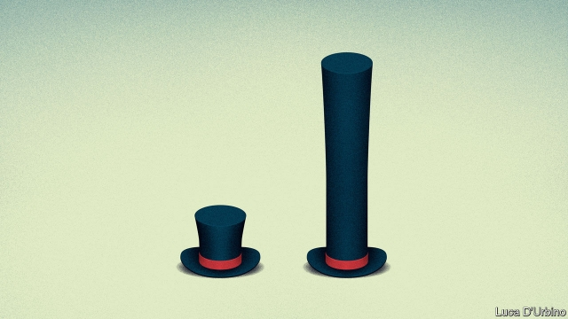
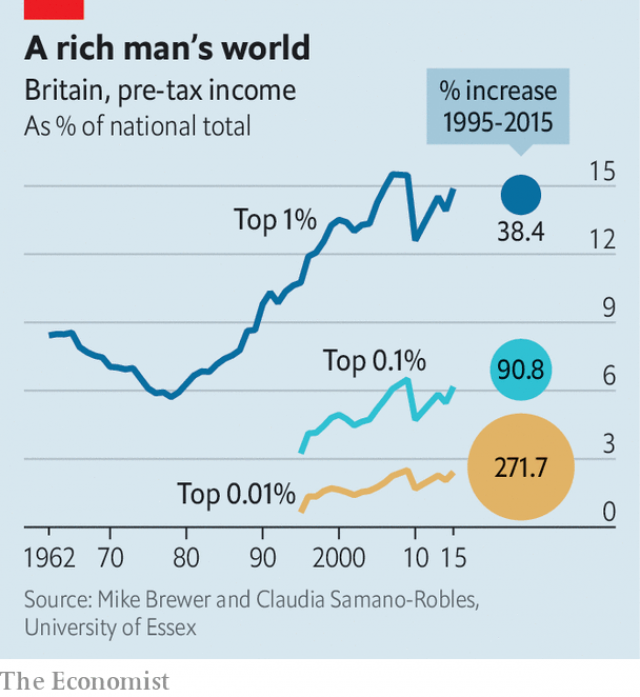

###### The rich v the rest

# A rare peep at the finances of Britain’s 0.01% 

 

> print-edition iconPrint edition | Britain | Jun 29th 2019 

THEY ARE objects of both fascination and fury. But beyond the annual Sunday Times “Rich List”, which estimates the fortunes of Britain’s wealthiest, relatively little is known about the finances of the economic elite. Official statistics, which extrapolate from surveys of the general public, are good at guessing the incomes of middling sorts. But they find it harder to get an accurate picture of those with more unusual circumstances. The very richest are particularly elusive. As well as being frustrating for nosy parkers, this makes it harder to estimate inequality, which depends on an accurate understanding of the full extent of their loot. 

In a paper published on June 17th, Mike Brewer and Claudia Samano-Robles of Essex University paint an unusually detailed portrait of Britain’s very highest earners. Using data from the tax office up until 2015-16, they focus on the incomes of not just the top 1%—who earned a trifling £129,000 ($164,000) or more in that year—but the top 0.01%. The 5,000 or so individuals in that club each made at least £2.2m. 

Who are they? Nearly all live in England, the majority in London. Scotland has about 200 of them, and Wales and Northern Ireland perhaps 50 between them. Only about one in ten is a woman; one in 20 is a millennial (roughly defined as the generation born between 1981 and 1996). Financial services, by far the biggest category, employ more than a third of them. Yet roughly 15% of Britain’s super-high earners do not appear to work at all. In 2015 40% of the income of the top 0.01% was “unearned”, meaning that it came from the returns to financial investments and the like. 

The very rich have been getting a lot richer. Since 1995 the share of overall income accruing to the top 0.01% has roughly tripled (see chart). They had a turbulent time during the financial crisis of 2008-09, when many bankers were sacked and the value of financial investments plummeted. Yet they quickly bounced back. By 2015-16 the share of income accruing to the top 0.01% was at its second-highest level in decades. It is likely to have risen still further since then. 

 

The paper is part of a recent trend among economists to improve estimates of the incomes of the rich. That work is much needed, since Britain’s two official measures of overall inequality—one from the Office for National Statistics (ONS) and the other from the Department for Work and Pensions (DWP)—have limited success in guessing the incomes of the well-off. Both suffer from the problem that very rich people are particularly likely to under-report their income. Some evidence finds that the very well-off are less likely to answer surveys, since they believe they are too busy to do so. They may also have earnings from a variety of sources, which can make it hard to keep track of everything that is gushing in. An ONS study published in February suggests that survey data capture only about half the income of someone who has just made it into the richest 0.5%. 

Since the rich command a disproportionately large share of overall income, getting them wrong is a disproportionately big problem. Both the ONS and DWP suggest that, somewhat surprisingly, since the early 1990s overall income inequality (as measured by the Gini coefficient) has not changed much. Could these conclusions be skewed by a poor understanding of just how rich the richest are? 

In an effort to get to the bottom of this, academic researchers have sought to combine tax data with survey data. (Wonks at the DWP already do this, though their methodology is widely agreed to be flawed.) Calculations in a paper published earlier this year by Stephen Jenkins of the London School of Economics and the late Tony Atkinson, formerly of Oxford University, show a marked increase in overall inequality since the mid-1990s, in contrast to the stability shown by official statistics. Such work is at an early stage. But it suggests that a better understanding of the 0.01% may reveal that the gap between rich and poor has been widening more than many people thought. ◼ 

