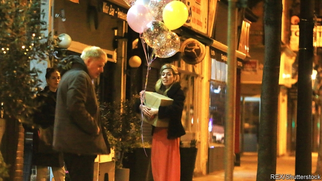

###### Monsieur Boris

# Boris Johnson, Britain’s first French prime minister? 

 

> print-edition iconPrint edition | Britain | Jun 29th 2019 

“ET ALORS?” So responded François Mitterrand, then president of France, when asked about a child from an extra-marital relationship. His curt “So what?” summed up the way in which the private lives of French politicians are generally off-limits to nosy journalists, and of little concern to French voters. Criticism of François Hollande, another president caught having an affair, focused on the fact that he had turned up to his illicit liaisons on an unpresidential scooter. How Boris Johnson must have wished that similar attitudes prevailed in Britain when an argument with his girlfriend became front-page news on June 21st, after the police were called to her flat in south London. 

Mr Johnson is attempting to become Britain’s first French prime minister, with an impregnable barrier between his public and (rather vibrant) private life. “I do not talk about stuff involving my family, my loved ones,” he garbled this week. “And there’s a very good reason for that. If you do, you drag them into things that, really, is, in a way that is not fair on them.” 

Unfortunately for Mr Johnson, the British take a keen interest in the personal lives of their politicians. More than half of voters think Mr Johnson’s private life is relevant to his ability to be prime minister, according to a poll taken by Survation after last week’s domestic row was splashed all over the press. One in three voters said the episode—in which Mr Johnson’s partner, Carrie Symonds, was recorded screaming “Get off me!” and “Get out of my flat!” before labelling Mr Johnson “spoilt”—would make them less likely to support him. Happily for Team Johnson, half suggested it would make no difference. 

It made for a chaotic start to the leadership race by Mr Johnson, who nonetheless remains the favourite. While noisily stating that he would not comment on Mr Johnson’s private life, Jeremy Hunt, the foreign secretary, who is running against him, labelled his opponent a coward for ducking out of a head-to-head debate. Mr Johnson’s team had attempted to launch a “submarine” assault on Downing Street, in which their gaffe-prone candidate would surface only occasionally. But following criticism of his invisibility Mr Johnson changed tactics, giving a flurry of interviews in which he discussed everything from his plan to leave the EU by October 31st (“come what may, do or die”) to his hobby of painting buses on old wine boxes—anything other than his love life. 

Yet the topic may re-emerge in the remaining month of the contest. Basic questions about Mr Johnson, such as how many children he has, are unanswered. Judges have, in general, upheld the right of journalists to stick their beaks in. When in 2013 the mother of one of Mr Johnson’s children tried to stop newspapers from naming him as the father, the courts ruled against her, declaring that it was “a public interest matter which the electorate was entitled to know when considering [Mr Johnson’s] fitness for high public office”. 

Following the latest fireworks, one poll suggested that Mr Johnson had lost his lead to Mr Hunt among the general public. His victory looks a little less certain than a week ago. But Conservative voters still prefer him—and the decision lies with party members, who are particularly enthusiastic backers of his hard line on Brexit. A majority say they would be willing to seriously damage the economy or even lose Scotland in order to leave the EU (see Bagehot). Just as Brexit has superseded the party’s attitudes to business and the union, so too it may override its attitude to family values. Mr Johnson’s team is banking on the hope that Conservative Party members will greet any topic other than Brexit with a Gallic “Et alors?” ◼ 

