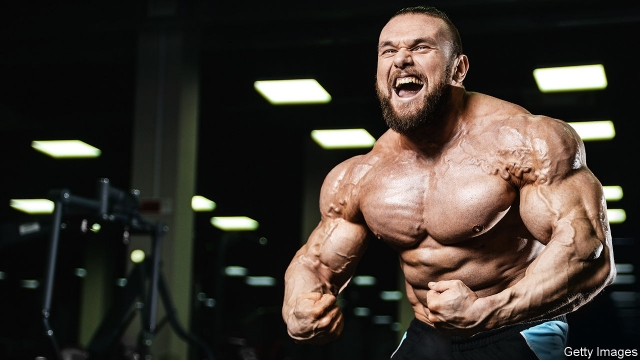

###### Welsh beef

# How Welshmen went from mining coal to pumping iron 

 

> print-edition iconPrint edition | Britain | Jun 29th 2019 

RHYS CALLOWAY first went on the juice seven years ago. At 21, he was fit but skinny—football training every day at college had seen to that. He envied the bulging muscles of his mates down the gym, and he knew their secret. To make progress, he needed to pinch the added ingredient of their regimes: steroids. “Your veins are out, your muscles are full, arms nice and tight, chest puffed out,” he says. “All the compliments started coming in.” 

It is tricky to work out how many Britons take anabolic steroids, synthetic compounds derived from the male hormone testosterone that promote muscle growth. Users are often keen to imply that they sculpted their bodies with hard work alone. One user told a researcher from Teesside University that his girlfriend “wouldn’t mind if I told her I did some crack [cocaine], but if I told her I took steroids she wouldn’t even want to know me.” 

Another reason for their reticence is that steroids occupy a grey area between legitimate pharmaceuticals and banned drugs. They are legal to possess, but illegal to supply. Most steroid users don’t see themselves as drug abusers, and shy away from health services. And since steroids are “class C” drugs (the least serious of three bands), they are not a priority for cops. So academics reckon the official finding that 310,000 Britons have taken steroids is a significant underestimate. 

Few doubt that use of steroids is growing. They were first knocked back by Russian weightlifters in the 1950s and later taken by American athletes, generating a run of doping scandals. But in recent decades they have proliferated, first among amateur bodybuilders and powerlifters and now among large swathes of men keen, as one puts it, to “look like a beast”. Official statistics suggest that the number who admit to ever having taken steroids has swelled by 70% in the past ten years. So common are “’roids” in some gyms that sharps bins for needles are provided. 

Most users take steroids for cosmetic purposes. Some combine a short course of steroids with tanning drugs to get “jacked and tan” before going on holiday; others are keen to keep up with others at the gym or to look like their idols on Instagram. Social media fuel competition between rival gyms, or “meat houses”. Some have posing rooms with floor-to-ceiling mirrors on every wall for selfie-snapping. Steroids are also popular among gay men and those who need to look beefy for work, such as prison guards and bouncers. One criminal’s heavy told Georgios Antonopoulos, another Teesside academic, why he started taking steroids: “You have to look like a hard bastard.” 

There are users everywhere, but some evidence suggests steroids are particularly prevalent in post-industrial places. Take the Valleys, once the industrial heartland of Wales. According to Public Health Wales, a government agency, 64% of patients at needle-exchange clinics there say they use steroids or other image- and performance-enhancing drugs (known as IPEDs), compared with 37% in Cardiff, the capital. “Many young working-class men were socialised to believe physical labour is the male activity,” says Mr Antonopoulos. Now that they work in call centres and supermarkets rather than mines and steelworks, steroids offer a way to retain the traditional trappings of masculinity. “If you look at my job now, it’s just sitting at a desk,” says Mr Calloway, whose grandfather was a miner. 

Like many users, Mr Calloway first bought his steroids from a dealer. These dealers are quite different from the crooks who push harder drugs, though. Small-scale user-dealers buy their gear from underground labs in Britain or import it from countries where it is cheaply and readily available, such as Turkey. They are often gym owners or personal trainers, for whom profit comes second to being seen as “brokers of masculinity”, says Mr Antonopoulos. About a quarter of users buy online. Several forums allow people to compare the quality of different websites’ products. 

The Welsh authorities quickly recognised the problem. Two years ago the then public-health minister warned of the “worrying number” of young men buying the drugs for cosmetic reasons. Mike Mallett set up a specialist IPEDs clinic in Newport after noticing that more and more patients visiting his needle-exchange were using steroids. Staff at the clinic take blood samples and give advice on reducing the risks of injecting or swallowing steroids. 

Studies suggest that steroid users risk less damage than smokers, drinkers or users of most illegal drugs. But they often experience side-effects like acne, shrinking testicles and low libido. Because of the extra pressure placed on their bodies, users also risk serious long-term complications such as cardiovascular disease and impaired liver function. 

At Mr Calloway’s first visit to the Newport clinic, he chats through his steroid regime with a doctor. “What dosage is safe?” he asks. He confirms that he never shares needles and the doctor tells him that his intake is “not that horrendous”. He will have to wait a few weeks to get the results from his blood sample. Whatever it says, he seems unlikely to quit. “It has no limits,” he says. “Every time you look in the mirror, you still think, ‘I could be bigger,’ so you just keep going.” ◼ 

