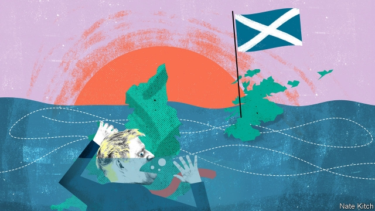

###### Bagehot

# Leaving the EU is straining the union with Scotland 

 

> print-edition iconPrint edition | Britain | Jun 29th 2019 

GORDON BROWN is doing a much better job of being an elder statesman than he did of being prime minister. A man who was seen as a failure in office has transmogrified into a widely respected figure. In April he delivered an electrifying speech on the shame of anti-Semitism in his Labour Party. This week he was at it again. He warned that “the union is today more at risk than at any time in 300 years—and more in danger than when we had to fight for it in 2014 during a bitter Scottish referendum.” He added that there was more at stake than just the unity and integrity of a country. Also on the line is a collection of values—“tolerance, respect for diversity, being outward-looking”—which are embodied in the United Kingdom and now threatened by various competing, narrow nationalisms. He is right on all counts. 

England and Scotland have been drifting apart for decades. Scotland increasingly feels like a different country rather than just a distinctive part of a multinational kingdom. It has its own parliament, its own ruling party, its own tax rates, its own welfare arrangements (Scottish students go to university free of charge) and, if things go according to plan, will soon have its own Scottish National Investment Bank. The Scots wake up every morning to curse different politicians and chew over different political scandals. The country is currently obsessed by a scandal that has got little traction in the south but could shake the ruling Scottish National Party to its foundations: Alex Salmond, Scotland’s first minister in 2007-14, is awaiting trial on multiple charges of sexual assault and two of attempted rape. 

Britain’s great political parties are also losing their Scottish dimensions. Historically the Labour Party has drawn on Scotland for a disproportionate share of its leaders: Keir Hardie, Ramsay MacDonald, John Smith, Tony Blair (just) and Mr Brown. The Conservatives had a strong tartan streak, albeit usually of the landowning variety. Today they are thoroughly Anglicised. Excluding the Scotland secretary and shadow-secretary, there are only three Scots on the front benches—Michael Gove and Liam Fox on the government side and Barry Gardiner on the Labour side—and none of them represents a Scottish seat. The transformation of Labour is particularly striking. What was a Tartan Raj in the days of Mr Blair and Mr Brown has become a London clique, with six members of the shadow cabinet representing London seats—and four of them, Jeremy Corbyn, Emily Thornberry, Diane Abbott and Sir Keir Starmer, representing adjacent constituencies. Chris Deerin, head of Reform Scotland, a think-tank, points out that the Scots have little time for Mr Corbyn’s student-union brand of politics: “The Scots have historically been serious about their socialism. They know bullshit when they smell it.” 

Until recently it looked as if Scotland’s drift could be held back. The result of the independence referendum was decisive enough, at 55%-45%, to force the nationalists back to the drawing board. The Brexit result further complicated the independence project. A third of people who voted for independence also voted to leave the European Union. And Britain’s difficulties in extricating itself from a 46-year relationship with the EU have emphasised the difficulties that Scotland would face if it were to untangle its far more complex, 312-year-old tie with England. But now pressure for break-up is rising dramatically. 

The Brexit debate in England is becoming increasingly radical and irresponsible. The Scots voted by 62% to stay in the EU, with every one of the country’s 32 authorities backing Remain. Since then, all of Scotland’s preferred options for a “soft Brexit”, such as staying in a customs union or the single market, have been rejected. Many Scots feel that this is an omen of worse to come. If the English have been so unwilling to listen to them so far, why would they be more willing to listen to them when it comes to shaping a post-Brexit Britain? 

The Conservatives are set on crowning Boris Johnson as prime minister. Yet north of the border, Mr Johnson is kryptonite: a bumbling Bertie Wooster who takes his privileges for granted and expects other people to clean up his messes and darn his socks. The Scottish Tories are so worried about the damage he will do to their brand that they organised a stop-Boris plot, code-named Operation Arse (“We called it that so we’d all be clear who we were talking about,” one reportedly said). It is a measure of how desperate they are that they are pinning their hopes on Jeremy Hunt, a man who only has an approval rating of minus 24 in Scotland, compared with Mr Johnson’s minus 37. 

Both Boris and do-or-die Brexit can be explained by something deeper: the rise of English nationalism. The Conservative Party is on its way to becoming an English nationalist party rather than a unionist one. A recent YouGov poll showed that 63% of Tory members would rather see Scotland independent than lose Brexit. Mr Johnson is surrounded by a clique of people such as Jacob Rees-Mogg and Iain Duncan Smith who exude Englishness and talk blithely about turning Britain into “Singapore-on-Thames”. The party is now more worried about losing voters to another English nationalist outfit—Nigel Farage’s Brexit Party—than it is about keeping the country in one piece. 

The economic cost of a Brexit-induced break-up of Britain would be big enough. But Mr Brown is right that the cultural cost would be even bigger. British nationalism is a peculiarly capacious sort of nationalism that makes it easier for people from all sorts of backgrounds to identify as British. English nationalism, by contrast, has a tinge of narrowness about it that excludes not only the Welsh, Scottish and Northern Irish, but also English people from ethnic minorities. Mr Johnson’s reckless approach to Brexit risks not just precipitating a no-deal exit from the EU, but also wrecking one of the most creative fudges in the history of nation-making. ◼ 

