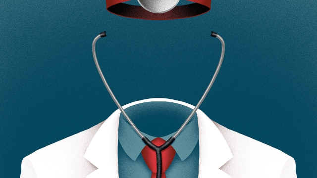

###### What’s up, doc?

# The front line of England’s NHS is being reinvented 

 

> print-edition iconPrint edition | Britain | Jun 27th 2019 

THE NATIONAL HEALTH SERVICE is free, so it is also rationed. Family doctors, known as general practitioners (GPs), act as the first port of call for patients; friendly gatekeepers to the rest of the service who refer people to specialists only if needed. But in some parts of the country, including St Austell on the Cornish coast, access to the rationers is itself now rationed. “You can’t book an appointment to see me here,” explains Stewart Smith, a 39-year-old GP, one of a team in charge of an innovative new medical centre. “You go on a list and then we triage you.” 

It is an approach that will soon be familiar to more patients. Simon Stevens, chief executive of NHS England, has said that being a GP is arguably the most important job in the country. There is, however, a severe shortage of them. According to the Nuffield Trust, a think-tank, there are 58 GPs per 100,000 people, down from 66 in 2009—the first sustained fall since the 1960s. Only half of patients say they almost always see their preferred doctor, down from 65% six years ago. The average consultation lasts just nine minutes, among the quickest in the rich world. 

Although the NHS hopes to train and recruit new family doctors, the gap won’t be plugged any time soon. A new five-year contract to fund GP practices will eventually include £891m ($1.1bn) a year for 20,000 extra clinical staff, such as pharmacists and physiotherapists, with the first cash for such roles arriving on July 1st. To access the money, practices will have to form networks which, it is hoped, will help them take advantage of economies of scale and do more to prevent illnesses rather than merely treating them. 

When the four practices serving St Austell merged in 2015, it was an opportunity to reconsider how they did things. The GPs kept a diary, noting precisely what they got up to during the day. It turned out that lots could be done by others: administrators could take care of some communication with hospitals, physios could see people with bad backs and psychiatric nurses those with anxiety. So now they do. Only patients with the most complicated or urgent problems make it to a doctor. As a result, each GP is responsible for 3,800 locals, compared with an average of 2,000 in the rest of Cornwall. 

Although few practices have made changes on the scale of St Austell Healthcare, across England the number of clinical staff other than GPs has grown by more than a third since 2015. The logic behind the introduction of these new roles is compelling, says Ben Gershlick of the Health Foundation, another think-tank. The NHS estimates that 30% of GPs’ time is spent on musculoskeletal problems, for instance, which could often be handled by a physiotherapist. Another estimate suggests 11% of their day is taken up by paperwork. Doctors complain that they are overworked, and growing numbers retire early. They are also expensive: the starting salary for a GP is £57,655, whereas a physio costs around half as much. 

NHS leaders hope the new workers will help practices play a more active role in their community, linking up with services provided by local authorities and charities. Each network will be responsible for a population of 30,000-50,000. The plan is that they will use data analysis to intervene early to prevent illness, and that practices will often share the new staff with others in their network. 

Those that are further down the road sing the benefits of the new approach. Caroline Taylor of the Beechwood Medical Centre in Halifax says that new roles quickly show their worth. Her practice took in a “work wellness adviser” employed by the council. The adviser’s goal was to help ten people over the age of 50 with poor mental health back to work in a year—a task which she completed in just six weeks. In St Austell two pharmacists last year helped to cut more than £140,000 from prescribing costs. Far fewer staff now report that they are burnt out. 

Working in a team will nevertheless require a big shift in mindset for many doctors, particularly those in surgeries that have never before employed anyone else aside from the odd nurse. One worry is that practices will end up doing what they must to get the extra funding, but little more. There are also more practical problems. Seven in ten GPs say their practices are too cramped to provide new services, and it is not clear where some of the extra staff will be hired from. 

Perhaps the biggest problem is that patients have grown used to having a doctor on demand. Although those who no longer have to queue for an appointment may be happy, others might feel fobbed off if diverted to another clinician. A study published last year by Charlotte Paddison of the Nuffield Trust, and colleagues, in the British Medical Journal found that patients had less trust in the care provided by a nurse if they initially expected to see a doctor. Patients who have a close relationship with their GP tend to be more satisfied and enjoy better health outcomes than others. 

But other evidence suggests that, for some conditions, nurses provide care that is as good as or better than that provided by GPs. The aim, says Nav Chana of the National Association of Primary Care, which helped develop the new approach, is therefore to use small teams of doctors and other clinical staff to replicate the sort of relationship with patients that used to be more common. Just parachuting in “a lot of people who look like doctors” will not raise standards, he warns. 

The shortage of GPs leaves the NHS with little choice but to try something new. “A lot of the world has either copied or is trying to copy English primary care,” in particular its openness to all and the continuity of care that it provides, says Dr Chana. Keeping these strengths, while changing how primary care works, is the task NHS officials are now facing up to. Even if they succeed, it will take time for the public to adjust. Having explained the benefits of the new way of doing things, one GP pauses, before adding: “I should say, though, patients don’t love it.” ◼ 

