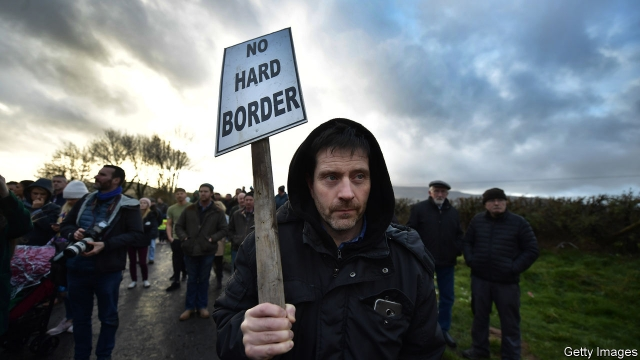

###### Back to the border

# The search for ways to keep the Irish border open after Brexit 

 

> print-edition iconPrint edition | Britain | Jun 29th 2019 

THERESA MAY’s Brexit deal was rejected by MPs because of the Irish backstop. This part of the withdrawal agreement would keep the United Kingdom in a customs union with the EU until another option was found that could avert the need for a hard border with Ireland. The government has convened an advisory group to study such options. And this week a commission set up by Prosperity UK, a think-tank, under the auspices of two Tory MPs, Greg Hands and Nicky Morgan, published a report on alternatives. 

Scepticism about magical ways to avoid border controls is in order. Yet the report is based on work by experienced customs and border officials. It draws on international practice to advocate systems using trusted traders, authorised economic operators and exemptions for small businesses to minimise border friction. And although it stresses digital solutions, it does not rely on untested technology. Its timetable of putting alternative arrangements in place within three years may be unrealistic, but some ideas should still be considered. 

The report disowns Mrs May’s December 2017 promise of no checks anywhere on the island. Instead it suggests that inspection posts should be sited well away from the border. That is a hard sell for Brussels, given the region’s history of smuggling. It is especially tricky in the agrifood business, which accounts for much cross-border trade. For this the report suggests a single all-island food-safety unit and proposes that the EU deems British food standards equivalent to its own. Neither proposal seems politically saleable. 

The authors are clear that none of these suggestions could survive a no-deal Brexit, not least because they depend on trust. That, as the main author, Shanker Singham, concedes, is now almost entirely lacking. And it does not argue that the Irish backstop can simply be ditched altogether. There is something of a Brexiteers’ paradox at work. If they really believed in alternative arrangements, they would not worry about the backstop, since it would never be needed. By the same token, the more they say the backstop is intolerable, the more a suspicious EU will see it as an essential insurance policy. 

The EU’s fears are not being eased by the willingness of the two rival Tory leadership candidates to accept no-deal. Both Boris Johnson and Jeremy Hunt claim they could renegotiate the Brexit deal to remove the Irish backstop before October 31st. They also invoke imaginary technology to avoid any border controls. Even more incredibly, Mr Johnson argues that the border problem can be sorted out during a standstill transition period that is not on offer from Brussels, especially since he is simultaneously threatening not to pay Britain’s agreed exit bill of £39bn ($49bn). 

Such contradictions fuel two other ideas. The first, promoted in a new Policy Exchange pamphlet by Lord Bew of Queen’s University, Belfast, is to dispute the claims in Brussels and Dublin that the Good Friday peace agreement depends on there being no hard border. Echoing many in the Democratic Unionist Party (DUP), Lord Bew argues that Mrs May’s Brexit deal itself is more of a threat to the peace process, and that smart border controls would be tolerable. Yet a majority of Northern Irish voters backed Remain in 2016 and support the backstop. That points to a strong preference for an invisible border with no checks or controls at all. 

A second idea is to revert to the original December 2017 plan of a backstop covering Northern Ireland alone. This was scuppered because the DUP, on which Mrs May’s government relies for its majority, opposed customs checks in the Irish Sea. Arlene Foster, the DUP leader, is still against, though she also opposes a no-deal Brexit. Yet animals arriving in Larne from the British mainland already undergo checks. Controls at sea are less intrusive than on land. A Northern Ireland-only backstop would allow Britain an independent trade policy. For now, the next Tory prime minister would struggle to get such a thing through Parliament. But do not be surprised if it is revived in future. ◼ 

