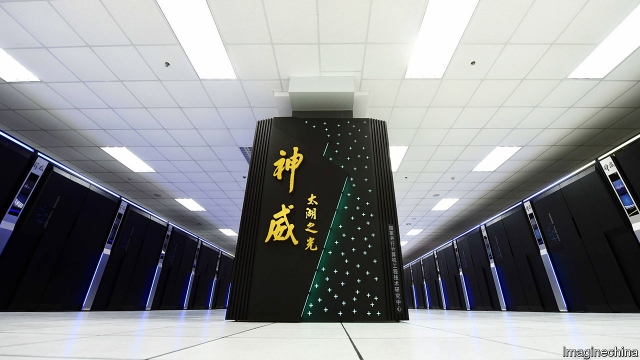

###### The balance of processing power

# An American ban hits China’s supercomputer industry 

 

> print-edition iconPrint edition | Business | Jun 29th 2019 

IN 2000 CHINA had two supercomputers ranked among the world’s fastest 500. Ten years later a machine named Tianhe-1A topped the global league table. It was, though, based on Intel chips. So when in 2015 America barred its giant chipmaker from selling to four Chinese supercomputer labs—fearing that the machines were being used to simulate nuclear blasts—it might have expected China’s progress in the field to slow. Instead, China unveiled another supercomputer, Sunway TaihuLight, that led that ranking in 2016 and 2017—this time powered entirely by home-grown microprocessors. The latest American sanctions will nevertheless bite. 

On June 21st America’s Commerce Department blacklisted another five Chinese supercomputing entities on the grounds that they too pose a threat to national security. The export ban prohibits American firms from selling them chips and “interconnects” that allow chips to talk to each other. An army-led institute that designed chips for the latest world-beating machine is on the list, as is Sugon, which has built a third of China’s 100 fastest ones. 

So is Hygon, born of a joint venture in 2016 between Sugon and Advanced Micro Devices (AMD), an American semiconductor firm. Intel chips dominate high-powered computing in desktops, servers and supercomputers. But AMD makes advanced ones compatible with Intel’s technology. The $293m arrangement gave Hygon the ability to make slightly slower near-replicas of AMD’s designs—and China a domestic manufacturer of crucial components. 

The latest ban chokes off practically all of AMD’s dealings with Hygon. Transfer of intellectual property and technical support are proscribed. The manufacturer of the copycat chips, GlobalFoundries, is American, so it too is banned from working with Hygon. Finding an alternative foundry would require onerous tweaks to the chips’ design. AMD has carefully transferred only as much knowledge as Hygon needs to copy but not reverse-engineer them. 

A blow, for sure—but perhaps not a knockout. Last year new American computers ended China’s dominance; it will be pouring money into reclaiming it. Jack Dongarra, a supercomputing expert at the University of Tennessee who has scrutinised Sunway’s chip, calls it “very impressive”. Rumours have spread of a big new supercomputer powered by AMD’s licensed chips whirring in a Chinese lab. 

To China the blacklisting, days before President Donald Trump is to meet his Chinese counterpart, Xi Jinping, at the G20 summit in Japan, smacks of a negotiating ploy in the two countries’ trade war. In May Mr Trump said he could ease export restrictions that had been placed the previous week on Huawei, a Chinese telecoms giant. Even if he doesn’t, Intel and Micron, another chipmaker, are already circumventing the Huawei ban in ways they claim are legal, according to the New York Times.FedEx is suing America’s government over the “impossible” job of inspecting parcels to blacklisted Chinese firms. Chipping away at Chinese computing progress is tough. ◼ 

