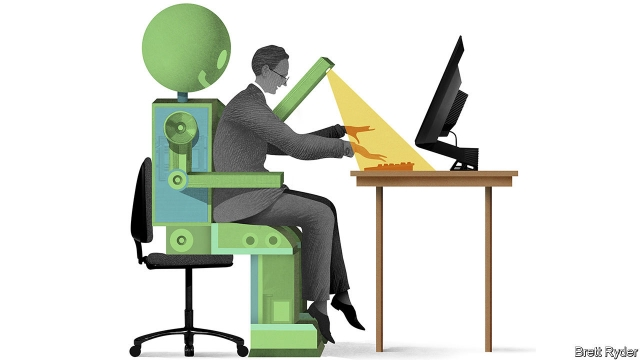

###### Schumpeter

# An accidental doom-monger 

 

> print-edition iconPrint edition | Business | Jun 27th 2019 

IT IS ONE of the most widely quoted statistics of recent years. No report or conference presentation on the future of work is complete without it. Think-tanks, consultancies, government agencies and news outlets have pointed to it as evidence of an imminent jobs apocalypse. The finding—that 47% of American jobs are at high risk of automation by the mid-2030s—comes from a paper published in 2013 by two Oxford academics, Carl Benedikt Frey and Michael Osborne. It has since been cited in more than 4,000 other academic articles. Meet Mr Frey, a Swedish economic historian, in person, however, and he seems no prophet of doom. Indeed, Mr 47% turns out not to be gloomy at all. “Lots of people actually think I believe that half of all jobs are going to be automated in a decade or two,” he says, leaving half the population unemployed. That is, Mr Frey stresses, “definitely not what the paper says”. 

So what does it say? Its authors modelled the characteristics of 702 occupations and classified them according to their “susceptibility to computerisation”. This classification was, ironically, itself automated—using a machine-learning system built by Mr Osborne, which was trained using 70 hand-labelled examples. After crunching the numbers, the model concluded that occupations accounting for 47% of current American jobs (including those in office administration, sales and various service industries) fell into the “high risk” category. But, the paper goes on, this simply means that, compared with other professions, they are the most vulnerable to automation. “We make no attempt to estimate how many jobs will actually be automated,” the authors write. That, they underscore, will depend on many other things, such as cost, regulatory concerns, political pressure and social resistance. 

The paper was intended for an academic audience, says Mr Frey, and got “more attention than we would ever have expected”. Chinese whispers and exaggerated headlines meant the carefully caveated, theoretical and highly unlikely upper bound of 47% came to be seen by some as a firm prediction—sometimes even a target. In April one striking dockworker in Los Angeles carried a placard that read “47% of American jobs are planned to be automated by 2034”. Needless to say, they are not. 

Such misperceptions, irksome as they are to Mr Frey, are also telling. For, he says, they reflect the polarised nature of the debate about the nature of automation and the future of jobs. 

At one extreme are the doom-mongers. They warn of mass technological joblessness just around the corner. One advocate of this position, Martin Ford, has written two bestselling books on the dangers of automation. Mr Ford worries that middle-class jobs will vanish, economic mobility will cease and a wealthy plutocracy could “shut itself away in gated communities or in elite cities, perhaps guarded by autonomous military robots and drones”. The unemployed masses will subsist on a universal basic income. At the sanguine end of the spectrum, classical economists argue that in the past new technology has always ended up creating more jobs than it destroyed. Everything will work out fine in the long run, these optimists reckon, though the short term is likely to be bumpy, as it was during the Industrial Revolution, unless governments take action to smooth the transition. 

Mr Frey is often assumed to be in the first camp. So plenty of people are stunned to discover that he is, in fact, closer to the second. He has now laid out his position in more detail in a new book, “The Technology Trap”. This has allowed him, he says, to put the 47% figure in “the right context”. That context is largely historical. Building on his original paper, he revisits the history of industrialisation and asks what lessons it provides today. 

One is that new technologies take time to produce productivity and wage gains. It was several decades before industrialisation led to significantly higher wages for British workers in the early 1800s, a delay known as Engels’s pause, after the theorist of communism who observed it. Another lesson is that, even though it eventually increases the overall size of the economic pie, automation is also likely to boost inequality in the short run, by pushing some people into lower-paid jobs. Mr Frey is concerned that automation will leave many people worse off in the short term, leading to unrest and opposition, which could in turn slow the pace of automation and productivity growth. Everyone would then be worse off in the long run. This is the titular “technology trap”. Whereas many people assume he worries about a world with too many robots, Mr Frey is in reality more concerned about a future with too few. 

To avoid the trap, Mr Frey argues, today’s policymakers should take advantage of the fact that this time around it is possible to see how things might play out, and manage the transition accordingly. In particular that means making greater use of wage insurance, to compensate workers who have to move to jobs with a lower salary; reforming education systems to boost early-childhood education and support retraining and lifelong learning; extending income tax credit to improve incentives to work and reduce inequality; removing regulations that hinder job-switching; providing “mobility vouchers” to subsidise relocation as the distribution of jobs changes; and changing zoning rules to allow more people to live in the cities where jobs are being created. 

These are all sensible suggestions. Will anyone pay attention? Messrs Frey and Osborne had an unexpected smash hit with their study. But the bestselling books on artificial intelligence, robots and automation are the bleak ones, like Mr Ford’s. In part that is because fear sells, particularly if stoked by misunderstanding, whereas pragmatic expositions of policy proposals do not—or not nearly as well. “The Technology Trap” may well ensnare doom-seekers’ attention with its ominous-sounding title. But it should ultimately hearten anyone who reads it. Provided, that is, they read it more carefully than they read Mr Frey’s earlier work.◼ 

