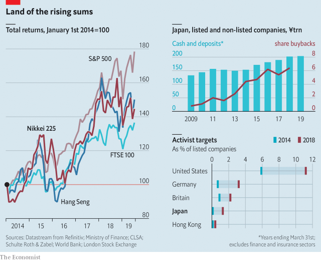

###### Ousted from the throne

# Japanese AGMs are getting more boisterous 

> print-edition iconPrint edition | Business | Jun 29th 2019 

 

IF CORPORATE governance were measured by the boisterousness of annual meetings, then things in Japan are looking up—a bit. Activist investors are eyeing ever more companies. This week Lixil, which makes toilets among other things, had its board flushed out in favour of an alternative one which backed its recently ousted former boss. The head of Nissan got an earful over low profits (among other gripes). Shareholders want more cash, which is piling up in corporate Japan, returned to them. Companies are obliging.◼ 

