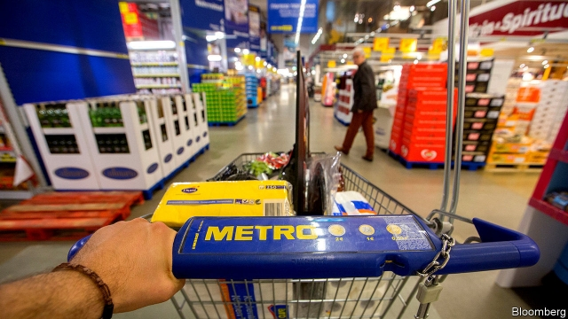

###### From Prague, with cash

# Metro is fighting for its independence 

 

> print-edition iconPrint edition | Business | Jun 29th 2019 

FOR A MAN who apparently likes to keep a low profile, Daniel Kretinsky makes a lot of headlines. In March journalists of Le Monde battled to prevent the inscrutable Czech oligarch from taking control of the prestigious French daily. On June 23rd the management of Metro, a German retail behemoth based in Düsseldorf, rejected a €5.8bn ($6.6bn) takeover offer from EP Global Commerce, an investment vehicle controlled by Mr Kretinsky and Patrik Tkac, his Slovak business partner, arguing that it “substantially undervalues” the company. The offer of €16 a share is a measly 3% above the previous closing price on June 21st. 

In a statement EP Global Commerce said it has the “full support” of the Haniel family, an important shareholder, and that it holds call options for 9% of Metro shares owned by Ceconomy, a consumer-electronics business that used to be part of the group. One of Germany’s oldest industrial clans, the Haniels owned a big chunk of Metro for more than half a century. 

After years of poor returns, the Haniels decided last August to cut their losses by selling 7.3% of Metro to Messrs Kretinsky and Tkac. They also gave the duo an option to buy the family’s remaining 15.2% stake. Metro has two other big shareholders: the Meridian Stiftung, which owns 14.2% of shares, and the Beisheim Holding, which holds 6.6%. Meridian reportedly said it will not sell; Beisheim has not yet announced its decision. 

What does the Francophile Mr Kretinsky, who made his money in the energy industry, want with a struggling German retailer? According to Bruno Monteyne at AB Bernstein, a research firm, he saw an opportunity to buy—on the cheap and with outside finance—a retailer still in the process of transformation. Metro was once a retail conglomerate with activities stretching from consumer electronics to department stores. Under Olaf Koch, its chief executive, it has been shedding businesses to focus on food wholesalers. Mr Koch is not done. He is about to sell Real, a loss-making chain of hypermarkets, as well as Metro’s China business. EP Global Commerce says it backs the decision to flog these businesses provided Mr Koch can get a good price. 

Messrs Kretinsky and Tkac have four weeks to submit their offer to German regulators and Metro’s board. They can either stick to their stingy bid or increase it in the hope of winning over Meridian and other shareholders. EP Global Commerce will only buy the rest of the Haniel shares if this gets it across a threshold of 75% of votes at the annual meeting. This would trigger a “domination agreement” that lets it exercise full control of the group’s cashflow without owning 100% of the company. 

If they fail, Metro will have two large, unhappy shareholders: the eastern Europeans, with 7.3% plus options to buy Ceconomy’s 9%, and the Haniels, with 15.2%. Mr Koch may struggle to find a taker for their stakes at a time when traditional retail is threatened by e-commerce. Metro’s annual sales of €36bn remain hefty. But they are in decline, as are profits. A counter-bid could come from farther east—an Asian buyer interested in more than Metro’s Chinese arm. If it does, Mr Kretinsky and Mr Tkac may walk away with a profit. If it doesn’t, they will own one of the world’s top ten retailers. Either way, expect more headlines.◼ 

